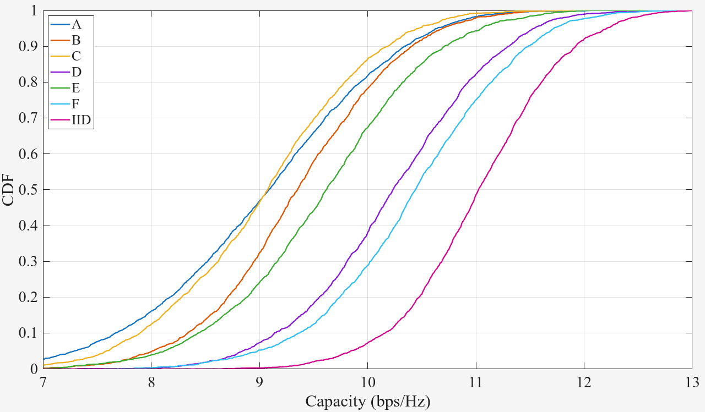
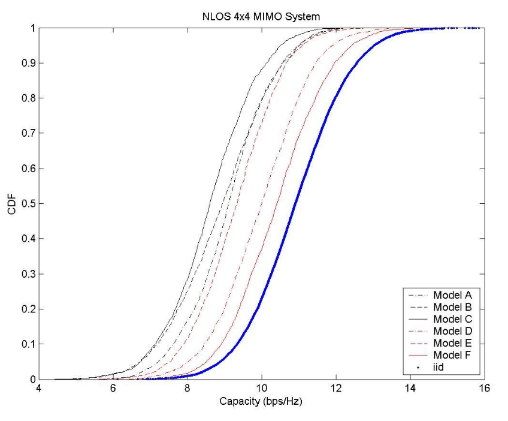
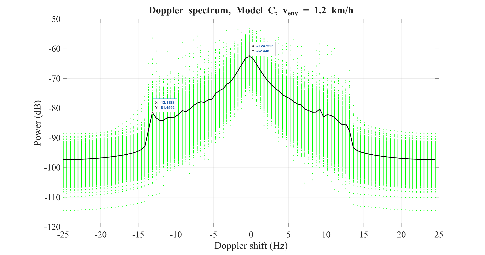
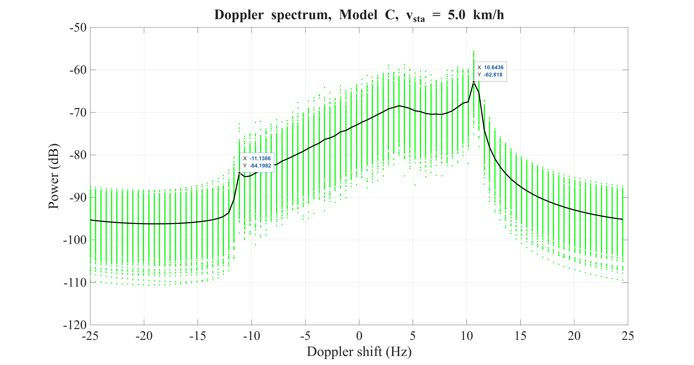
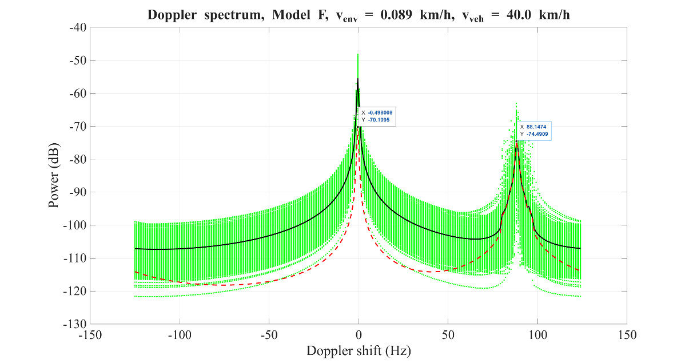
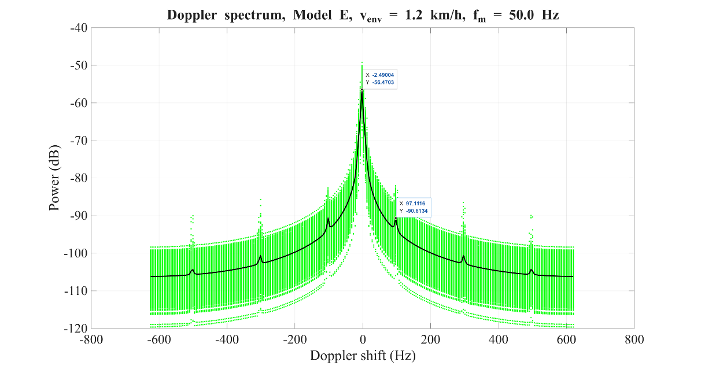

# Abstract

This report presents a modern, high-performance C++ framework for the IEEE 802.11 **indoor** channel models, implemented in **Quadriga-Lib** and released under the **Apache 2.0** license. The goal is to provide a unified, cross-platform, and publicly accessible reference implementation that consolidates the indoor model families from **TGn, TGac, TGah**, and **TGax**-style evaluations. The framework covers indoor scenarios A-F with the cluster-based modeling approach, ULA-based MIMO, power-angular shaping, detailed Doppler spectrum components, and dual-polarized antenna support, while extending usability through generic antenna and polarization models and a sub-path representation. A concise software overview and validation results demonstrate consistency with the intended statistical behavior and suitability for reproducible simulation workflows.

# 1 Introduction

The IEEE 802.11 indoor channel models developed across different task groups (TGn, TGac, TGax, TGah) are widely used as reference models for PHY and system-level evaluation. However, in practice they are often available only as fragmented, task-group--specific code bases or scripts, with inconsistent APIs, limited portability, and varying degrees of feature coverage. This report presents a **modern C++ framework for the IEEE indoor channel models**, implemented as part of **Quadriga-Lib** and released under an **Apache-2 license** to make these models easily accessible, reusable, and verifiable in both academic and industrial settings.

**Motivation and scope:** The framework is designed with the following goals:

- Provide a common framework for the IEEE indoor channel models across task groups, exposing a single coherent API and consistent data structures.
- Make the models publicly accessible through an open-source implementation under the Apache-2 license as part of Quadriga-Lib.
- Provide a cross-platform implementation, targeting native C++ use and language bindings to MATLAB, Octave and Python to integrate into existing workflows.
- High performance implementation, leveraging an efficient C++ core with optional acceleration for performance-critical operations.
- Feature completeness across IEEE indoor model families, covering the relevant normative and engineering-realization aspects from TGn, TGac, TGah, and key extensions commonly associated with TGax use cases.
- Scope limitation: this work focuses on indoor channel models (no outdoor / macro / campus extensions).

**TGn-covered features:** The framework supports all TGn indoor-model capabilities, including:

- Indoor models A-F with their scenario parameters, including the cluster modeling approach and per-tap/cluster delay-power and directional statistics.
- MIMO modeling based on uniform linear arrays (ULAs).
- Power-angular shape (PAS/PDS-related behavior) consistent with the tabulated angular statistics.
- Doppler spectrum modeling, including: Main temporal Doppler component (environment motion), Doppler component due to a moving vehicle, Doppler components due to fluorescent lights
- Dual-polarized antenna support for the common 2×2 XPOL case.

**TGac/TGax-covered features:** To support high-efficiency WLAN evaluations consistent with TGac-style scenarios, the framework includes:

- Larger system bandwidths up to 640 MHz.
- Higher-order MIMO configurations beyond the baseline TGn examples.
- AoA/AoD modifications for MU-MIMO.

**TGah-covered features**: For sub-1 GHz indoor evaluations, the framework supports:

- Carrier frequencies below 1 GHz.
- Multi-floor path loss modeling, enabling additional attenuation and variability for links separated by multiple floors.

**Additional (framework) features** beyond the IEEE tables: In addition to implementing the IEEE features, the framework provides engineering-realization features needed for practical simulation pipelines:

- Sub-path model: resolved taps/clusters can be realized as multiple sub-paths to obtain explicit ray angles for antenna embedding and improved convergence behavior.
- Generic MIMO antenna models: arbitrary array configurations via sampled far-field patterns.
- Generic polarization model: a per-sub-path polarization transfer representation that generalizes beyond fixed small MIMO examples.

From a user perspective, the implementation is structured around a small set of concepts: antenna arrays, a channel object representation, and a single high-level generator function for the IEEE indoor models, with optional post-processing utilities (e.g., transformations into frequency-domain representations). The same conceptual API is exposed across native C++ and supported language bindings to enable consistent experiments and validation.

The remainder of this report is organized as follows: Chapter 2 describes the software structure and API, including the main generator interface, antenna-array handling, channel-object semantics, and typical workflows. Chapter 3 documents implementation details, covering parameterization, tap refinement, large-scale fading, MU-MIMO angle handling, sub-path mapping, polarization coupling, MIMO embedding/normalization, Doppler evolution, and uplink/downlink conventions. Chapter 4 provides validation results using representative numerical checks (e.g., delay spread behavior, MIMO capacity metrics, Doppler spectra). Chapter 5 concludes with a summary and outlook.

# 2 Software Structure and API

## 2.1 Overview

This chapter describes how the IEEE indoor channel model is implemented as part of Quadriga-Lib, and how the software is structured around a small set of data types and a single high-level channel-generation entry point. The underlying modeling steps (tap generation/interpolation, large-scale fading, sub-path mapping, polarization coupling, antenna embedding, Doppler evolution, and uplink/downlink handling) are documented in Chapter [3](#implementation-details) (Implementation Details). Concrete usage scenarios and numerical checks are shown in Chapter [4](#validation) (Validation).

The IEEE indoor channel model implementation is distributed as part of **Quadriga-Lib** (<http://quadriga-lib.org>), an open-source utility library for radio channel modelling and simulation released under an Apache-2 license. Quadriga-Lib targets system-level studies by providing:

- Channel impulse-response generation and handling
- Array-antenna modelling and antenna embedding into path data
- Storage, loading, and transformation utilities for channel data (including baseband transformations)
- Site-specific geometry utilities (e.g., ray-object and beam-point intersection tests) and mesh-format conversions.

Quadriga-Lib is implemented primarily in C++, with optional AVX2 acceleration for performance-critical operations, and it provides bindings for MATLAB/Octave and Python to integrate the same computational core into different workflows. Platform support is summarized in Table 2.1.


**Table 2.1:** *Platform support (high-level), as of Quadriga-Lib v0.10*

| Platform | Native C++ | MATLAB | Octave | Python |
| -------- | ---------- | ------ | ------ | ------ |
| Linux    | ✓          | ✓      | ✓      | ✓      |
| Windows  | ✓          | ✓      | --     | --     |

**Architectural overview**

From a user perspective, the IEEE indoor channel model is accessed through:

1.  **Antenna-array representation**
2.  **Channel representation**
3.  **A single generator function** for TGn/TGac/TGax/TGah indoor models
4.  **Optional post-processing utilities**, most importantly conversion to a band-limited frequency response

This separation has two goals:

- **Separation of concerns:** antenna definitions, stochastic channel generation, and signal-domain transformations are independent building blocks.
- **Interoperability:** the same conceptual objects are exposed across C++, MATLAB/Octave, and Python, enabling consistent experiments and validation.

Despite language-specific container types, all APIs expose the same modelling degrees of freedom: channel type selection, carrier frequency, tap spacing, multi-user configuration (TGac/TGah), time evolution, antenna embedding, and deterministic seeding.

## 2.2 Channel generation interface

### 2.2.1 Antenna arrays

The generator consumes two antenna-array objects:

- **Access point antenna array** (AP): transmit side for downlink, receive side for uplink
- **Station antenna array** (STA): receive side for downlink, transmit side for uplink

Each array provides sampled far-field patterns on an azimuth/elevation grid. The IEEE indoor model implementation is two-dimensional: only the azimuth cut at elevation $0$ is used for 3D antenna patterns. This modelling choice is explained in Chapter [3](#_Ref216787524). At a conceptual level, an antenna array provides:

- Discrete grids: azimuth $\phi \in \lbrack - \pi,\pi\rbrack$, elevation $\theta \in \lbrack - \pi/2,\pi/2\rbrack$
- Complex far-field components for each element: $E_{\theta}(\theta,\phi)$ and $E_{\phi}(\theta,\phi)$
- (Optional) element positions and a coupling matrix mapping elements to ports

### 2.2.2 Channel objects (common conceptual model)

All language bindings return a per-user time-domain MIMO channel, represented as a sparse impulse response with:

- Per-snapshot transmitter and receiver metadata (position and orientation)
- A finite set of resolved paths (taps), each with:
  - Complex MIMO coefficients per tap and snapshot
  - Propagation delays per MIMO sub-link
  - Tap gains before antenna embedding (path gain)

The detailed semantics of the coefficient and delay tensors are tied to the modelling steps described in Chapter [3](#implementation-details) (especially antenna embedding, normalization, and time evolution).

### 2.2.3 Generator function for IEEE indoor models

The IEEE indoor model is generated through a single high-level entry point:

- **C++:** quadriga_lib::get_channels_ieee_indoor(\...) returning a vector of channel objects
- **MATLAB/Octave:** quadriga_lib.get_channels_ieee_indoor(\...) returning a struct array
- **Python:** quadriga_lib.channel.get_ieee_indoor(\...) returning a list of dictionaries

The output length equals the number of users, $N_{\text{users}}$, for multi-user simulations (TGac/TGah).

**Model selection and basic parameters**

- **Channel type.** The parameter ChannelType selects the TGn indoor model class:
  $$ChannelType \in \{ A,B,C,D,E,F\}.$$
- **Carrier frequency.** CarrierFreq_Hz sets the RF carrier frequency. Frequency-dependent quantities (e.g., Doppler scaling) follow the definitions in Section [3](#implementation-details).
- **Tap spacing.** tap_spacing_s defines the base tap spacing $\Delta\tau$ used to discretize the power-delay profile (PDP). The implementation constrains:
  $$\Delta\tau = \frac{10\ \text{ns}}{2^{k}},\quad k \in \mathbb{N}_{0},$$
  with TGn default $\Delta\tau = 10$ ns. How this interacts with TGac tap interpolation/refinement is described in Section [3.2](#tap-interpolation-and-rate-expansion-tgac).

**Multi-user configuration (TGac/TGah)**

- For multi-user operation, n_users specifies the number of independent user channels returned as a vector/array/list. Per-user geometry and TGah floor penetration are configured via:

  - Dist_m: TX--RX distance(s) in meters (scalar or length $N_{\text{users}}$)
  - n_floors: number of floors (scalar or length $N_{\text{users}}$), limited to the model's supported range

- **Angle offsets for MU-MIMO.** The optional offset_angles argument allows user-specific deterministic offset angles (in degrees) to decorrelate directions across users, following TGac conventions. If omitted, model defaults are applied when applicable (see Section [3.4](#offset-angles-for-mu-mimo-tgac)).

**Time evolution and mobility**

A channel can be generated either as:
- Static: observation_time = 0, producing a single snapshot ($N_{\text{snap}} = 1$)
- Time-varying: observation_time \> 0, producing multiple snapshots with update interval update_rate

A common discretization is:
$$N_{\text{snap}} = 1 + \left\lfloor \frac{T_{\text{obs}}}{\Delta t} \right\rfloor,$$
where $T_{\text{obs}} = observation\_ time$ and $\Delta t = update\_ rate$. Snapshot timing and Doppler phase evolution are specified in Chapter [3.8](#doppler-model). Two mobility parameters separate motion of the terminal from motion of the environment:

- speed_station_kmh: station speed (terminal motion)
- speed_env_kmh: environment speed (scatterer motion proxy)

In addition, Doppler_effect captures model-specific special Doppler behavior (e.g., fluorescent lights or moving vehicles) for selected channel types. The Doppler model and its parameterization are described and justified in Chapter [3.8](#doppler-model).

**Link direction and reciprocity**

The Boolean uplink switches the channel direction:
- Downlink (uplink = false): AP $\rightarrow$ STA
- Uplink (uplink = true): STA $\rightarrow$ AP
Directionality affects the interpretation of TX/RX metadata and can apply reciprocity transformations to the MIMO coefficients depending on the chosen convention. The mathematical handling of uplink/downlink generation is detailed in Chapter [3.9](#downlink-and-uplink-reciprocity).

**Sub-path resolution and angular spreads**

The parameter n_subpath controls the number of sub-paths used to realize each tap/cluster for angular spread mapping. Increasing $N_{\text{sub}}$ improves convergence to the intended small-scale fading statistics, while also increasing computational cost. The sub-path mapping procedure, including the relation to RMS angular spreads and the Laplacian distribution assumptions, is described in Chapter [3.5](#sub-path-mapping).

**Randomness and repeatability**

The seed parameter controls determinism:

- seed = -1: use a non-deterministic seed (system random device)
- seed ≥ 0: deterministic generation suitable for reproducible experiments and regression tests

Recommendations for using fixed seeds in validation and benchmarking are illustrated in Chapter 4.

## 2.3 Typical workflow

A typical workflow consists of three conceptual steps:

1.  **Antenna definition:** create AP and STA array antennas (e.g., via an antenna-array generator utility).
2.  **Time-domain channel generation:** generate one or more sparse MIMO impulse responses for the desired IEEE indoor model and scenario parameters.
3.  **Optional signal-domain transformation:** convert the sparse time-domain representation into a band-limited frequency response for a specific set of subcarriers.

Examples of end-to-end workflows and expected numerical properties (power normalization, delay structure, and Doppler behavior) are provided in Chapter 4.

# 3 Implementation Details

This chapter documents how the framework turns the IEEE indoor channel-model tables (TGn/TGac, with TGah-specific large-scale adjustments where applicable) into a simulation-ready, antenna-embedded MIMO channel. The intent is twofold: (i) implement the normative parts of the IEEE models (delays, powers, spreads, large-scale loss) as faithfully as possible, and (ii) provide a consistent *engineering realization* that exposes explicit ray directions, polarization coupling, array responses, and optional time evolution - capabilities that are not fully specified by the original tapped-delay-line descriptions. The implementation follows a staged pipeline that keeps the responsibilities of each processing step clear and testable:

1.  **Model parameterization (TGn/TGac/TGah):**\
    load the scenario-dependent delay/power and directional statistics from the IEEE tables.

2.  **Delay refinement (TGac):**\
    optionally interpolate taps while preserving the reference PDP intent (delay/power domain refinement).

3.  **Large-scale effects:**\
    apply deterministic pathloss and stochastic shadow fading (including multi-floor correction where enabled).

4.  **Multi-user angle diversity (TGac):**\
    apply deterministic, reproducible per-user offset angles for MU-MIMO consistency.

5.  **Sub-path realization:**\
    convert each resolved path into a finite set of sub-paths with physically usable AoD/AoA samples that match the specified angular spreads and converge toward the TGn Rayleigh assumption for sufficiently many sub-paths.

6.  **Polarization coupling:**\
    apply a per-sub-path polarization transfer (Jones) matrix consistent with the model's XPR/XPD assumptions.

7.  **MIMO embedding + normalization:**\
    evaluate antenna patterns and array phasing to obtain sparse per-path MIMO coefficients, then normalize per tap so the realized powers remain consistent with the IEEE tables.

8.  **Time evolution and reciprocity:**\
    extend the snapshot channel to a sequence via Doppler phase evolution and derive UL from DL under the selected reciprocity convention.

Unless stated otherwise, the model is azimuth-only (planar) with angles represented in radians internally, and the resulting channel is represented as a sparse impulse response with a finite set of resolved paths (delays) and complex MIMO coefficients per path (and per snapshot when Doppler is enabled).

## 3.1 TGn model parameters

This section documents the parameter sets used by the IEEE 802.11 TGn indoor channel models (models A--F). The tapped-delay-line (TDL) power-delay profiles, cluster definitions, and directional parameters are taken from IEEE 802.11-03/940r4, Appendix C (TGn Channel Models) [[1]](#_ref_TGn). In addition, when the same parameterization is reused at sub‑1 GHz carrier frequencies (e.g., for TGah use cases), the shadow-fading standard deviations are adjusted according to IEEE 802.11-968r4 (TGah Channel Model), Table 2 [[4]](#_ref_TGah).

The TGn models define six reference profiles (A--F) with increasing delay spreads. [[1]](#_ref_TGn) (Appendix C) specifies, for each profile, (i) delays, (ii) per-cluster tap powers, and (iii) per-tap mean angles of departure/arrival together with the corresponding angular spreads. These quantities are treated as normative lookup data in the framework. The framework also uses TGn path-loss and shadowing parameters based on a two-slope log-distance model with a breakpoint distance *d~BP~*. The breakpoint distance and the shadow-fading standard deviations for LOS and NLOS conditions are model-dependent.

The following notation is used throughout this document:

- Tap/Path index: p = 1, ..., P (with p=1 being the LOS path)
- Cluster index: c = 1, ..., N~cl~
- Sub-path index: s = 1, ..., S
- User index : u = 1, ..., U
- Antenna indices r = 1, ..., N~rx~, and t = 1, ..., N~tx~
- Snapshot index n = 1, ..., N~snap~
- Path delay: τ~p~ (seconds), specified in TGn [[1]](#_ref_TGn), appendix C in nanoseconds
- Tap power in dB: P~c,p~ (dB), with non-existent taps marked as −∞ dB
- Linear tap power: P~c,p~ (linear scale)
- Mean departure and arrival angles: $\phi_{c,p}^{d}$, $\phi_{c,p}^{a}$ (degrees in TGn [[1]](#_ref_TGn); converted to radians for simulation)
- Angular spreads: $\sigma_{c,p}^{d}$, $\sigma_{c,p}^{a}$ (degrees in Appendix C; converted to radians)
- Breakpoint distance: d~BP~ (meters)
- Shadow fading: X~SF~ (dB), zero-mean Gaussian with standard deviation σ~SF~ (dB)
- LOS/NLOS power split (Rician K-factor): K (dimensionless, applied to first tap for distances below d~BP~ when a LOS component is present)
- Cross-polarization ratio XPR: X (linear, dimensionless), used for NLOS polarization coupling

Table 3.1 summarizes the key scalar parameters for the six TGn profiles. The complete per-tap, per-cluster power and angular data are defined in IEEE 802.11-03/940r4, Appendix C, with N~path~ being the total number of non-zero coefficients obtained from both, the clusters and the tap positions. For LOS, an additional path is added for the LOS steering matrix.

**Table 3.1:** *Summary of TGn profiles A–F*

| Model | N_cl | N_taps | N_path LOS | N_path NLOS | Max. delay (ns) | d_BP (m) | σ_SF,LOS (dB) | σ_SF,NLOS (dB) | K (linear) |
| ----- | ---- | ------ | ---------- | ----------- | --------------- | -------- | ------------- | -------------- | ---------- |
| A     | 1    | 1      | 2          | 1           | 0               | 5        | 3             | 4              | 1 (0 dB)   |
| B     | 2    | 9      | 13         | 12          | 80              | 5        | 3             | 4              | 1 (0 dB)   |
| C     | 2    | 14     | 19         | 18          | 200             | 5        | 3             | 5              | 1 (0 dB)   |
| D     | 3    | 18     | 28         | 27          | 390             | 10       | 3             | 5              | 2 (≈3 dB)  |
| E     | 4    | 18     | 39         | 38          | 730             | 20       | 3             | 6              | 4 (≈6 dB)  |
| F     | 6    | 18     | 42         | 41          | 1050            | 30       | 3             | 6              | 4 (≈6 dB)  |

**Path loss, breakpoint, and shadow fading**

The TGn model uses a two-slope path-loss law. Up to the breakpoint distance d~BP~ the path loss follows free-space loss; beyond d~BP~ the loss increases with an exponent corresponding to *35·log10(d/ d~BP~)* in the dB-domain. Shadow fading is modeled as a log-normal term X~SF~ (in dB) added to the mean path loss. The standard deviation σ~SF~ is selected based on LOS or NLOS conditions and the channel profile Table 3.1.

**Rician K-factor and polarization parameters**

For profiles that include a LOS component, the framework supports an additional scaling of the first tap by the Rician K-factor K at short ranges (d \< d~BP~) to emphasize the dominant component. For polarization coupling, NLOS paths are parameterized by a cross-polarization ratio XPR (linear), defined as XPR = P~co~ / P~cross~. The framework uses this value when forming the polarization transfer matrix for each sub-path.

**Sub‑1 GHz shadow-fading adjustment (TGah compatibility)**

When operating below 1 GHz carrier frequency, the TGah channel model slightly modifies the TGn shadow-fading values at the breakpoint distance. Specifically, the shadow-fading standard deviation is reduced by 1 dB for all TGah channel models relative to the corresponding TGn settings (IEEE 802.11-968r4, Table 2).

**Functional description of parameter generation**

Given a selected profile (A--F), carrier frequency fc, and link distance d, the parameter generation proceeds as follows:

1.  Select the TGn profile and load the corresponding Appendix C lookup tables: delays, per-cluster tap powers, and per-tap directional parameters (AoD/AoA and angular spreads).

2.  Form the set of non-zero taps by discarding entries with Pc,p(dB) = −∞ dB. The remaining tap/cluster combinations define the channel's sparse TDL structure.

3. Convert delays from nanoseconds to seconds and convert angles and angular spreads from degrees to radians.

4. Convert tap powers from dB to linear scale. If required by the simulation chain, apply a normalization such that the sum of tap powers matches the intended average receive power reference.

5. Compute path loss using the breakpoint model and apply shadow fading by adding X~SF~ with σ~SF~ chosen from Table 3.1. For f~c~ \< 1 GHz, apply the TGah compatibility adjustment.

6. If a LOS component is present and d \< d~BP~, apply the Rician K-factor K to the first component as configured for the selected profile.

7. Map each retained tap into multiple sub-paths by sampling per-tap sub-path angles around the mean AoD/AoA using the specified angular spreads, and allocate sub-path powers according to the selected intra-tap power mapping rule, see Section [3.5](#sub-path-mapping) for details.

8. Construct per-sub-path polarization transfer matrices using the NLOS XPR (and any additional polarization assumptions defined by the framework) and output delays, angles, and powers in consistent SI units.

## 3.2 Tap interpolation and rate expansion (TGac)

The TGac indoor channel model is based on the TGn clustered power-delay profile (PDP) representation, but extends it to support larger transmission bandwidths. A wider bandwidth implies a finer time resolution in the discrete-time channel impulse response. To preserve the TGn/TGac PDP structure while allowing smaller tap spacing than the 10 ns grid used in TGn, the TGac addendum specifies *tap spacing reduction* by generating additional PDP taps through linear interpolation of the TGn-defined tap powers on a cluster-by-cluster basis (IEEE 802.11-09/0308r12 [[2]](#_ref_TGac), Section 2).

In the framework, this mechanism is implemented as a rate expansion (tap-grid refinement) followed by PDP tap interpolation. The procedure is applied to the per-cluster per-tap parameters (power, angles, and angular spreads), and updates the effective number of taps used by subsequent stages of channel generation.

After interpolation and rate expansion, the PDP is represented on the refined tap grid. All per-tap parameter arrays (cluster powers, angles, and angular spreads) are replaced by their expanded versions, and the effective number of taps is updated accordingly. Subsequent stages (e.g., normalization, sub-path generation, polarization modeling, and time-domain filtering) then operate on this refined PDP, enabling consistent simulation across different tap spacing and bandwidths.

**Tap spacing and rate expansion factor**

Let the original TGn reference tap grid be defined on a base spacing of $T_{0} = 10\ \text{ns},\$and let the simulation tap spacing be $\Delta t\ \left( \text{in seconds} \right).\$Define the rate expansion factor $I$ as

$$I = round\left( \frac{T_{0}}{\Delta t} \right),\quad\quad\text{with}\quad\Delta t = \frac{T_{0}}{2^{m}},\ m \in \mathbb{N}_{0},$$

i.e., the tap spacing is restricted to the TGn base spacing divided by a power of two. If $I \leq 1$, the reference PDP is used without modification. If $I > 1$, each eligible 10 ns tap interval is refined into $I$ sub-intervals (rate expansion), yielding a denser discrete-time representation.

**Cluster-by-cluster PDP tap interpolation**

The TGn PDP can be viewed as a set of cluster-indexed tap powers. Let

- $c \in \{ 1,\ldots,C\}$ denote the cluster index,
- $p$ denote the tap index on the original reference grid,
- $i$ denote the index of the interpolated tap between two taps of the reference grid,
- $\tau_{p}$ denote the delay of tap p (in ns),
- $P_{c,p}$ denote the corresponding cluster power at tap p (in dB),
- $\phi_{c,p}$ denote the associated angular parameters for that cluster and tap (AoD, AoA) and angular spreads (ASD, ASA).

For a refined grid ($I > 1$), intermediate taps are inserted between consecutive original taps when interpolation is required. For each original tap $p$, the intermediate delays are constructed as

$$\tau_{p,i} = \tau_{p} + i\frac{T_{0}}{I},\quad\quad i = 1,2,\ldots,I - 1.$$

**Power interpolation**: For each cluster $c$, linear interpolation in the dB domain is applied only when both the current and the next tap carry a defined (non-negligible) power for that cluster. Denoting the next tap delay by $\tau_{k + 1}$ and its cluster power by $P_{c,p + 1}$, the interpolated power is

$$P_{c,p,i} = P_{c,p} + \left( P_{c,p + 1} - P_{c,p} \right)\frac{\tau_{p,i} - \tau_{p}}{\tau_{p + 1} - \tau_{p}}.$$

This produces a smooth transition of the cluster power across delay, while preserving the original cluster structure.

**Angular parameters during interpolation**: The interpolation defined in [[2]](#_ref_TGac), Section 2 targets the PDP tap powers. In the implemented procedure, the angular parameters are not interpolated across the refined taps. Instead, for intermediate taps derived from the interval starting at $\tau_{k}$, the angles and spreads are held constant and taken from the original tap $k$: $\phi_{c,p,i} \equiv \phi_{c,p}.\$This choice keeps the refinement strictly in the delay/power domain and avoids introducing artificial angle dynamics that are not specified by the TGac interpolation rule.

**Handling of absent taps and interpolation eligibility**

The TGn/TGac tables may indicate that certain cluster contributions are absent at specific taps (conceptually $P_{c,p}(dB) = - \infty$). The interpolation procedure therefore distinguishes between: 1) eligible intervals, where at least one cluster has defined power at both taps $k$ and $k + 1$, enabling meaningful interpolation; and 2) non-eligible intervals, where no such cluster pair exists, in which case the interval is not refined by interpolation. For clusters that do not have defined power at both endpoints of the interval, the corresponding intermediate contributions are treated as absent:

$$P_{c,p,i} = - \infty,\quad\quad\phi_{c,p,i} = 0.$$

This ensures that interpolation does not "create" energy where the reference model defines none, and that newly inserted taps only carry physically motivated contributions.

After interpolation, all absent taps are removed and only paths with non-zero power are returned. If multiple clusters are present at a single tap, they are reported separately having the same delay, but different angles and powers. This reduces the necessary computational steps in the following sections. For example, TGn model B has two clusters and 9 taps, where cluster 1 covers the first 5 taps and cluster 2 the last 7. Taps 3, 4 and 5 are overlapping. The resulting set has P = 13 paths (LOS) and P = 12 (NLOS), ordered by delay. From here on, the notion of cluster/tap is dropped and all following steps operate on these paths with *p = 1* being the LOS path (if present) and *p = 2, ..., P* being the NLOS paths.

## 3.3 Pathloss and Shadow fading (incl. TGah multi-floor model)

This section describes the large-scale channel attenuation applied per user link. The large-scale attenuation is composed of (i) a deterministic distance-dependent pathloss term and (ii) a stochastic log-normal shadow fading term. In addition, an indoor multi-floor correction is applied to capture additional loss and variability when transmitter and receiver are separated by one or more floors. Let

- $f_{c}$ be the carrier frequency in Hz,
- $c = 3.0 \times 10^{8}\ m/s$ be the speed of light,
- $d$ be the transmitter-receiver distance in meters,
- $d_\mathrm{BP}$ be the breakpoint distance in meters,
- $n_{f} \in \{ 1,2,3,4\}$ be the number of floors separating transmitter and receiver (multi-floor model),
- $\mathrm{PL}(d)$ be the pathloss in dB,
- $L_{F}(n_{f})$ be the additional floor attenuation in dB,
- $X_{\sigma}$ be the shadow fading in dB, with standard deviation $\sigma$.

The resulting large-scale attenuation (in dB) is modeled as

$$A(d,n_{f}) = PL(d) + L_{F}(n_{f}) + X_{\sigma}(d,n_{f}).$$

**Distance-dependent pathloss model**

A two-slope (breakpoint) model is used. The pathloss is anchored by the free-space term and then increases with distance according to two different distance exponents below and above $d_\mathrm{BP}$. Given the frequency-dependent free-space constant (in dB)

$$\mathrm{PL}_{0} = 20\log_{10}\left( \frac{4\pi f_{c}}{c} \right),$$

the distance-dependent pathloss is then

$$\mathrm{PL}(d) = \left\{ \begin{matrix}
PL_{0} + 20\log_{10}(d), & d < d_\mathrm{BP}, \\
PL_{0} + 20\log_{10}(d_\mathrm{BP}) + 35\log_{10}\left( \frac{d}{d_\mathrm{BP}} \right), & d \geq d_\mathrm{BP}.
\end{matrix} \right.$$

This corresponds to a pathloss exponent of $2.0$ below the breakpoint and $3.5$ above the breakpoint.

**Multi-floor attenuation (TGah multi-floor model)**

To account for additional penetration loss when transmitter and receiver are located on different floors, an additive floor attenuation factor is applied by TGah [[4]](#_ref_TGah):
$$\mathrm{PL}_{MF}(d,n_{f}) = PL(d) + L_{F}(n_{f}).$$

The floor attenuation and shadow fading values are:

**Table 3.2:** *Multi-floor attenuation, from [[4]](#_ref_TGah)*

| Floor separation $n_f$ | $L_F(n_f)$ [dB] | $\sigma_F(n_f)$ [dB] |
| :--------------------: | --------------: | -------------------: |
|           1            |            12.9 |                  7.0 |
|           2            |            18.7 |                  2.8 |
|           3            |            24.4 |                  1.7 |
|           4            |            27.7 |                  1.5 |


These constants introduce increasing attenuation with the number of intervening floors, reflecting higher penetration and diffraction losses in multi-storey indoor scenarios.

**Shadow fading model**

Shadow fading models slow variations around the mean pathloss due to blockage and large objects. It is applied as a zero-mean Gaussian random variable in dB (equivalently, log-normal in linear scale):

$$X_{\sigma} \sim \mathcal{N}(0, \sigma^{2}) \text{ [dB]}.$$

A standard normal sample $Z \sim \mathcal{N}(0,1)$ is drawn per user, and scaled to the desired standard deviation:

$$X_{\sigma} = \sigma(d,n_{f})\, Z.$$

The baseline shadow fading standard deviation depends on whether the link is below or above the breakpoint distance:

$$\sigma_{base}(d) = \left\{ \begin{matrix}
\sigma_{LOS}, & d < d_\mathrm{BP}, \\
\sigma_{NLOS}, & d \geq d_\mathrm{BP}.
\end{matrix} \right.$$

Here, $\sigma_{LOS}$ and $\sigma_{NLOS}$ are scenario parameters (in dB) representing the variability in the two distance regimes. If a multi-floor condition applies, the shadow fading standard deviation is set according to floor separation:

$$\sigma(d,n_{f}) = \left\{ \begin{matrix}
\sigma_{F}(n_{f}), & n_{f} \in \{ 1,2,3,4\}, \\
\sigma_{base}(d), & \text{otherwise}.
\end{matrix} \right.$$

This captures empirically different large-scale variability for links crossing floors, and ensures that both the mean attenuation (via $L_{F}$) and the fading spread (via $\sigma_{F}$) reflect the multi-floor environment.

## 3.4 Offset angles for MU-MIMO (TGac)

In multi-user MIMO (MU-MIMO) simulations, the AP communicates with multiple stations (STAs) simultaneously. While the baseline TGn [[1]](#_ref_TGn) channel model provides cluster-wise angles of departure (AoD) and angles of arrival (AoA) for a single point-to-point link, MU-MIMO requires *per-user angle diversity* to represent different client positions and orientations. To achieve this, the TGac addendum [[2]](#_ref_TGac) specifies per-user random *offset angles* that are added to the baseline AoDs and AoAs. The offsets are generated deterministically from fixed seeds so that the results are reproducible and consistent across implementations.

Let the baseline (TGn-defined) angles be:

- LOS tap angles $\phi_{1}^{d}$ (for AoD), $\phi_{1}^{a}$ (for AoA)
- NLOS cluster angles (for tap/cluster index p): $\phi_{p}^{d}$, $\phi_{p}^{a}$ with *p \> 1*

For each user $u \in \{ 1,\ldots,U\}$, four offsets are defined (in degrees):

- Departure LOS offset angle $\Delta\phi_{1}^{d}(u)$
- Arrival LOS offset angle$\ \Delta\phi_{1}^{a}(u)$
- Departure NLOS offset angle $\Delta\phi_{p}^{d}(u)$
- Arrival NLOS offset angle$\ \Delta\phi_{p}^{a}(u)$

These offsets are each intended to be uniformly distributed over $\pm \pi$. The per-user angles are obtained by adding the corresponding offsets to the baseline angles:

**LOS tap:**

$$\phi_{1}^{d}(u) = wrap\left( \phi_{1}^{d} + \Delta\phi_{1}^{d}(u) \right),$$

$$\phi_{1}^{a}(u) = wrap\left( \phi_{1}^{a} + \Delta\phi_{1}^{a}(u) \right).$$

**NLOS taps:**

$$\phi_{p}^{d}(u) = wrap\left( \phi_{p}^{d} + \Delta\phi_{p}^{d}(u) \right),$$

$$\phi_{p}^{a}(u) = wrap\left( \phi_{p}^{a} + \Delta\phi_{p}^{a}(u) \right).$$

Here, $wrap( \cdot )$ normalizes angles to a chosen principal interval of $( - \pi,\pi\rbrack$:

$$wrap(\phi) = \left( (\phi + \pi)\ mod\ 2\pi \right) - \pi.$$

This procedure preserves the relative angular structure of the baseline clusters while introducing independent, user-specific rotations for LOS and NLOS components.

**Pseudorandom generation of per-user offsets**

To ensure deterministic and implementation-independent behavior, the offsets are generated using a multiplicative linear congruential generator (LCG), consistent with the TGac method (see [[2]](#_ref_TGac), Appendix A.2 - MATLAB-Independent Implementation). For a given stream (one of the four offset types), define:

- multiplier: $a = 16807$

- modulus: $m = 2^{31} - 1 = 2147483647$

- integer seed: $s_{0} \in \{ 1,\ldots,m - 1\}$

The generator evolves as $s_{k + 1} = \left( a\, s_{k} \right)\ mod\ m,$ and produces a normalized pseudorandom value:

$$r_{k} = \frac{s_{k}}{m},\quad\quad r_{k} \in (0,1).$$

The corresponding offset angle in degrees is then: $\Delta\theta_{k} = (r_{k} - 0.5) \cdot 2\pi,$ which lies in the interval $( - \pi,\pi\rbrack$. For $U$ users, the sequence $\{\Delta\theta_{k}\}_{k = 0}^{U - 1}$ provides one offset per user for that stream. Separate pseudorandom streams are used for LOS/NLOS and AoD/AoA offsets by selecting distinct fixed initial seeds. In this implementation, the four streams use:

**Table 3.3:** *Offset streams and fixed seeds*

| Offset stream                                   | Seed $s_0$ |
| ----------------------------------------------- | ---------- |
| Departure LOS offset angle $\Delta\phi_0^d(u)$  | 608341199  |
| Arrival LOS offset angle $\Delta\phi_0^a(u)$    | 1468335517 |
| Departure NLOS offset angle $\Delta\phi_p^d(u)$ | 266639588  |
| Arrival NLOS offset angle $\Delta\phi_p^a(u)$   | 115415752  |

Using fixed seeds ensures that the per-user offsets are reproducible across runs and consistent across platforms, while still providing user-to-user angular diversity.

## 3.5 Sub-path mapping

The TGn/TGac channel model specifies large-scale and cluster-level parameters (tap delays, cluster powers, mean AoD/AoA, and angular spreads). In this section, these parameters are converted into physical sub-paths (rays) per user. This conversion is an implementation choice (not mandated by IEEE), introduced to (i) obtain explicit ray angles for array steering, (ii) support per-user angular diversity and receiver orientation in MU-MIMO, and (iii) ensure that, when a sufficient number of sub-paths is used, the resulting channel converges to the classical TGn IID/Rayleigh modeling assumption.

The TGn MIMO formulation assumes that each tap consists of many individual rays such that the complex Gaussian assumption becomes valid. This motivates representing each cluster/tap as a finite sum of sub-paths: With few sub-paths, the model behaves as a sparse, geometry-like multipath channel. With a reasonable number of sub-paths (usually 20 or more per path), the aggregate of many randomly phased contributions approaches a correlated complex Gaussian process, consistent with the TGn IID/Rayleigh perspective. This approach provides a practical bridge between (a) cluster-level IEEE parameters and (b) an explicit ray-based representation needed for array steering, polarization handling, and consistent MU-MIMO angle diversity.

TGn reports that the within-cluster angle statistics are well described by a Laplacian distribution. Using an RMS angular spread parameter $\sigma$ (numerically corresponding to the "AS" value), the Laplacian probability density function is

$$p(\Delta\phi;\sigma) = \frac{1}{\sqrt{2}\,\sigma}\exp\left( - \frac{\sqrt{2}\,|\Delta\phi|}{\sigma} \right),$$

where $\Delta\theta$ is the angular deviation from the cluster mean angle. Equivalently, this is a Laplace distribution with scale parameter

$$b = \frac{\sigma}{\sqrt{2}}.$$

In the implementation, separate spreads are used at transmitter and receiver: transmit-side angular spread: $\sigma_{tx} = ASD$, receive-side angular spread: $\sigma_{rx} = ASA$.

**LOS and NLOS taps**

For each user link, the model produces a set of output paths (including an optional LOS component and multiple NLOS clusters), each realized as a sum of sub-paths. When a LOS component is present, the tap is interpreted as Ricean with K-factor $K$ (linear). For a tap power $P$:

$$P_{LOS} = \frac{K}{K + 1}P,\quad\quad P_{NLOS} = \frac{1}{K + 1}P.$$

The LOS contribution is represented as a *single deterministic sub-path* (one ray), while the NLOS portion is distributed across multiple sub-paths within the NLOS clusters. This aligns with the TGn MIMO decomposition idea that, for a tap,

$$H = \sqrt{P}\left( \sqrt{\frac{K}{K + 1}}\, H_{F} + \sqrt{\frac{1}{K + 1}}\, H_{V} \right),$$

where $H_{F}$ is a fixed (LOS) component and $H_{V}$ is a random (Rayleigh/NLOS) component.

**Joint AoD/AoA generation for sub-paths**

A key element of the implementation is the *joint* generation of NLOS sub-path angles and sub-path powers in a way that: (i) matches the TGn Laplacian within-cluster statistics at *both* ends (AoD and AoA), (ii) is numerically stable for moderate numbers of sub-paths, and (iii) converges smoothly to the TGn IID/Rayleigh assumption as the number of sub-paths increases.

**Step 1:** *Draw angular deviations:* For a given NLOS cluster with mean angles $(\mu_{AoD},\mu_{AoA})$, generate $S$ sub-path deviations:

$$\Delta\phi_{tx,s} \sim Laplace(0,b_{tx}),\quad b_{tx} = \frac{\sigma_{tx}}{\sqrt{2}},$$

$$\Delta\phi_{rx,s} \sim Laplace(0,b_{rx}),\quad b_{rx} = \frac{\sigma_{rx}}{\sqrt{2}},\quad\quad s = 1,\ldots,S.$$

Special case handling: If $\sigma_{tx} = 0$, then $\Delta\theta_{tx,s} = 0$ for all s. If $\sigma_{rx} = 0$, then $\Delta\theta_{rx,s} = 0$ for all s.

**Step 2:** *Assign joint sub-path powers from marginal PAS:* Instead of assigning equal power to all sub-paths, each sub-path is given a weight proportional to the *product* of the transmit and receive marginal Laplacian densities:

$${\widetilde{w}}_{s} \propto p(\Delta\theta_{tx,s};\sigma_{tx})\; p(\Delta\theta_{rx,s};\sigma_{rx}),$$

followed by normalization:

$$w_{s} = \frac{{\widetilde{w}}_{s}}{\sum_{k = 1}^{S}{\widetilde{w}}_{k}},\quad\quad\sum_{s = 1}^{S}w_{s} = 1.$$

The TGn "complex Gaussian per tap" assumption relies on many rays with power concentrated around the cluster mean (higher density near $\Delta\phi = 0$). Equal-power rays can over-emphasize tail angles when $S$ is moderate, distorting the effective spatial correlation. Using $w_{s} \propto p_{tx}p_{rx}$ preserves the intended Laplacian PAS shape *in the realized discrete set*, not only "on average". The product form corresponds to an independence assumption between AoD and AoA deviations within a cluster. This is a pragmatic choice: it preserves TGn's marginal PAS behavior on both ends while avoiding the need for additional, scenario-specific joint statistics that are not provided by the IEEE parameter set.

**Step 3:** *Enforce the target angular spreads (weighted RMS correction):* For a finite $S$, random draws can deviate from the desired RMS spreads. To reduce Monte Carlo error and improve repeatability, the deviations are rescaled so that the *weighted RMS* matches the target AS values:

$$s_{tx} = \sqrt{\sum_{s = 1}^{S}w_{s}\,\Delta\phi_{tx,s}^{2}},\quad\quad s_{rx} = \sqrt{\sum_{s = 1}^{S}w_{s}\,\Delta\phi_{rx,s}^{2}}.$$

Then apply scaling (when $s_{tx},s_{rx} > 0$):

$$\Delta\phi_{tx,s} \leftarrow \Delta\phi_{tx,s}\,\frac{\sigma_{tx}}{s_{tx}},\quad\quad\Delta\phi_{rx,s} \leftarrow \Delta\phi_{rx,s}\,\frac{\sigma_{rx}}{s_{rx}}.$$

After rescaling, weights are recomputed from the Laplacian densities so that powers remain consistent with the final angles. With a moderate number of sub-paths$\ S$, the realized spread can otherwise drift from the specified ASD/ASA, producing inconsistent spatial correlation and MU-MIMO separability. The correction makes the discrete ray set faithfully represent the *intended* cluster spreads, improving convergence behavior without changing the underlying TGn statistical model.

**Step 4:** *Apply mean angles, MU-MIMO offsets, and receiver orientation:* The final sub-path angles are formed by adding (i) the cluster mean angles, (ii) per-user MU-MIMO offsets (TGac), and (iii) a receiver heading/yaw term that aligns the receive coordinate system consistently:

$$\phi_{p,s}^{d}(u) = wrap\left( \phi_{p}^{d} + \Delta\phi_{tx,s} + \Delta\phi_{p}^{d}(u) \right),$$

$$\phi_{p,s}^{a}(u) = wrap\left( \phi_{p}^{a} + \Delta\phi_{rx,s} + \Delta\phi_{p}^{a}(u) + \psi(u) \right).$$

where $\Delta\phi_{p}^{d}(u)$ and $\Delta\phi_{p}^{a}(u)$ are the per-user TGac offsets (Section 2.5), and $\psi(u)$ is the per-user receiver yaw/heading that ensures the LOS direction implied by AoD and AoA is geometrically consistent.

**Convergence to IID/Rayleigh behavior**

Each sub-path contributes a rank-one, steering-based term (optionally including polarization and a random phase). Conceptually, for sub-path s of a path with total power $P_{\text{path}}$:

$$H_{s} = \sqrt{P_{\text{path}}\, w_{s}}\; e^{j{k\tau}_{path}}\; \mathbf{a}_{rx}(\phi_{p,s}^{a})\mathbf{a}_{tx}(\phi_{p,s}^{d})^{H},$$

and the tap/cluster matrix is the sum over its sub-paths:

$$H_{\text{path}} = \sum_{s = 1}^{S}H_{s}.$$

As S increases, the sum of many independently phased contributions approaches a complex Gaussian process (central-limit behavior). At the same time, the discrete weighted Laplacian PAS approaches the corresponding continuous PAS integral, yielding stable spatial correlation consistent with the TGn modeling intent. Therefore, for a reasonable number of sub-paths ($\geq$ 20), the model converges toward the classic TGn IID/Rayleigh assumption while retaining explicit physical angles needed for MU-MIMO angle diversity and array steering computations.

## 3.6 Polarization model

This section describes the polarization treatment applied to each sub-path. The objective is to represent polarization-dependent attenuation and mixing (depolarization) in a way that (i) is consistent with the TGn notion of cross-polarization discrimination (XPD/XPR), (ii) can be applied to any antenna configuration, and (iii) integrates naturally with the sub-path formulation by acting on the electromagnetic field before the antenna array response is evaluated.

IEEE TGn [[1]](#_ref_TGn) provides a detailed example for a 2×2 dual-polarized MIMO case, but does not define a generic polarization-mixing model for arbitrary MIMO dimensions. The approach adopted here generalizes the concept by associating a 2×2 polarization transfer matrix (Jones matrix) with each sub-path, independent of the number of antenna elements. Array-specific effects (steering vectors, element patterns, cross-element correlation) are applied subsequently.

For each sub-path, the complex baseband electric field is represented in the linear polarization basis $\{\widehat{V},\widehat{H}\}$ as the 2-element vector

$$\mathbf{e}_{in} = \begin{bmatrix}
E_{V} \\ E_{H}
\end{bmatrix}.$$

Propagation-induced polarization mixing is modeled as

$$\mathbf{e}_{out} = \mathbf{M}\,\mathbf{e}_{in},$$

where $\mathbf{M} \in \mathbb{C}^{2 \times 2}$ is a Jones matrix assigned to the sub-path. Link-level depolarization arises statistically from summing many sub-paths with different phases and mixing states.

TGn [[1]](#_ref_TGn) defines cross-polarization discrimination (XPD) as the ratio of mean received co-polar power to mean received cross-polar power for a dual-polar link. In this implementation, a single parameter in linear scale $X \equiv \mathrm{XPR}_\mathrm{lin} > 0$ controls polarization leakage between $V$ and $H$. (For example, 3 dB corresponds to $X = 2$.) To enforce the requested power split, define magnitudes

$$\alpha = \sqrt{\frac{X}{1 + X}},\quad\quad\beta = \sqrt{\frac{1}{1 + X}},$$

so that for either transmitted linear polarization the output co- and cross-components satisfy

$$P_{co} = \alpha^{2} = \frac{X}{1 + X},\quad\quad P_{cross} = \beta^{2} = \frac{1}{1 + X},\quad\quad\frac{P_{co}}{P_{cross}} = X.$$

This mapping provides a direct and exact control of linear-basis XPR and ensures column-wise normalization ($\alpha^{2} + \beta^{2} = 1$), so that polarization effects do not unintentionally change the sub-path power (power scaling is handled separately by the PDP/path gain model). Each sub-path already has a complex propagation factor associated with delay and random phase. The polarization model separates this into:

1. **Common path phase** (applies equally to all polarization components):

$$g = e^{j\phi_{0}},\quad\quad\phi_{0}\mathcal{\sim U\lbrack}0,2\pi).$$

2. **Relative phases inside the Jones matrix** (determine polarization mixing behavior).

This separation is physically motivated: the geometric path delay contributes a common phase rotation to the entire electric field, while polarization conversion is governed by relative phase relationships between orthogonal components induced by scattering and reflections. A structured Jones matrix is used with: (i) equal co-polar magnitudes ($\alpha$) on the diagonal, (ii) equal cross-polar magnitudes ($\beta$) on the off-diagonals, (iii) quadrature (±90°) between co and cross terms to represent strong conversion into elliptical components. Up to an overall complex scalar phase, the sub-path Jones matrix is

$$\mathbf{M} = g\,\begin{bmatrix}
\alpha & j\beta \\ -j\beta & \alpha
\end{bmatrix}.$$

***Linear to linear (H ↔ V) cross-talk:*** For an V-polarized input $\mathbf{e}_{in} = \lbrack 1,0\rbrack^{T}$, the output is proportional to

$$\mathbf{e}_{out} \propto \begin{bmatrix}
\alpha \\ -j\beta
\end{bmatrix},$$

so the co- and cross-power ratio is exactly $X$ as shown above. The same holds symmetrically for a $H$-polarized input due to the matrix structure.

Physical rationale: indoor reflections and scattering partially rotate polarization; XPR captures the average leakage power into the orthogonal linear component. Modeling this leakage per sub-path allows different rays to contribute different polarization mixes, which becomes important when antenna arrays combine rays coherently.

**Linear to circular coupling (ellipticity from linear excitation):** Quadrature between the co and cross components implies that even when the input is purely linear, the output becomes generally *elliptically polarized*. A convenient summary measure is the *axial ratio* (major/minor field magnitude). For the structured quadrature model above, a linear input produces an ellipse whose axial ratio satisfies

$$\mathrm{AR} = \sqrt{X}.$$

Example: with $X = 2$ (3 dB), $\mathrm{AR} \approx 1.41$, i.e., mild ellipticity.

Physical rationale: Many indoor scatterers induce phase shifts between orthogonal components (e.g., via different reflection coefficients and path lengths for different field components). A purely "real" mixing (no quadrature) would unrealistically constrain the output to remain linear in the same phase plane. Enforcing ±90° is a robust way to represent strong polarization conversion without introducing additional, under-specified parameters.

**Circular to circular coupling (LHCP ↔ RHCP):** Although the model is parameterized in the linear basis (through $X = \mathrm{XPR}_\mathrm{lin}$), it is important that it behaves sensibly for circularly polarized antennas as well. Let $\{ LHCP,RHCP\}$ denote the circular basis, with the standard unitary transform between bases:

$$\mathbf{e}_\mathrm{circ} = \mathbf{U}\,\mathbf{e}_\mathrm{lin},\quad\quad\mathbf{U} = \frac{1}{\sqrt{2}}\begin{bmatrix}
1 & j \\ 1 & - j
\end{bmatrix}.$$

The channel transfer in the circular basis is

$$\mathbf{M}_\mathrm{circ} = \mathbf{U\, M\,}\mathbf{U}^{H}.$$

Substituting the structured $\mathbf{M}_\mathrm{lin}$ from above yields (up to the same global phase factor $g\, e^{j\theta}$)

$$\mathbf{M}_\mathrm{circ} \propto \begin{bmatrix}
\alpha & - \beta \\ -\beta & \alpha
\end{bmatrix}.$$

Therefore, for an LHCP input $\mathbf{e}_{in,circ} = \lbrack 1,0\rbrack^{T}$, the output contains: co-circular (LHCP → LHCP) amplitude $\alpha$ and cross-circular (LHCP → RHCP) amplitude $\beta$, and the corresponding power ratio is

$$\mathrm{XPR}_\mathrm{circ} = \frac{\alpha^{2}}{\beta^{2}} = X.$$

The same result holds symmetrically for RHCP input.

Physical rationale: depolarization mechanisms in multipath (surface roughness, multiple reflections, and scattering) often cause *handedness flips* and handedness leakage for circular polarization, just as they cause $H \leftrightarrow V$ leakage in the linear basis. Enforcing $\mathrm{XPR}_\mathrm{circ} = \mathrm{XPR}_\mathrm{lin}$ avoids basis-dependent artifacts and yields a consistent single-parameter description of polarization purity across both linear and circular antenna types.

## 3.7 MIMO model

This section converts the generated sub-path parameters (angles, powers, delays, and polarization coupling) into a sparse time-domain MIMO channel for the downlink (AP $\rightarrow$ STA). Doppler/time evolution and uplink reciprocity are treated in later sections and are not part of the model described here.

For each link (one AP and one STA), the preceding sections provide:

- $P$ resolved paths, indexed by $p \in \{ 1,\ldots,P\}$.
- $S$ sub-paths per path, indexed by $s \in \{ 1,\ldots,S\}$.
- Sub-path azimuth angles of departure/arrival $\phi_{p,s}^{d}$, $\phi_{p,s}^{a}$ (radians).
- Per-sub-path linear powers $P_{p,s}$ and a per-path delay $\tau_{p}$.
- A $2 \times 2$ complex polarization transfer (Jones) matrix $\mathbf{M}_{p,s} \in \mathbb{C}^{2 \times 2}$ for each path and sub-path.

This section adds an antenna model and calculates the per-path MIMO coefficient matrix at the carrier frequency $f_{c}$, $\mathbf{H}_{p} \in \mathbb{C}^{R \times T}$, together with its delay $\tau_{p}$ with N~rx~ as the number of receive antennas and N~tx~ the transmit antennas.

**Local polar-spherical field description:** Each embedded antenna element pattern is tabulated on a grid (elevation $\theta$, azimuth $\phi$) of size $N_{\theta} \times N_{\phi}$:

$$\{\theta_{i}\}_{i = 1}^{N_{\theta}} \subset \lbrack - \frac{\pi}{2},\frac{\pi}{2}\rbrack,\quad\{\phi_{j}\}_{j = 1}^{N_{\phi}} \subset \lbrack - \pi,\pi),$$

as complex far-field components in the Ludwig-3 spherical basis of the antenna's local frame:

$$\mathbf{F}(\theta,\phi) = \begin{bmatrix}
F^{\lbrack\theta\rbrack}(\theta,\phi) \\
F^{\lbrack\phi\rbrack}(\theta,\phi)
\end{bmatrix} = \begin{bmatrix}
E_{\theta}(\theta,\phi) \\
E_{\phi}(\theta,\phi)
\end{bmatrix} \in \mathbb{C}^{2}.$$

Here, ${\widehat{\mathbf{e}}}_{r}$ is the propagation direction, ${\widehat{\mathbf{e}}}_{\theta}$ ("vertical"), and ${\widehat{\mathbf{e}}}_{\phi}$ ("horizontal") are transverse. Since elevation is fixed to zero, the pattern lookup reduces to interpolation along azimuth only at $\theta = 0$. Patterns are provided in Ludwig-3 $\lbrack\theta,\phi\rbrack$ components. Hence, the planar identification aligns (up to the sign) with vertical polarization for $\theta = 0$, and the $\phi$-component aligns with horizontal polarization. Azimuth interpolation is performed on the complex fields with proper phase handling and periodic wrap-around at $\phi = \pm \pi$. The result is a port-dependent $\mathbf{F}_{t}(\phi_{p,s}^{d,\text{loc}})$ and $\mathbf{F}_{r}(\phi_{p,s}^{a,\text{loc}})$ for every sub-path angle.

**Steering distances for array phasing:** For an element at local position $\mathbf{r} \in \mathbb{R}^{2}$, the signed projection of $\mathbf{r}$ onto the local propagation direction ${\widehat{\mathbf{s}}}^{(loc)}$ gives the effective path-length offset $\Delta L = - \,{\widehat{\mathbf{s}}}^{(loc)} \cdot \mathbf{r},\$so the carrier-phase steering factors at $f_{c}$ are

$$a_{t}^{(p,s)} = e^{- jk_{c}\,\Delta L_{t}^{(p,s)}},\quad\quad a_{r}^{(p,s)} = e^{- jk_{c}\,\Delta L_{r}^{(p,s)}}.$$

**Time-domain per-path gains and sparse impulse response:** For each sub-path ($p,s)$ with TX departure angle $\phi_{p,s}^{d}$, RX arrival angle $\phi_{p,s}^{a}$, total length $L_{p}$, and Jones matrix $\mathbf{M}_{p,s}$ define the per-link, per-path complex gain at $f_{c}$:

$$G_{r,t,p,s}\; = \; A_{p,s}(f_{c})\mathbf{F}_{r}(0,\phi_{p,s}^{a})^{\top}\;\mathbf{M}_{p,s}\;\mathbf{F}_{t}(0,\phi_{p,s}^{d})\; a_{r}^{(p,s)}\, a_{t}^{(p,s)},$$

where $A_{p,s}(f_{c})$ contains free-space $1/L_{p}^{2}$, in-material attenuation/phase, and the path carrier phase $e^{- jk_{c}L_{p}}$. The physical delay for link $(r,t)$ and path $p$ is

$$\tau_{r,t,p} = \tau_{p} + \Delta L_{r}^{(p)}/c + \Delta L_{t}^{(p)}/c,$$

which reduces to $\tau_{p} = L_{p}/c$ under the planar-wave (far-field) assumption. The time-domain channel (continuous-time, passband referenced to $f_{c}$ and expressed at complex baseband) is the sparse impulse response

$$g_{r,t}(\tau)\; = \sum_{p = 1}^{P}{\sum_{s = 1}^{S}G_{r,t,p,s}}\delta\left( \tau - \tau_{r,t,p} \right).$$

**Power normalization**

In the IEEE indoor models, the parameter tables define the intended tap powers independent of the end-user antenna patterns (this is a new feature added by the sub-path framework). In practice, when arbitrary directional or polarized antenna patterns are used, the coherent sub-path sum can change the realized tap power (constructive/destructive combining across ports).

To ensure consistency with the IEEE tap-power tables while still supporting arbitrary antenna patterns, the implementation applies a two-stage normalization (stage 1 with a known probe-antenna and stage 2 with the desired antenna pattern). This procedure is an implementation choice for antenna independence and is not part of the IEEE specification itself.

*Step 1: Probe-channel computation (antenna neutral):* A conceptual cross-polarized probe antenna is used at both link ends. The probe is dual-polarized and is chosen such that its embedded element patterns are approximately unity and polarization-orthogonal over azimuth. Using the same sub-path angles and polarization matrices $\mathbf{M}_{p,s}$, the probe produces coefficients ${\widetilde{h}}_{r,t}^{(p,s)}$ and mixed tap matrices ${\widetilde{\mathbf{H}}}_{p}$ via

$$\left\lbrack {\widetilde{\mathbf{H}}}_{p} \right\rbrack_{r,t} = \sum_{s = 1}^{S}{\widetilde{h}}_{r,t}^{(p,s)}.$$

From ${\widetilde{\mathbf{H}}}_{p}$, the antenna-neutral realized tap power after sub-path mixing is computed as

$${\widetilde{P}}_{p}\; = \;\frac{1}{{2N}_{rx}N_{tx}}\sum_{r = 1}^{N_{rx}}{\sum_{t = 1}^{N_{tx}}\left| \left\lbrack {\widetilde{\mathbf{H}}}_{p} \right\rbrack_{r,t} \right|^{2}}.$$

Because the probe excites two orthogonal polarizations, the above power may be referenced to a dual-polarized excitation. Assuming that IEEE tap powers are interpreted per single polarized excitation (i.e. for a unified linear array antenna), a factor of $\frac{1}{2}$ is applied consistently in the definition of ${\widetilde{P}}_{p}$.

*Step 2: Target tap powers from the IEEE model parameters:* The IEEE model provides per-sub-path powers $P_{p,s}$. The target tap power is the antenna-independent sum

$$P_{p}\; = \;\sum_{s = 1}^{S}P_{p,s}.$$
*Step 3: Per-tap gain factors:* A per-tap amplitude correction factor is then defined by

$$g_{p}\; = \;\sqrt{\frac{P_{p}}{{\widetilde{P}}_{p}}},$$

with the convention that $g_{p} = 0$ if ${\widetilde{P}}_{p} = 0$. By construction, scaling the probe tap matrix by $g_{p}$ yields the intended average tap power $P_{p}$.

*Step 4: Actual-antenna channel computation:* Using the **actual** embedded element patterns for AP and STA, the unnormalized tap matrices $\mathbf{H}_{p}$ are computed as described above.

*Step 5: Apply normalization to enforce IEEE tap powers:* Finally, the per-tap gain factors are applied uniformly to all MIMO entries of the corresponding tap:

$$\mathbf{H}_{p} \leftarrow g_{p}\,\mathbf{H}_{p}.$$

This ensures that the tap powers follow the IEEE parameter tables (via $P_{p}$), while the spatial/polarimetric structure across ports is governed by the specified sub-path angles $(\phi_{p,s}^{d},\phi_{p,s}^{a})$, polarization matrices $\mathbf{M}_{p,s}$, and the chosen antenna patterns.

## 3.8 Doppler model

The IEEE indoor channel models specified in the preceding sections are *snapshot* models: they generate a set of $P$ paths with delays $\tau_{p}$ and (after sub-path generation and antenna embedding) complex MIMO coefficients for each sub-path. The Doppler model extends this static description to a *time sequence* by applying time-varying phase rotations to the sub-path coefficients and then re-combining them into per-path MIMO taps.

The time evolution is represented by discrete snapshots spaced by the update interval $\Delta t$:

- **Observation time:** observation_time $\triangleq T_{obs}$ (seconds)
- **Update interval:** update_rate $\triangleq \Delta t$ (seconds)

If $T_{obs} = 0$, the channel is static and only a single snapshot at $t_{0} = 0$ is produced. Otherwise, the snapshot times are

$$t_{n} = (n - 1)\,\Delta t,\quad\quad n = 1,\ldots,N_{snap},\ \ N_{snap} = 1 + \left\lfloor \frac{T_{obs}}{\Delta t} \right\rfloor.$$

All path delays remain time-invariant over the observation window and are indexed by the path delay $\tau_{p}$ (seconds). Doppler is controlled through three physical parameters:

- $v_{STA}$ (km/h): optional station motion (not part of the IEEE indoor specification; default $0$)

- $v_{env}$ (km/h): environment motion speed (from IEEE TGn or TGac)

- special Doppler mechanisms (fluorescent lights in models D/E, moving vehicle in model F)

From these, the following constants are formed (with carrier frequency $f_{c}$ and wavelength $\lambda$):

$$v_{STA}^{(m/s)} = \frac{v_{STA}}{3.6},\quad\quad v_{env}^{(m/s)} = \frac{v_{env}}{3.6},\ \ \lambda = \frac{c}{f_{c}},\quad\quad f_{D,max}^{(STA)} = \frac{v_{STA}^{(m/s)}}{\lambda}.$$

Let ${\widetilde{h}}_{r,t,p,s}^{(u)}\mathbb{\in C}$ denote the static complex MIMO coefficient of user $u$ for receiver element $r$, transmitter element $t$, path $p$, and sub-path $s$, after antenna embedding (Section [3.7](#mimo-model)), but before Doppler is applied. Doppler is introduced by multiplying each sub-path coefficient by a unit-magnitude complex phasor:

$$h_{r,t,p,s}^{(u)}\lbrack n\rbrack = {\widetilde{h}}_{r,t,p,s}^{(u)}\; e^{- j2\pi f_{D,p,s}^{(u)}\, t_{n}},$$

where $f_{D,p,s}^{(u)}$ is the Doppler frequency assigned to that sub-path (in Hz). The resulting time-varying per-path MIMO coefficient is obtained by the complex sum over the $S$ sub-paths of the same path:

$$h_{r,t,p}^{(u)}\lbrack n\rbrack = \sum_{s = 1}^{S}h_{r,t,p,s}^{(u)}\lbrack n\rbrack.$$

The discrete-time sparse impulse response at snapshot $n$ is therefore

$$g_{r,t}^{(u)}(\tau;n) = \sum_{p = 1}^{P}h_{r,t,p}^{(u)}\lbrack n\rbrack\;\delta(\tau - \tau_{p}).$$

The following subsections define how $f_{D,p,s}^{(u)}$ is constructed from different physical mechanisms.

### 3.8.1 Jakes model (STA motion)

The Jakes component models Doppler induced by motion of the receiving station (STA). It is an optional extension: setting $v_{STA}$ = 0 disables this component and yields $f_{D,p,s}^{(u)} = 0$ from station motion. To compute the Doppler shift of an arriving plane wave, the STA motion direction is represented by a unit vector $\widehat{\mathbf{v}}$ and the arrival direction of a sub-path by a unit vector ${\widehat{\mathbf{s}}}_{p,s}^{(u)}$ (pointing *towards* the receiver).

The implementation uses a receiver-local frame whose $x$-axis is aligned with the STA motion direction. In that motion-aligned local frame, the arrival direction can be parameterized by local azimuth $\phi_{p,s}^{(u)}$ and local elevation $\theta_{p,s}^{(u)}$ (angles already available from the planar channel generation; in the IEEE indoor planar model $\theta_{p,s}^{(u)} = 0$):

$${\widehat{\mathbf{s}}}_{p,s}^{(u)} = \begin{bmatrix}
\cos\theta_{p,s}^{(u)}\cos\phi_{p,s}^{(u)} \\
\cos\theta_{p,s}^{(u)}\sin\phi_{p,s}^{(u)} \\
\sin\theta_{p,s}^{(u)}
\end{bmatrix}.$$

The normalized Doppler factor is defined as the projection of the arrival direction onto the motion direction, i.e., the $x$-component in this frame:

$$\mu_{p,s}^{(u)} = {\widehat{\mathbf{s}}}_{p,s}^{(u)} \cdot \widehat{\mathbf{v}} = cos\theta_{p,s}^{(u)}\cos\phi_{p,s}^{(u)},\quad\quad\mu_{p,s}^{(u)} \in \lbrack - 1,1\rbrack.$$

For the IEEE indoor planar geometry (TX and RX in the same plane), $\theta_{p,s}^{(u)} = 0$ and thus $\mu_{p,s}^{(u)} = cos\phi_{p,s}^{(u)}$. Given the maximum Doppler shift $f_{D,max}^{(STA)} = \frac{v_{STA}}{\lambda}$, the Jakes Doppler shift assigned to sub-path $(p,s)$ of user $u$ is

$$f_{STA,p,s}^{(u)} = f_{D,max}^{(STA)}\;\mu_{p,s}^{(u)}.$$

The corresponding station-motion phasor at snapshot time $t_{n}$ is

$$\Phi_{STA,p,s}^{(u)}\lbrack n\rbrack = e^{- j2\pi f_{STA,p,s}^{(u)}t_{n}}.$$

Applied at the sub-path level, the station-motion contribution yields

$$h_{r,t,p,s}^{(u)}\lbrack n\rbrack = {\widetilde{h}}_{r,t,p,s}^{(u)}\;\Phi_{STA,p,s}^{(u)}\lbrack n\rbrack\quad\text{(station-motion only).}$$

Two details are essential for reproducing the intended behavior:

- Modulation precedes sub-path mixing: The phase rotation is applied to each of the $S$ sub-path coefficients *before* summing them into a path coefficient. This ensures that Doppler changes the constructive/destructive interference pattern within each path over time.

- Doppler is antenna-agnostic: The Doppler phasor depends only on the sub-path arrival direction (and motion parameters), not on the antenna indices $(r,t)$. Therefore, for fixed $(u,p,s)$ the same $\Phi_{STA,p,s}^{(u)}\lbrack n\rbrack$ multiplies every MIMO sub-link coefficient ${\widetilde{h}}_{r,t,p,s}^{(u)}$.

If station motion is disabled ($v_{STA} = 0$), then $f_{STA,p,s}^{(u)} = 0$ for all $(u,p,s)$ and the Doppler model reduces to the static snapshot channel of Section [3.7](#mimo-model).

### 3.8.2 Bell model (Environment motion)

Indoor wireless channels are often dominated by motion in the environment (e.g., people moving between transmitter and receiver) even when the terminals are stationary. The IEEE indoor Doppler model therefore introduces an additional Doppler component per sub-path whose distribution follows a *bell-shaped* Doppler power spectrum. The environment motion is parameterized by an effective speed $v_{env}$:

- TGn: $v_{env}$= 1.2 km/h

- TGac: $v_{env}$= 0.089 km/h

The target Doppler power spectrum is specified (in linear scale) as

$$S(f) = \frac{1}{1 + A\left( \frac{f}{f_{d}} \right)^{2}}.$$

The constant $A$ is chosen such that $S(f_{d}) = 0.1$, which yields

$$S(f_{d}) = \frac{1}{1 + A} = 0.1\quad \Rightarrow \quad A = 9.$$

Hence, the bell-shaped spectrum used here is

$$S(f) = \frac{1}{1 + 9\left( \frac{f}{f_{d}} \right)^{2}}.$$

This functional form corresponds to a Lorentzian shape (up to a normalization constant), which is naturally generated by a **Cauchy**-distributed Doppler frequency. For each user $u \in \{ 1,\ldots,U\}$, path $p \in \{ 1,\ldots,P\}$, and sub-path $s \in \{ 1,\ldots,S\}$, one environment Doppler frequency $f_{env,p,s}^{(u)}$ is drawn and then held constant over the observation interval. To match the bell-shaped spectrum with $A = 9$, the model uses a Cauchy distribution centered at zero with scale parameter

$$\gamma_{bell} = \frac{f_{d}}{3}.$$

A standard Cauchy random variable with this scale can be generated from a uniform variate $U\mathcal{\sim U(}0,1)$ via the inverse CDF:

$$f_{env,p,s}^{(u)} = \gamma_{bell}\tan\left( \pi(U - 0.5) \right).$$

To avoid unrealistically large outliers, the draw is truncated to a finite range $\left| f_{env,p,s}^{(u)} \right| \leq 5f_{d}.$ This is implemented by rejection sampling (re-drawing $U$ until the bound is met, with a small fixed maximum number of attempts). The truncation has negligible impact near the spectrum peak, while limiting rare extreme Doppler values.

Let ${\widetilde{h}}_{r,t,p,s}^{(u)}\mathbb{\in C}$ denote the static sub-path coefficient after antenna embedding (Section [3.7](#mimo-model)). For snapshot index $n \in \{ 1,\ldots,N_{snap}\}$, with snapshot time $t_{n} = (n - 1)\Delta t,\$the environment Doppler component is applied by phase modulation:

$$h_{r,t,p,s}^{(u)}\lbrack n\rbrack = {\widetilde{h}}_{r,t,p,s}^{(u)}\; e^{- j2\pi f_{env,p,s}^{(u)}t_{n}}.$$

As in §[3.8.1](#jakes-model-sta-motion), the phase term is antenna-agnostic: for a fixed $(u,p,s)$, the same Doppler phasor multiplies all MIMO sub-links $(r,t)$. The time-varying per-path tap coefficient is obtained after Doppler modulation by summing sub-paths:

$$h_{r,t,p}^{(u)}\lbrack n\rbrack = \sum_{s = 1}^{S}h_{r,t,p,s}^{(u)}\lbrack n\rbrack.$$

When station-motion Doppler (§[3.8.1](#jakes-model-sta-motion)) is enabled, the environment Doppler is combined additively at the frequency level, i.e., the total sub-path Doppler is the sum of the station and environment contributions.

### 3.8.3 Model for fluorescent lights

Measurements of indoor channels have shown that fluorescent lighting can introduce a fast-changing electromagnetic environment. Reflections are effectively introduced and removed at twice the mains frequency (e.g., 100 Hz in Europe for 50 Hz mains, 120 Hz in the US for 60 Hz mains). In the received signal this appears as frequency-selective amplitude modulation, i.e., a small set of channel taps exhibits a periodic (but randomized) variation in magnitude over time. In the IEEE TGn [[1]](#_ref_TGn) indoor model, this effect is introduced for the office-like scenarios D and E only. In the present framework it is enabled when: (i) the channel type is D or E, and (ii) the channel is time-sampled ($N_{snap} \geq 1$), and the parameter Doppler_effect specifies the mains frequency $f_{m}$ (Hz). Setting Doppler_effect = 0 disables the fluorescent model.

The fluorescent effect is modeled by a real-valued modulation waveform $g\lbrack n\rbrack \approx g(t_{n})$ that is a sum of the fundamental fluorescent component (twice mains) and two higher odd harmonics:

$$g(t) = \sum_{\mathcal{l} = 0}^{2}A_{\mathcal{l}}\cos\left( 2\pi f_{\mathcal{l}}t + \varphi_{\mathcal{l}} \right),\quad\quad f_{\mathcal{l}} = 2(2\mathcal{l} + 1)f_{m},\quad\quad\varphi_{\mathcal{l}}\mathcal{\sim U\lbrack}0,2\pi).$$

Thus, for a 50 Hz mains frequency, the included components are at 100 Hz, 300 Hz and 500 Hz. The harmonic amplitudes are specified in dB as: $A_{0}$: $0$ dB, $A_{1}$: $- 15$ dB, $A_{2}$: $- 20$ dB and are interpreted as amplitude ratios (not power ratios). Hence, the linear amplitudes are $A_{0} = 1,\ {\ A}_{1} = 10^{- 15/20},\ A_{2} = 10^{- 20/20}.$ To avoid overly "clean" periodicity, the implementation can approximate a collection of independent lamps by summing $N_{L}$ independent copies of the waveform with small frequency jitter. With lamp index $\nu = 1,\ldots,N_{L}$ and jitter variables $\delta f_{\nu,\mathcal{l}}\mathcal{\sim N(}0,\sigma_{f}^{2})$, the discrete-time modulator becomes

$$g\lbrack n\rbrack = \sum_{\nu = 1}^{N_{L}}\sum_{\mathcal{l} = 0}^{2}\frac{A_{\mathcal{l}}}{\sqrt{N_{L}}}\;\cos\left( 2\pi(f_{\mathcal{l}} + \delta f_{\nu,\mathcal{l}})\, t_{n} + \varphi_{\nu,\mathcal{l}} \right),\quad\quad\varphi_{\nu,\mathcal{l}}\sim \mathcal{U}[0,2\pi).$$

The factor $1/\sqrt{N_{L}}$ preserves the overall RMS amplitude of $g\lbrack n\rbrack$ while the random phases and slight frequency offsets produce realistic waveform diversity.

The fluorescent effect is applied only to a small subset of taps. The TGn definition specifies three tap numbers per model: Model D: cluster 2, tap numbers 2, 4, 6, and Model E: cluster 1, tap numbers 3, 5, 7. In this implementation, subsequent processing operates on a set of paths (not clusters) sorted by delay, where multiple paths may share the same delay $\tau_{p}$ (e.g., overlap of clusters at a tap). Therefore, the affected set is implemented as a delay-based selection. For each user $u$, define a set of modulated path indices $\mathcal{P}_{fluor}^{(u)} \subseteq \{ 1,\ldots,P\}$ by selecting all paths whose delays match the model-specific tap delays: Model D: $\tau \in \left\{ 140\text{ ns},\, 200\text{ ns},\, 290\text{ ns} \right\}$, and Model E: $\tau \in \{ 20\text{ ns},\, 50\text{ ns},\, 110\text{ ns}\}$. A subsequent offsetting then filters for the correct cluster. If TGac bandwidth expansion is enabled (smaller tap spacing than 10 ns), then every interpolated tap derived from the above original tap positions is included as well. This keeps the total fluorescent-modulated energy comparable between TGn and TGac channels.

The overall strength of fluorescent modulation is randomized via an interference-to-carrier energy ratio $I/C$. A Gaussian auxiliary variable $X$ is drawn and squared:

$$\frac{I}{C} = X^{2},\quad\quad X\mathcal{\sim N(}0.0203,\ {0.0107}^{2}).$$

This yields a nonnegative random $I/C$ with statistics aligned to measured results in typical indoor environments.

Let $c_{r,t,p}^{(u)}\lbrack n\rbrack$ denote the time-varying complex path coefficient after applying the *phase* Doppler components (e.g., station and environment Doppler) and after any per-path amplitude normalization required by the parameter. Define the (per-snapshot) path energy aggregated over MIMO sub-links:

$$P_{p}^{(u)}\lbrack n\rbrack = \sum_{r = 1}^{N_{rx}}{\sum_{t = 1}^{N_{tx}}\left| c_{r,t,p}^{(u)}\lbrack n\rbrack \right|^{2}}.$$

The total carrier energy over all snapshots and all paths is

$$C^{(u)} = \sum_{n = 1}^{N_{snap}}{\sum_{p = 1}^{P}P_{p}^{(u)}}\lbrack n\rbrack.$$

Only paths in $\mathcal{P}_{fluor}^{(u)}$ are modulated. The modulation energy term (proportional to $g\lbrack n\rbrack^{2}$) is accumulated as

$$D^{(u)} = \sum_{n = 1}^{N_{snap}}g\lbrack n\rbrack^{2}\;\sum_{p \in \mathcal{P}_{fluor}^{(u)}}^{}P_{p}^{(u)}\lbrack n\rbrack.$$

A scalar normalization constant $\alpha^{(u)}$ is then chosen such that the modulation energy matches the drawn $I/C$ ratio:

$$\alpha^{(u)} = \sqrt{\frac{\left( \frac{I}{C} \right)\, C^{(u)}}{D^{(u)}}},$$

with the convention that $\alpha^{(u)} = 0$ if $D^{(u)} = 0$ (e.g., no selected taps present). For each snapshot $n$ and each path $p$, the fluorescent model modifies the path coefficient by

$${c'}_{r,t,p}^{(u)}\lbrack n\rbrack = \left\{ \begin{matrix}
c_{r,t,p}^{(u)}\lbrack n\rbrack\left( 1 + \alpha^{(u)}g\lbrack n\rbrack \right), & p \in \mathcal{P}_{fluor}^{(u)}, \\
c_{r,t,p}^{(u)}\lbrack n\rbrack, & p \notin \mathcal{P}_{fluor}^{(u)}.
\end{matrix} \right. $$

The factor $\left( 1 + \alpha^{(u)}g\lbrack n\rbrack \right)$ is real-valued and identical for all antenna pairs $(r,t)$ for a given $(u,p,n)$, i.e., fluorescent modulation is frequency-selective (tap-selective) but not MIMO-link-selective. Finally, the time-varying channel impulse response uses the modified coefficients ${c'}_{r,t,p}^{(u)}\lbrack n\rbrack$ at the fixed path delays $\tau_{p}$:

$$g_{r,t}^{(u)}(\tau;n) = \sum_{p = 1}^{P}{c'}_{r,t,p}^{(u)}\lbrack n\rbrack\;\delta(\tau - \tau_{p}).$$

### 3.8.4 Reflection from vehicle

For TGn model F, a dedicated Doppler component is introduced to represent reflections from a moving vehicle (e.g., in a factory or outdoor hot-spot environment). Compared to the bell-shaped environment Doppler (§[3.8.2](#bell-model-environment-motion)), the vehicle reflection produces a narrow Doppler "spike" centered at a positive Doppler frequency corresponding to the vehicle speed. This mechanism is enabled when: (i) the channel type is **F**, (ii) the channel is time-sampled ($N_{snap} \geq 1$), and (iii) Doppler_effect specifies the vehicle speed (km/h). Setting Doppler_effect = 0 disables the vehicle reflection model.

Let the vehicle speed be given by Doppler_effect (km/h). In SI units:

$$v_{veh} = \frac{\text{Doppler\_effect}}{3.6}\quad\lbrack m/s\rbrack,\quad\quad\lambda = \frac{c}{f_{c}}.$$

The spike center frequency is defined as $f_{spike} = \frac{v_{veh}}{\lambda}\lbrack Hz\rbrack,\$and the spike is located at positive frequencies. The TGn definition uses a narrow Lorentzian-shaped term around $f_{spike}$ in addition to the bell-shaped background spectrum. The narrow spike width is controlled by a dimensionless constant $C$:

$$S_{spike}(f) \propto \frac{1}{1 + C\left( \frac{f - f_{spike}}{f_{spike}} \right)^{2}}.$$

This corresponds to a Cauchy distribution centered at $f_{spike}$ with scale $\gamma_{spike} = \frac{f_{spike}}{\sqrt{C}}.\$Using the TGn-recommended narrowband assumption with relative 10 dB bandwidth parameter $\alpha = 0.02$ yields

$$C = \frac{36}{\alpha^{2}} = 90000,\quad\quad\gamma_{spike} = \frac{f_{spike}}{\sqrt{90000}}.$$

To prevent rare extreme outliers, the spike draw is truncated to a narrow interval around the center:

$$\left| f - f_{spike} \right| \leq 0.1\, f_{spike}.$$

The TGn model F assigns the vehicle-induced Doppler component to the 3rd tap of cluster 1, corresponding to a delay of approximately $20$ ns. Since subsequent processing operates on a list of paths (not tap/clusters) sorted by increasing delay, and multiple paths may share the same delay $\tau_{p}$, the vehicle effect is applied via a delay-based selection. For each user $u$, define the set of vehicle-affected path indices $\mathcal{P}_{veh}^{(u)} \subseteq \left\{ 1,\ldots,P \right\}\$as all paths whose delays match the vehicle tap delay: $p \in \mathcal{P}_{veh}^{(u)} \Leftrightarrow \tau_{p} \approx 20\text{ ns}\$(including all paths present at that delay). If bandwidth expansion / tap interpolation is enabled (tap spacing below 10 ns), then every interpolated tap derived from the original 20 ns tap position is included in $\mathcal{P}_{veh}^{(u)}$. This keeps the total vehicle-reflection energy comparable between TGn (no interpolation) and TGac-style interpolated timing grids.

Only a subset of sub-paths within the selected tap are assumed to be reflected from the vehicle. For each user $u$ and each vehicle-affected path $p \in \mathcal{P}_{veh}^{(u)}$, define a subset $\mathcal{S}_{veh}^{(u,p)} \subseteq \left\{ 1,\ldots,S \right\}\$of sub-path indices that are considered vehicle-reflected. The selection is constrained by two TGn-motivated targets: (i) Fraction of sub-paths: approximately one third of sub-paths are vehicle-reflected, i.e., $\left| \mathcal{S}_{veh}^{(u,p)} \right| \approx \left\lceil \frac{S}{3} \right\rceil,\$with at least one selected sub-path. (ii) Power split: the total power in the vehicle-reflected sub-paths is roughly 2--4 dB below the remaining (static-object) sub-paths. Let $P_{p,s}^{(u)}$ denote the (antenna-independent) power assigned to sub-path $s$ of path $p$ for user $u$ (from the sub-path power generation step). Define

$$P_{veh}^{(u,p)} = \sum_{s \in \mathcal{S}_{veh}^{(u,p)}}^{}P_{p,s}^{(u)},\quad\quad P_{stat}^{(u,p)} = \sum_{s \notin \mathcal{S}_{veh}^{(u,p)}}^{}P_{p,s}^{(u)}.$$

The target is $10\log_{10}\left( P_{stat}^{(u,p)}/\ P_{veh}^{(u,p)} \right) \approx 3\text{ dB},\$i.e., vehicle-reflected power is about one third of the total for that path. Operationally, $\mathcal{S}_{veh}^{(u,p)}$ is obtained by evaluating multiple random candidate subsets of the desired size and selecting the one whose resulting ratio best matches the 3 dB target (with a fallback to choosing the strongest sub-path if needed). For each user $u$, path $p$, and sub-path $s$, define an environment Doppler frequency $f_{env,p,s}^{(u)}$:

- If $p \in \mathcal{P}_{veh}^{(u)}$ and $s \in \mathcal{S}_{veh}^{(u,p)}$, then the Doppler frequency is drawn from the narrow spike around $f_{spike}$:
$$f_{env,p,s}^{(u)} = f_{spike} + \delta f,\quad\quad\delta f \sim Cauchy(0,\gamma_{spike}),\quad\quad|\delta f| \leq 0.1\, f_{spike}.$$
- With the truncation, $f_{env,p,s}^{(u)}$ remains positive.
- Otherwise, the sub-path uses the bell-shaped environment Doppler of §[3.8.2](#bell-model-environment-motion):

$$f_{env,p,s}^{(u)} \sim Cauchy(0,\gamma_{bell}),\quad\quad\gamma_{bell} = \frac{f_{d}}{3},\quad\quad\left| f_{env,p,s}^{(u)} \right| \leq 5f_{d}.$$

Each $f_{env,p,s}^{(u)}$ is drawn once and then held constant over the observation interval. The rest of the procedure is then identical to §[3.8.2](#bell-model-environment-motion).

## 3.9 Downlink and Uplink reciprocity

The IEEE indoor channel models primarily describe propagation between two endpoints. In a time-division duplex (TDD) system and under standard reciprocity assumptions, the physical propagation channel is reciprocal: exchanging transmitter and receiver yields the transpose of the MIMO channel matrix for each delay tap. In other words, when the same carrier frequency is used and the environment is unchanged, the uplink (UL) channel is obtained from the downlink (DL) channel by swapping endpoint roles and applying matrix transposition (with complex conjugation depending on the baseband convention).

In this framework, the ray-based / cluster-based generation (angles, delays $\tau_{p}$, sub-path mixing, Doppler phase evolution) is performed in a single direction. Uplink channels are then produced by a deterministic downlink-to-uplink conversion that enforces propagation reciprocity while keeping:

- identical path delays $\tau_{p}$,
- identical Doppler evolution per sub-path (same time index $n$),
- identical per-path power normalization (Sections [3.7](#mimo-model)-[3.8](#doppler-model)),
- consistent metadata (positions and orientations) with swapped endpoints.

This conversion is an implementation feature that provides UL channels without re-running the full parameter generation in the reverse direction.

Consider user index $u \in \{ 1,\ldots,U\}$. For each snapshot $n \in \{ 1,\ldots,N_{snap}\}$ and each path $p \in \{ 1,\ldots,P\}$, let the downlink channel coefficient matrix be $\mathbf{H}_{DL}^{(u)}\lbrack n,p\rbrack \in \mathbb{C}^{N_{rx} \times N_{tx}},\$where entry $(r,t)$ corresponds to receive element $r$ and transmit element $t$: $\left\lbrack \mathbf{H}_{DL}^{(u)}\lbrack n,p\rbrack \right\rbrack_{r,t} = h_{r,t,p}^{(u)}\lbrack n\rbrack.$ The uplink coefficient matrix is constructed as the conjugate transpose of the downlink matrix

$$\mathbf{H}_{UL}^{(u)}\lbrack n,p\rbrack = \left( \mathbf{H}_{DL}^{(u)}\lbrack n,p\rbrack \right)^{H} \in \mathbb{C}^{N_{tx} \times N_{rx}}.$$

Equivalently, on an per-element basis

$$h_{UL}^{(u)}\lbrack n,p\rbrack(t,r) = \left( h_{DL}^{(u)}\lbrack n,p\rbrack(r,t) \right)^{*},\quad\quad t = 1,\ldots,N_{tx},\ \ r = 1,\ldots,N_{rx}.$$

This mapping preserves per-path power because $\left. \parallel\mathbf{H}_{UL}^{(u)}\lbrack n,p\rbrack \right.\parallel_{F}^{2} = \left. \parallel\mathbf{H}_{DL}^{(u)}\lbrack n,p\rbrack \right.\parallel_{F}^{2},\$where $\parallel \cdot \parallel_{F}$ is the Frobenius norm. Delays are stored per MIMO link and per path, even though the physical tap delay $\tau_{p}$ is common across links in the planar-wave model. For consistency, the uplink delay tensor is obtained by transposing the link dimensions:

$$\mathbf{T}_{UL}^{(u)}\lbrack p\rbrack = \left( \mathbf{T}_{DL}^{(u)}\lbrack p\rbrack \right)^{\top},$$

where $\mathbf{T}_{DL}^{(u)}\lbrack p\rbrack \in \mathbb{R}^{N_{rx} \times N_{tx}}$ contains the per-link delays for path $p$. This ensures that delay entry $(t,r)$ in uplink corresponds to delay entry $(r,t)$ in downlink.

In addition to the coefficient-level transformation, uplink representation requires swapping the roles of transmitter and receiver in the channel metadata:

- Transmit and receive positions are exchanged:

$$\mathbf{r}_{TX,UL}^{(u)}\lbrack n\rbrack = \mathbf{r}_{RX,DL}^{(u)}\lbrack n\rbrack,\quad\quad\mathbf{r}_{RX,UL}^{(u)} = \mathbf{r}_{TX,DL}.$$

- Transmit and receive orientations are exchanged:

$$\mathbf{o}_{TX,UL}^{(u)} = \mathbf{o}_{RX,DL}^{(u)},\quad\quad\mathbf{o}_{RX,UL}^{(u)} = \mathbf{o}_{TX,DL}.$$

If station motion is enabled (optional feature), the time-varying endpoint positions are defined for the station side in the downlink representation. The swap above ensures that the same physical motion is attributed to the transmitting node in uplink, consistent with exchanging TX/RX roles while keeping the same worldline for the moving device.

# 4 Validation

## 4.1 RMS Delay spread

Using the IEEE 802.11-09/0569r0 definition (Table 2) as reference [[4]](#_ref_TGah), the RMS delay spreads was computed for TGn (10 ns tap spacing) and the interpolated TGac variant (5 ns tap spacing) for channel types B-F. The obtained TGn and TGac RMS delay spreads in ns are listed in [Table 4‑1](#_Ref216790334). Overall, the values closely track the published reference numbers, with small deviations across all models; the largest discrepancy is observed for Model D (TGac) at roughly 0.9 ns (\~1.8%), while the remaining cases agree to well below 1% in most scenarios. This indicates that the interpolation and power-delay handling in the current implementation reproduces the expected delay-spread behavior of the TGn/TGac indoor channel models.

**Table 4.1:** *RMS Delay spread results*

| Model    | B      | C      | D      | E      | F      |
| -------- | ------ | ------ | ------ | ------ | ------ |
| 11n [4]  | 15.648 | 33.433 | 49.953 | 98.990 | 148.92 |
| 11ac [4] | 15.933 | 33.278 | 49.402 | 97.249 | 142.14 |
| TGn      | 15.436 | 33.122 | 49.538 | 98.334 | 148.69 |
| TGac     | 15.924 | 33.198 | 48.502 | 96.832 | 142.06 |


**MATLAB code:**

```matlab
function rds = rms_delay_spread(delay_ns, power_linear)
    % delay_ns, power_linear: vectors (same length)
    P = sum(power_linear);
    w = power_linear ./ P;
    mean_d = dot(w, delay_ns);
    mean_sq = dot(w, delay_ns.^2);
    rds = sqrt(mean_sq - mean_d * mean_d);
end

ChannelType = {'B','C','D','E','F'};

rds = zeros(2, 5);
for n = 1:5
    freq = 2.4e9;
    ant = quadriga_lib.arrayant_generate('omni', 30);

    % TGn
    ch_n = quadriga_lib.get_channels_ieee_indoor(ant, ant, ChannelType{n}, freq); % TGn
    power_linear = squeeze(ch_n.coeff_re.^2 + ch_n.coeff_im.^2);
    delay_ns = squeeze(ch_n.delay * 1e9);
    rds(1, n) = rms_delay_spread(delay_ns, power_linear);

    % TGac
    ch_ac = quadriga_lib.get_channels_ieee_indoor(ant, ant, ChannelType{n}, freq, 5e-9); % TGac, 5 ns
    power_linear = squeeze(ch_ac.coeff_re.^2 + ch_ac.coeff_im.^2);
    delay_ns = squeeze(ch_ac.delay * 1e9);
    rds(2, n) = rms_delay_spread(delay_ns, power_linear);
end

rds
```

## 4.2 4x4 MIMO NLOS narrowband capacity

This section evaluates the simulated MIMO channel matrices produced by the proposed framework against the TGn reference results for the IEEE indoor channel models. The focus is the narrowband MIMO channel capacity under the standard TGn assumptions. Channel capacity is used as a compact measure of the spatial richness (rank) and correlation of the simulated MIMO channel. Following the TGn specification, we assume:

- A $4 \times 4$ MIMO system ($n_{t} = n_{r} = 4$).
- Uniform linear arrays (ULA) with adjacent spacing of $\lambda/2$.
- The channel is known at the receiver only.
- Equal power allocation across transmit antennas.
- Average SNR $r = 10$ dB (linearized for computation).
- Models A-F, NLOS only (realized through AP-STA distance = 50 meters)

For an $n_{r} \times n_{t}$ complex channel matrix $\mathbf{H}$, the per-realization capacity (in b/s/Hz) is computed as

$$C\; = \;\log_{2}\det\left( \mathbf{I}_{n_{r}}\; + \;\frac{r}{n_{t}}\,\mathbf{H}\mathbf{H}^{H} \right),$$

where $\mathbf{I}_{n_{r}}$ is the $n_{r} \times n_{r}$ identity matrix and $( \cdot )^{H}$ denotes the Hermitian transpose. To enable a fair comparison across realizations, the channel is normalized to unit average element power. The evaluation follows the TGn setup as closely as possible: $4 \times 4$ ULA geometry, isotropic elements, and a fixed SNR of 10 dB. Channel realizations are generated for Models A--F (NLOS) and for an i.i.d. Rayleigh reference case (complex Gaussian, zero-mean, unit-variance entries). Results reported below are based on 2000 channel realizations per model.

Table 4.2 summarizes the mean capacities obtained from the current implementation ("New implementation") and compares them to the TGn reference values. The final column reports the mean capacity as a percentage of the i.i.d. mean capacity.

**Table 4.2:** *MIMO channel mean capacity and comparison with TGn results*

| Model | TGn reference (b/s/Hz) | TGn reference (% i.i.d.) | New implementation (b/s/Hz) | New implementation (% i.i.d.) |
| ----- | ---------------------: | -----------------------: | --------------------------: | ----------------------------: |
| A     |                    9.1 |                       83 |                         9.0 |                            82 |
| B     |                    8.9 |                       81 |                         9.4 |                            85 |
| C     |                    8.6 |                       78 |                         9.1 |                            82 |
| D     |                   10.0 |                       92 |                        10.2 |                            93 |
| E     |                    9.3 |                       85 |                         9.6 |                            87 |
| F     |                   10.4 |                       95 |                        10.4 |                            95 |
| IID   |                   10.9 |                      100 |                        11.0 |                           100 |


**Observations:**

- The i.i.d. reference mean capacity matches the TGn value (approx. 10.9 b/s/Hz), indicating that the capacity metric, the $\frac{r}{n_{t}}$ power split, and the SNR interpretation are consistent with the TGn definition.
- All models match reasonably close in relative terms, consistent with the TGn expectations.
- Some deviations appears for Models B and C, where the current implementation yields higher capacities (closer to i.i.d.) than the TGn reference, but the relative error is \< 4%

Beyond mean values, TGn reports cumulative distribution functions (CDFs) of the narrowband capacity for Models A-F and an i.i.d. baseline. [Figure 4‑1](#_Ref216797945) shows the corresponding CDF families for the NLOS $4 \times 4$ case at $r = 10$ dB.



**Figure 4.1:** Simulated 4x4 MIMO NLOS narrowband capacity CDFs. Left = new implementation, Right = TGn reference

**Qualitative agreement:** Both CDF sets show the same high-level structure: (i) The i.i.d. baseline is the right-most curve (highest capacity). (ii) Models A, B, C and E produce the left-most curves (lowest capacity), consistent with stronger spatial correlation and fewer effective eigenmodes. (iii) Models D and F are shifted to the right, reflecting richer multipath and higher effective rank.

The corrected NLOS validation indicates that the framework largely reproduces TGn's capacity behavior, with excellent agreement for Models A, D, and F and close agreement for E. The remaining right-shift for Models B and C suggests that the new implementation may produce slightly reduced spatial correlation (or higher effective rank) for those scenarios compared to TGn's correlated-i.i.d. reference.

**MATLAB code:**

```matlab
function C = mimo_capacity_logdet(Hf, snr_lin)
    [Nr, Nt, N] = size(Hf);
    scale = sqrt(mean(abs(Hf(:)).^2)); % one scale for all carriers
    if scale > 0, Hf = Hf ./ scale; end
    C = zeros(N, 1);
    for k = 1:N
        s = svd(Hf(:, :, k));
        C(k) = sum(log2(1 + (snr_lin / Nt) * (s.^2)));
    end
end

freq = 2.4e9;
spacing = 0.50;
ant = quadriga_lib.arrayant_generate('ula', 30, freq, [], [], [], 1, 4, [], [], spacing);

ChannelType = {'A', 'B', 'C', 'D', 'E', 'F', 'IID'};

pilot_grid = 0; % Summation of all taps @ fc
bandwidth = 100e6;
n_iterations = 2000;
snr = 10;
dist = 50.0; % ALL NLOS

C = zeros(7, n_iterations);
for n = 1:7
    for m = 1:n_iterations
        if n < 7
            ch = quadriga_lib.get_channels_ieee_indoor(ant, ant, ChannelType{n}, freq, ...
                [], [], [], [], [], [], dist);
            [hmat_re, hmat_im] = quadriga_lib.baseband_freq_response(ch.coeff_re, ch.coeff_im, ...
                ch.delay, pilot_grid, bandwidth);
            H = complex(hmat_re, hmat_im);
        else % IID
            H = (randn(4, 4, numel(pilot_grid)) + 1j * randn(4, 4, numel(pilot_grid))) / sqrt(2);
        end
        C(n, m) = mean(mimo_capacity_logdet(H, snr)); % Average over frequency
    end
end

clc
avg_cap = mean(C, 2);
percent = round(avg_cap ./ avg_cap(end) * 100);

[round(avg_cap, 1), percent]

[cdf, bins] = qf.acdf(C, [7:0.01:13], 2); % From Quadriga

set(0, 'defaultTextFontSize', 24) % Default Font Size
set(0, 'defaultAxesFontSize', 24) % Default Font Size
set(0, 'defaultAxesFontName', 'Times') % Default Font Type
set(0, 'defaultTextFontName', 'Times') % Default Font Type

figure('Position', [100, 100, 2*760, 2*400]);
plot(bins, cdf, 'LineWidth', 2)
legend(ChannelType, 'Location', 'northwest')
xlabel('Capacity (bps/Hz)')
ylabel('CDF')
grid on
```

## 4.3 Doppler power spectrum

This section validates that the framework reproduces the *temporal Doppler components* specified for the IEEE indoor channel models. The section consists of four tests:

1.  Bell-shaped Doppler profile for model C, with environment speed of 1.2 km/h
2.  Jakes-like Doppler profile for model C, with station speed of 5.0 km/h
3.  Vehicle reflection for model F, with environment speed of 1.2 km/h, vehicle speed of 40 km/h
4.  Fluorescent modulation in model E with f~m~ = 50 Hz

The focus of **Test 1** is the **bell-shaped** Doppler power spectrum used for **Model C** when terminals are stationary and Doppler is driven solely by motion in the environment (e.g., people moving within the propagation area). The validation goals are: (i) Generate an ensemble Doppler power spectrum for Model C with $v_{env} = 1.2\ \text{km/h}$. (ii) Check that the spectrum is centered at $0$ Hz, approximately symmetric, and follows the intended bell-shaped roll-off. (iii) Compare the observed shape and characteristic Doppler spread to the IEEE TGn definition.

- Channel model: IEEE indoor **Model C**
- Users: $U = 1$ (single-link validation)
- Carrier frequency: $f_{c} = 2.4\ \text{GHz}$
- Tap spacing: $\Delta\tau = 10\ \text{ns}$
- Observation time: $T_{obs} = 2\ \text{s}$
- Update interval: $\Delta t = 0.02\ \text{s}$
- Station speed: $v_{STA} = 0\ \text{km/h}$ (no Jakes component)
- Environment speed: $v_{env} = 1.2\ \text{km/h}$ (TGn default for indoor motion)
- Monte Carlo averaging with 1000 iterations

The discrete-time sampling implies:

- Doppler bin spacing (resolution): approximately $1/T_{obs} \approx 0.5\ \text{Hz}$
- Unambiguous Doppler range (Nyquist):

$$f \in \left\lbrack - \frac{1}{2\Delta t},\ \frac{1}{2\Delta t} \right\rbrack = \lbrack - 25,\ 25\rbrack\ \text{Hz}$$



**Figure 4.2:** *Doppler power spectrum for Model C with environment speed $v_{ENV} = 1.2$ km/h. Green markers show individual realizations; the black curve is the ensemble average.*

**Observations:**

- The ensemble average (black curve) exhibits a clear bell-shaped spectrum with its maximum at 0 Hz, consistent with an environment-driven Doppler process that has zero-mean frequency shift. The spectrum is approximately symmetric around 0 Hz, as expected when the Doppler frequency distribution is centered at zero. Individual realizations (green markers) show substantial dispersion, especially in the wings. This is expected due to the variance in shadow fading in the model and the IFFT used to compute the Doppler spectrum.
- 
- Using the TGn-derived value $f_{d} \approx 2.67$ Hz, the expected $- 10$ dB point (relative to the peak) occurs near $|f| = f_{d}$. In the plotted average spectrum, the roll-off around a few Hz from the center is consistent with this expectation: the main lobe narrows rapidly close to the origin and then transitions into broader tails.

- The average spectrum shows pronounced changes around $|f| \approx 13$ Hz. This is consistent with a practical implementation choice often used for this model class: limiting rare extreme Doppler draws to a finite range. With $5f_{d} \approx 13.3$ Hz, any truncation at $\pm 5f_{d}$ produces visible shoulders near these frequencies in an ensemble estimate.

- Overall, Test 1 confirms that the framework's environment-motion Doppler mechanism for Model C produces a Doppler power spectrum that is consistent with the bell-shaped IEEE TGn specification in both shape and characteristic Doppler spread.

**Test 2** complements the environment-driven validation (Test 1) by isolating the station-motion Doppler component. The objective is to verify that: (i) enabling a moving receiver (STA) produces a Jakes-like Doppler distribution bounded by the maximum Doppler shift, (ii) the resulting spectrum reflects directional arrival statistics of Model C (i.e., it need not be symmetric when angles of arrival are not isotropic), and (iii) the observed Doppler support and dominant peak align with the expected maximum Doppler shift for $v_{STA} = 5.0\ km/h$ at $f_{c} = 2.4\ GHz$. In this test the station moves toward the AP, so multipath components arriving predominantly from the AP direction are expected to produce mostly positive Doppler shifts.



**Figure 4.3:** *Doppler power spectrum for Model C with station speed $v_{STA} = 5.0$ km/h (environment motion disabled). Green markers show individual realizations; the black curve is the ensemble average*

**Observations:**

- The ensemble average remains largely confined to a Doppler support consistent with the theoretical bound $|f| \leq f_{D,max}^{(STA)} \approx 11.1\ Hz$. A pronounced maximum appears near the positive edge (around $+ 10$ to $+ 11\ Hz$), matching the expectation for motion *toward* the dominant arrival direction (AP-side multipath), where $\phi$ is near $0^{\circ}$ and $\cos\phi \approx 1$.

- A classical Jakes spectrum assumes isotropic azimuthal scattering and therefore produces a symmetric Doppler profile about 0 Hz. The measured profile here is not symmetric: it contains substantially more energy at positive Doppler shifts than at negative shifts. This is a direct consequence of Model C's directional arrival structure: The two arrival clusters (290° and 330°) occupy a limited azimuth sector rather than spanning all angles uniformly. Under forward motion, these clusters map to mostly **positive** $\cos\phi$ values, yielding predominantly positive Doppler shifts. The reported angular spreads (22° and 24°) broaden the Doppler distribution around its dominant positive region, turning a sharp peak into a widened lobe.

- As for test 1, individual realizations (green markers) show substantial dispersion, especially in the wings. This is expected due to the variance in shadow fading in the model and the band-limited IFFT used to compute the Doppler spectrum.

**Test 3** validates the moving-vehicle Doppler mechanism defined for IEEE indoor Model F. In contrast to Tests 1-2 (single-mechanism spectra), Model F combines: a bell-shaped background Doppler spectrum due to general environmental motion, and an additional narrow Doppler spike at a positive Doppler shift representing reflections from a moving vehicle. The objectives are: (i) confirm the presence of a dominant bell-shaped component around 0 Hz (environment motion), (ii) confirm a distinct, narrow positive-frequency spike near the expected vehicle Doppler shift, (iii) compare the resulting shape and characteristic frequencies against the IEEE TGn definition and illustrative plot.

- Channel model: IEEE indoor **Model F**
- Observation time: $T_{obs} = 1\ \text{s}$
- Update interval: $\Delta t = 0.04\ \text{s}$
- Environment speed: $v_{env} = 0.089\ \text{km/h}$ (TGac default for indoor motion)
- Vehicle speed: $v_{veh} = 40\ \text{km/h}$ (TGn default)
- Monte Carlo averaging with 1000 iterations



**Figure 4.4:** *Doppler power spectrum for Model F with $v_{env} = 0.089$ km/h and vehicle speed $v_{veh} = 40$ km/h. Green markers show individual realizations; the black curve is the ensemble average, red curve shows only the vehicle-reflected path*

**Observations:**

- The averaged spectrum (black curve) clearly exhibits two distinct components: (i) Bell-shaped component around 0 Hz: A strong peak near 0 Hz with a rapid roll-off over only a few Hz, consistent with environmental motion. (ii) Narrow spike at positive Doppler: A pronounced, localized peak near approximately $+ 88\ Hz$, matching the predicted vehicle spike center $f_{spike} \approx 88.9\ Hz$. This matches the qualitative intent of the Model F Doppler definition: a normal indoor Doppler process plus a superimposed vehicle-induced Doppler line (with finite width).

- In the displayed spectrum, the vehicle spike is visibly lower than the main peak at 0 Hz. This is expected for two reasons: (i) **Only a subset of channel energy is vehicle-reflected.** The TGn definition applies the vehicle component to a specific tap (the vehicle-reflection tap), while all other taps follow the bell-shaped background. When power is summed across *all* taps/delays, the 0 Hz peak accumulates contributions from the entire channel, whereas the spike accumulates only from the vehicle-affected portion. (ii) The TGn reference plot depicts the Doppler spectrum behavior for the **vehicle-reflection tap** in isolation (and discusses a 2-4 dB ripple target on narrowband responses). When considering only the reflected path, one can see that it contributes the entire reflected energy (perfect match with black curve around 88 Hz). However, its power is roughly 3.3 dB below the power of the same tap at 0 Hz, well within the 2-4 dB band specified by TGn.

**Test 4** validates the fluorescent-light Doppler mechanism defined for IEEE indoor office-like scenarios, here applied to Model E. In addition to the standard environment-motion Doppler (bell-shaped spectrum around 0 Hz), fluorescent lighting introduces a tap-selective, periodic amplitude modulation that produces discrete Doppler components at multiples of the mains frequency. The objectives are: (i) confirm that the baseline environment Doppler produces a bell-shaped component around 0 Hz, (ii) confirm the appearance of spectral lines / side-components at the expected fluorescent frequencies, (iii) verify that the time sampling is sufficient to represent the higher fluorescent harmonics without aliasing.

- Channel model: IEEE indoor **Model E**
- Observation time: $T_{obs} = 0.4\ \text{s}$
- Update interval: $\Delta t = 0.008\ \text{s}$
- Environment speed: $v_{env} = 1.2\ \text{km/h}$ (TGac default for indoor motion)
- Mains frequency: $f_{m} = 50\ Hz$
- Monte Carlo averaging with 1000 iterations



**Figure 4.5:** *Doppler power spectrum for Model E with $v_{env} = 1.2$ km/h and fluorescent mains frequency $f_{m} = 50$ Hz. Green markers show individual realizations; the black curve is the ensemble average.*

**Observations:**

- The ensemble average (black curve) exhibits a strong maximum at the Doppler bin closest to **0 Hz** and a rapid decay in the immediate vicinity of the origin. Since $T_{obs} = 0.4$ s implies a Doppler grid spacing of about $2.5$ Hz, the discrete frequency axis may not include exactly 0 Hz (for odd $N_{snap}$). Consequently, the peak can appear slightly offset (on the nearest Doppler bin) even though the underlying spectrum is centered at 0 Hz. This behavior is consistent with the expected environment Doppler spread $f_{d} \approx 2.67$ Hz.

- In addition to the central bell-shaped component, the average spectrum shows **narrow peaks** near approximately $\pm 100\ Hz$, and weaker peaks near approximately $\pm 300\ Hz$ and $\pm 500\ Hz$. These locations match the expected fluorescent frequencies $f_{\mathcal{l}} = 2(2\mathcal{l} + 1)f_{m}$ for $f_{m} = 50$ Hz. Small offsets from the exact harmonic values are explained by Doppler binning with resolution $\approx 2.5$ Hz (the peaks fall on the nearest discrete bins). The relative prominence of the peaks follows the model intent: the lowest fluorescent component (100 Hz) is strongest, while higher harmonics are weaker.

- The plot aggregates Doppler power over the full delay axis, so it includes contributions from: taps governed only by environment motion (forming the broad bell around 0 Hz), and the fluorescent-affected taps (contributing additional narrow components at the fluorescent frequencies). The result is a **composite spectrum**: a low-frequency bell-shaped part plus discrete fluorescent side components.

- Overall, Test 4 confirms that Model E produces the expected combination of (i) a low-frequency bell-shaped Doppler profile due to environmental motion and (ii) distinct fluorescent-induced Doppler peaks near $100$, $300$, and $500$ Hz for a 50 Hz mains setting, without aliasing under the chosen time-sampling parameters.

**MATLAB code:**

```matlab
set(0, 'defaultTextFontSize', 24)     % Default Font Size
set(0, 'defaultAxesFontSize', 24)     % Default Font Size
set(0, 'defaultAxesFontName', 'Times') % Default Font Type
set(0, 'defaultTextFontName', 'Times') % Default Font Type

ant = quadriga_lib.arrayant_generate('omni', 30);
n_users = 1;                    % single user channel (TGn)
freq = 2.4e9;                   % Hz
tap_spacing_s = 10e-9;          % seconds
observation_time_s = 2;         % seconds
update_rate_s = 0.02;           % seconds
n_subpath = 100;                % number of sub-paths
seed = 1234;                    % random seed
bw = 100e6;                     % Bandwidth for Doppler-Delay profile
pilot_grid = -0.5:0.01:0.5;    % Carriers 0 = freq, 1 = freq + bandwidth
n_iterations = 1000;
n_snap = round(observation_time_s / update_rate_s + 1);
Doppler_axis_Hz = ((0:n_snap - 1) / n_snap - 0.5) / update_rate_s;

% TGn environment motion only, model C
v_sta_kmh = 0;      % station speed
v_env_kmh = 1.2;    % TGn environment speed
Doppler_profile = zeros(n_snap, n_iterations);
for n = 1:n_iterations
    ch = quadriga_lib.get_channels_ieee_indoor(ant, ant, 'C', freq, tap_spacing_s, n_users, ...
        observation_time_s, update_rate_s, v_sta_kmh, v_env_kmh, [], [], [], [], n_subpath, [], seed + n);
    [Hre, Him] = quadriga_lib.baseband_freq_response(ch.coeff_re, ch.coeff_im, ch.delay, pilot_grid, bw);
    H = permute(complex(Hre, Him), [3, 4, 1, 2]);   % Reorder dimensions
    G = fftshift(ifft2(H), 2);                       % 2D IFFT
    Doppler_profile(:, n) = sum(abs(G).^2, 1)';
end
avg_Doppler_dB = 10 * log10(mean(Doppler_profile, 2));
all_Doppler_dB = 10 * log10(Doppler_profile);

figure('Position', [100, 100, 2*760, 2*400]);
plot(Doppler_axis_Hz, all_Doppler_dB, '.g')
hold on
plot(Doppler_axis_Hz, avg_Doppler_dB, '-k', 'LineWidth', 2)
hold off
grid on
xlabel("Doppler shift (Hz)")
ylabel("Power (dB)")
title("Doppler spectrum, Model C, v_{env} = 1.2 km/h")
saveas(gcf, 'Doppler_C1.png')

% TGn station motion only, model C
v_sta_kmh = 5;      % station speed
v_env_kmh = 0;      % TGn environment speed
Doppler_profile = zeros(n_snap, n_iterations);
for n = 1:n_iterations
    ch = quadriga_lib.get_channels_ieee_indoor(ant, ant, 'C', freq, tap_spacing_s, n_users, ...
        observation_time_s, update_rate_s, v_sta_kmh, v_env_kmh, [], [], [], [], n_subpath, [], seed + n);
    [Hre, Him] = quadriga_lib.baseband_freq_response(ch.coeff_re, ch.coeff_im, ch.delay, pilot_grid, bw);
    H = permute(complex(Hre, Him), [3, 4, 1, 2]);   % Reorder dimensions
    G = fftshift(ifft2(H), 2);                       % 2D IFFT
    Doppler_profile(:, n) = sum(abs(G).^2, 1)';
end
avg_Doppler_dB = 10 * log10(mean(Doppler_profile, 2));
all_Doppler_dB = 10 * log10(Doppler_profile);

figure('Position', [100, 100, 2*760, 2*400]);
plot(Doppler_axis_Hz, all_Doppler_dB, '.g')
hold on
plot(Doppler_axis_Hz, avg_Doppler_dB, '-k', 'LineWidth', 2)
hold off
grid on
xlabel("Doppler shift (Hz)")
ylabel("Power (dB)")
title("Doppler spectrum, Model C, v_{sta} = 5.0 km/h")
saveas(gcf, 'Doppler_C2.png')

% Vehicle motion model F
v_sta_kmh = 0;              % station speed
v_env_kmh = 1.2;            % TGn environment speed
v_veh_kmh = 40.0;           % Vehicle speed
observation_time_s = 1;     % seconds
update_rate_s = 0.004;      % seconds
n_snap = round(observation_time_s / update_rate_s + 1);
Doppler_axis_Hz = ((0:n_snap - 1) / n_snap - 0.5) / update_rate_s;
Doppler_profile = zeros(n_snap, n_iterations);
Doppler_profile_tap3 = zeros(n_snap, n_iterations);
for n = 1:n_iterations
    ch = quadriga_lib.get_channels_ieee_indoor(ant, ant, 'F', freq, tap_spacing_s, n_users, ...
        observation_time_s, update_rate_s, v_sta_kmh, v_env_kmh, [], [], [], [], n_subpath, v_veh_kmh, seed + n);
    [Hre, Him] = quadriga_lib.baseband_freq_response(ch.coeff_re, ch.coeff_im, ch.delay, pilot_grid, bw);
    H = permute(complex(Hre, Him), [3, 4, 1, 2]);   % Reorder dimensions
    G = fftshift(ifft2(H), 2);                       % 2D IFFT
    Doppler_profile(:, n) = sum(abs(G).^2, 1)';
    
    [Hre, Him] = quadriga_lib.baseband_freq_response(ch.coeff_re(:, :, 4, :), ch.coeff_im(:, :, 4, :), ...
        ch.delay(:, :, 4, :), pilot_grid, bw);
    H = permute(complex(Hre, Him), [3, 4, 1, 2]);   % Reorder dimensions
    G = fftshift(ifft2(H), 2);                       % 2D IFFT
    Doppler_profile_tap3(:, n) = sum(abs(G).^2, 1)';
end
avg_Doppler_dB = 10 * log10(mean(Doppler_profile, 2));
all_Doppler_dB = 10 * log10(Doppler_profile);
avg_Doppler_dB_tap3 = 10 * log10(mean(Doppler_profile_tap3, 2));

figure('Position', [100, 100, 2*760, 2*400]);
plot(Doppler_axis_Hz, all_Doppler_dB, '.g')
hold on
plot(Doppler_axis_Hz, avg_Doppler_dB, '-k', 'LineWidth', 2)
plot(Doppler_axis_Hz, avg_Doppler_dB_tap3, '--r', 'LineWidth', 2)
hold off
grid on
xlabel("Doppler shift (Hz)")
ylabel("Power (dB)")
title("Doppler spectrum, Model F, v_{env} = 0.089 km/h, v_{veh} = 40.0 km/h")
saveas(gcf, 'Doppler_F.png')

% Fluorescent modulation model E
v_sta_kmh = 0;              % station speed
v_env_kmh = 1.2;            % TGn environment speed
mains_freq = 50.0;          % Hz
observation_time_s = 0.4;   % seconds
update_rate_s = 0.0008;     % seconds
n_snap = round(observation_time_s / update_rate_s + 1);
Doppler_axis_Hz = ((0:n_snap - 1) / n_snap - 0.5) / update_rate_s;
Doppler_profile = zeros(n_snap, n_iterations);
for n = 1:n_iterations
    ch = quadriga_lib.get_channels_ieee_indoor(ant, ant, 'E', freq, tap_spacing_s, n_users, ...
        observation_time_s, update_rate_s, v_sta_kmh, v_env_kmh, [], [], [], [], n_subpath, mains_freq, seed + n);
    [Hre, Him] = quadriga_lib.baseband_freq_response(ch.coeff_re, ch.coeff_im, ch.delay, pilot_grid, bw);
    H = permute(complex(Hre, Him), [3, 4, 1, 2]);   % Reorder dimensions
    G = fftshift(ifft2(H), 2);                       % 2D IFFT
    Doppler_profile(:, n) = sum(abs(G).^2, 1)';
end
avg_Doppler_dB = 10 * log10(mean(Doppler_profile, 2));
all_Doppler_dB = 10 * log10(Doppler_profile);

figure('Position', [100, 100, 2*760, 2*400]);
plot(Doppler_axis_Hz, all_Doppler_dB, '.g')
hold on
plot(Doppler_axis_Hz, avg_Doppler_dB, '-k', 'LineWidth', 2)
hold off
grid on
xlabel("Doppler shift (Hz)")
ylabel("Power (dB)")
title("Doppler spectrum, Model E, v_{env} = 1.2 km/h, f_{m} = 50.0 Hz")
saveas(gcf, 'Doppler_E.png')
```

# 5 Conclusions

This report documented a modern, cross-platform implementation of the IEEE 802.11 **indoor** channel models within **Quadriga-Lib**, structured around a small set of common data types (antenna arrays and sparse MIMO channel objects) and a single high-level generator entry point for TGn/TGac/TGah (and related TGax-style extensions). The implementation translates the IEEE table-based model definitions into a simulation-ready pipeline that cleanly separates parameterization, optional tap refinement, large-scale effects (including TGah multi-floor loss), MU-MIMO angle handling, sub-path realization, polarization coupling, antenna embedding with normalization, and optional Doppler time evolution including reciprocity conventions.

Validation results indicate that the framework reproduces key numerical properties expected from the IEEE indoor models. The RMS delay spread results for TGn (10 ns) and the TGac-style refined variant (5 ns) track published reference values closely across Models B-F, showing that the implemented delay/power handling and interpolation preserve the intended PDP characteristics. Spatial behavior was assessed via the TGn narrowband 4×4 NLOS MIMO capacity test: the i.i.d. baseline matches the TGn reference and the model families show the expected ordering, with excellent agreement for several models and only small residual deviations (notably a slight right-shift for Models B and C, with relative error below about 4%). Finally, the Doppler validation demonstrates that the implementation can reproduce the intended bell-shaped environment Doppler, Jakes-like STA motion Doppler, and additional components such as vehicle reflections and fluorescent light modulation, confirming that the time-evolution layer behaves consistently with the TGn definitions used in the report.

Several limitations should be kept in mind when using the framework:

- **Below 6 GHz**: The IEEE indoor models are intended to cover the 2.4 and 5 GHz bands, with an optional extension for below 1 GHz provided by TGah.

- **2D / azimuth-only modeling:** angles are treated in the horizontal plane. For 3D antenna patterns, only the azimuth cut at elevation (0) is used, i.e., elevation spreads and true 3D scattering are not modeled.

- **Indoor-only scope:** the implementation targets IEEE indoor models (Models A-F) and their indoor-centric extensions (e.g., TGah multi-floor loss). It is not intended to represent outdoor macro/micro scenarios.

- **Engineering-realization choices:** aspects not fully specified by the original tapped-delay descriptions (e.g., finite sub-path realization, generic polarization via per-sub-path Jones matrices, and normalization conventions) are implemented in a consistent, testable way, but they remain modeling choices that can influence second-order behavior (e.g., residual correlation differences observed in Models B and C).

Future work can strengthen the framework in two complementary directions:

1.  **Expanded validation coverage:** Beyond the current delay-spread, capacity, and Doppler checks, additional cases could be added to systematically validate (i) sub-1 GHz TGah configurations including multi-floor behavior, (ii) higher-order MIMO and dual-polarized arrays, (iii) MU-MIMO angle-offset behavior across many users, and (iv) statistical checks for angular spreads and polarization (e.g., achieved XPR/XPD distributions) under different sub-path resolutions.

2.  **Baseline for future indoor models:** A robust, open, and reproducible IEEE indoor reference implementation provides a practical baseline for comparing and benchmarking newer channel-model families, including alternative indoor standards and measurement-based models (e.g., 3GPP indoor-office or factory models). Such comparisons can highlight where legacy IEEE indoor assumptions remain adequate and where newer models offer materially different delay/angle/polarization/time-evolution behavior.

Overall, the presented C++ framework consolidates the IEEE indoor channel models into a single, reusable implementation and demonstrates (through targeted validation) that it reproduces the intended core behaviors while offering a clean foundation for continued extension and comparative studies.

# References

1. <a id="_ref_TGn"></a> IEEE 802.11-03/940r4, "TGn Channel Models", Tech. Rep., 2004.\
   <https://mentor.ieee.org/802.11/dcn/03/11-03-0940-04-000n-tgn-channel-models.doc>

2. <a id="_ref_TGac"></a> IEEE 802.11-09/0308r12, "TGac Channel Model Addendum", Tech. Rep., 2010.\
   <https://mentor.ieee.org/802.11/dcn/09/11-09-0308-12-00ac-tgac-channel-model-addendum-document.doc>

3. <a id="_ref_TGac_supp"></a> IEEE 802.11-09/0569r0, "TGac Channel Model Addendum Supporting Material", Tech. Rep., 2009.\
   <https://mentor.ieee.org/802.11/dcn/09/11-09-0569-00-00ac-tgac-channel-model-addendum-supporting-material.doc>

4. <a id="_ref_TGah"></a> IEEE 802.11-11/0968r4, "TGah Channel Model", Tech. Rep., 2015.\
   <https://mentor.ieee.org/802.11/dcn/11/11-11-0968-04-00ah-channel-model-text.docx>
