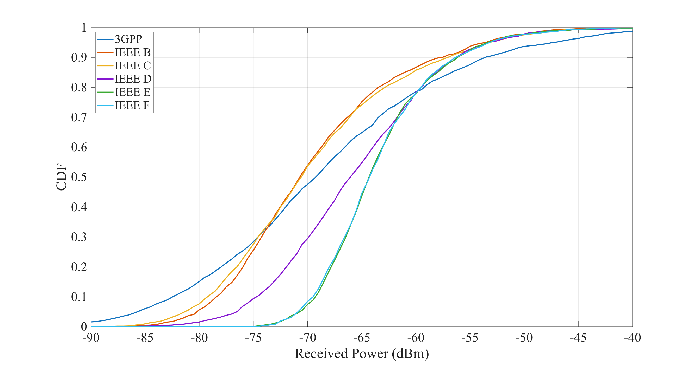
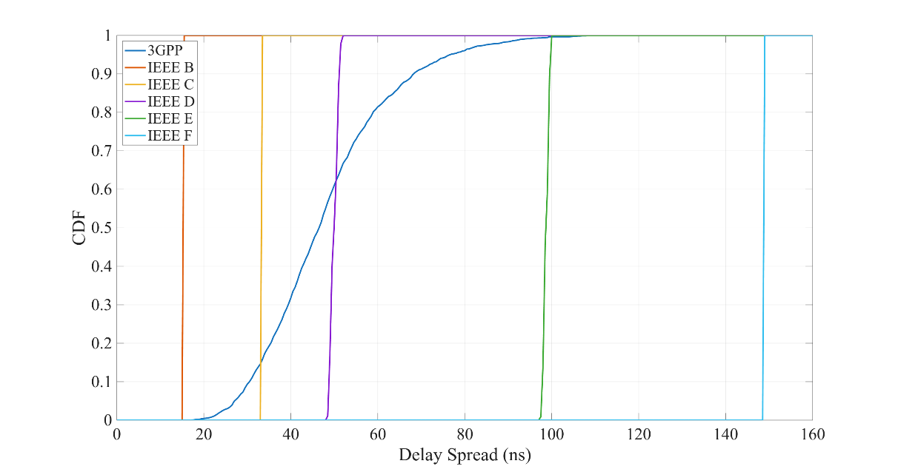
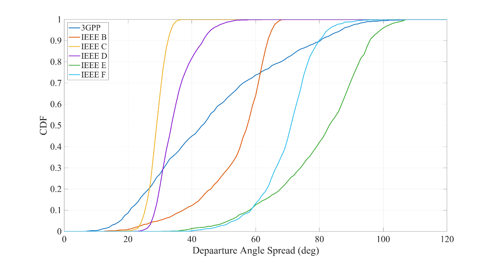
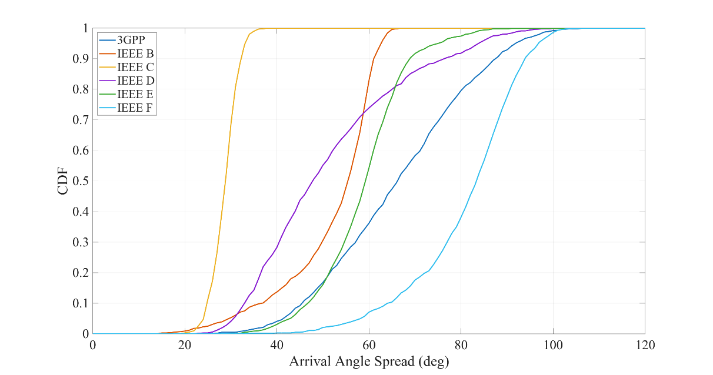
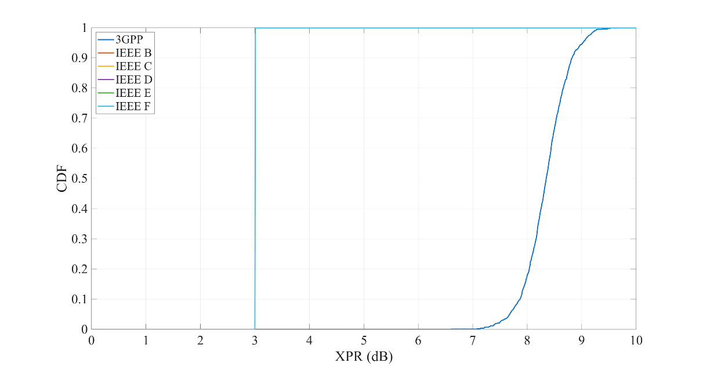
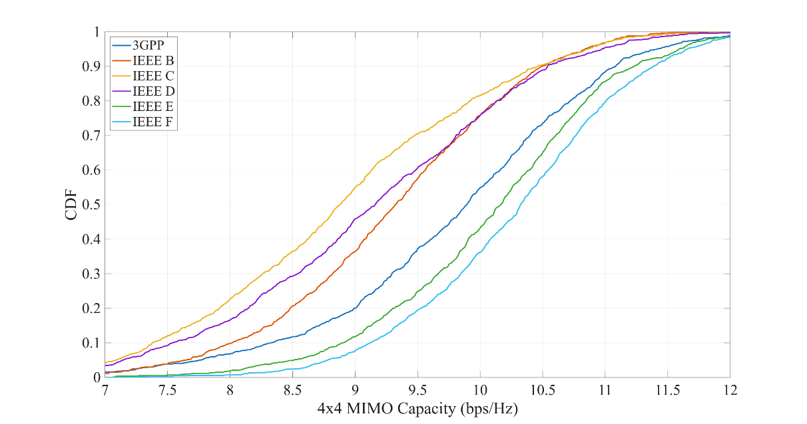

# Abstract

This report compares indoor non-line-of-sight (NLOS) channel-models: the IEEE TGn indoor model set (B-F) and the 3GPP indoor office model by extracting key performance indicators (KPIs) directly from generated channel coefficients under a common 2.4 GHz indoor scenario with random station drops within 20 m of a centrally placed access point. The evaluated KPIs include received power, RMS delay spread, azimuth angular spreads at transmitter and receiver, cross-polarization ratio, and 4×4 narrowband MIMO capacity using 4-element half-wavelength ULAs at 10 dB SNR. Results show that the IEEE models behave as scenario-specific archetypes with largely model-fixed delay spreads and angular statistics shaped by randomized subpath generation, whereas the 3GPP approach draws large-scale parameters from scenario distributions, leading to broader KPI distributions and stronger link-to-link variability. The study highlights how these different modeling philosophies translate into distinct channel statistics and provides a basis for selecting or tuning indoor models for simulations, with future work proposed to benchmark both approaches against ray-tracing results.

# 1 Introduction

Reliable indoor performance evaluation depends strongly on the underlying channel model. While both the IEEE TGn indoor channel models and the 3GPP TR 38.901 Indoor (InH) model are widely used, they originate from different standardization contexts and follow different modeling philosophies. This report provides a side-by-side KPI-based comparison between the IEEE TGn indoor channel models [[1]](#ref_TGn) (implemented following the modern framework in [[2]](#ref_2318_cpp) and released with Quadriga-Lib [[5]](#ref_quadriga_lib)) and the 3GPP InH NLOS model from TR 38.901 [[3]](#ref_3gpp38901) (generated with QuaDRiGa [[4]](#ref_quadriga)). To ensure a fair and implementation-agnostic comparison, all KPIs are extracted directly from the generated channel coefficients (i.e., from the resulting tap/ray parameters and complex coefficients), rather than relying on model-internal parameters.

A second motivation is validation: by reproducing the qualitative and quantitative behaviors expected from the TGn model family and contrasting them against the 3GPP reference model, the study further supports and cross-checks the IEEE indoor model implementation described in [[2]](#ref_2318_cpp) and distributed in [[5]](#ref_quadriga_lib). Finally, the report highlights how the two frameworks differ in practice: TGn's scenario-specific model selection versus 38.901's scenario-level stochastic parameter draws, and how these choices shape the resulting channel statistics.

Outlook on results: The comparison shows that 3GPP InH NLOS tends to produce broader distributions for several KPIs due to its scenario-dependent large-scale parameter generation, whereas the IEEE TGn family provides more scenario-specific behavior (e.g., fixed delay confirms the selected model class) with variability mainly stemming from randomized subpath generation. These structural differences are visible across delay spread, angular spreads, polarization behavior, and derived MIMO metrics.

# 2 Simulation Scenario

The comparison in this report covers one 3GPP indoor model and a set of IEEE TGn indoor models, all evaluated under NLOS-only conditions:

- 3GPP NR Indoor NLOS, as specified in 3GPP TR 38.901.
- IEEE TGn channel models (tapped-delay-line):
  - Model B: residential homes, NLOS, 15 ns RMS delay spread
  - Model C: small offices, NLOS, 30 ns RMS delay spread
  - Model D: typical office environment, NLOS, 50 ns RMS delay spread
  - Model E: large open space / office environments, NLOS, 100 ns RMS delay spread
  - Model F: large open space (indoor/outdoor), NLOS, 150 ns RMS delay spread

**Scenario definition and deployment geometry**

All simulations use a common indoor NLOS scenario to enable a like-for-like comparison across model families.

- **Topology**: single-cell indoor deployment with one AP and multiple STA locations.
- **AP placement**: one access point (AP) located at the center of the scenario.
- **STA placement**: 1000 independent STA drops uniform-in-area within 20 m from the AP. STAs are placed at random azimuth angles around the AP.
- **Heights / dimensionality**: all node heights are set to 0 (AP and STAs). This yields a consistent 2D layout matching the IEEE TGn indoor models; the 3GPP model is inherently 3D, but is evaluated using the same planar geometry for comparability.
- **Carrier frequency**: 2.4 GHz.
- **Propagation condition**: NLOS only. To remove distance-dependent LOS/NLOS transitions and ensure consistent conditions across all drops, the K-factor is fixed to 0 (KF = 0) for every link, independent of AP-STA distance.
- **Path loss**: used as defined by each model; no manual adjustment of the path-loss model or any breakpoint distance is performed.
- **Shadow fading**: enabled and applied as defined by the model parameters (i.e., model-native SF settings are used). The SF is re-drawn per STA drop.

**Channel generation assumptions**

- IEEE TGn models: channels are generated as tapped-delay-line impulse responses with a tap spacing of 10 ns and a reference bandwidth of 40 MHz (consistent with the 10 ns spacing used for TGn channel generation in this study)
- 3GPP TR 38.901 Indoor NLOS: channels are generated using the full stochastic cluster model of TR 38.901 (i.e., no CDL profile is used), evaluated at 2.4 GHz, and restricted to NLOS-only operation as described above.

**KPIs evaluated**

The following KPIs are evaluated for the generated channels. (Details of the metric extraction and post-processing are provided in Section 3; this section only defines what is assessed.)

1.  Received power for 0 dBm transmit power using isotropic SISO, V-polarized antennas, used primarily to compare the impact of path-loss and shadow-fading behavior across models.
2.  RMS delay spread
3.  Angular spreads: Departure angular spread at the AP, Arrival angular spread at the STA
4.  Cross-polarization ratio (XPR)
5.  4×4 MIMO single-link capacity for one AP-STA link at 10 dB SNR, using ULA antennas with 0.5 λ spacing.

# 3 Results

## 3.1 Received power

Figure 3.1 shows the CDF of the wideband received power (0 dBm transmit power), computed as the sum of the powers of all channel coefficients. With isotropic, V-polarized antennas at both AP and STA, this KPI is dominated by the large-scale attenuation applied by each model (path loss + model-defined shadow fading). The detailed multipath structure (e.g., the different RMS delay spreads of TGn B-F) has essentially no direct impact on this metric, because summing tap/ray powers collapses the channel to its total average gain.

**Figure 3.1:** *Received power relative to 0 dBm transmit power*

The median received powers are:

- 3GPP InH NLOS: −68.99 dBm
- IEEE B: −70.44 dBm
- IEEE C: −70.41 dBm
- IEEE D: −65.84 dBm
- IEEE E: −64.04 dBm
- IEEE F: −64.00 dBm

The IEEE models [[1]](#ref_TGn) use a dual-slope path-loss (PL) model, where up to a breakpoint distance $d_\mathrm{BP}$, the PL behaves LOS-like with an PL exponent of 2 and after $d_\mathrm{BP}$ the exponent increases to 3.5 (NLOS region). Hence, for the 20 meters indoor-scenario, some of the STAs will be places in the "near" region ($d < d_\mathrm{BP}$) and others in the "far" region ($d > d_\mathrm{BP}$). This results in three clear groupings:

- *Lowest power*: IEEE models B and C are almost identical (median difference \~0.03 dB), and their CDFs overlap tightly. This indicates that, under the chosen geometry and frequency, their large-scale loss and shadowing statistics are effectively the same, so the difference between B and C mainly shows up in other KPIs (e.g., delay spread), not in total received power. With a breakpoint distance of 5 meters, most of the scenario is in the "far" region, hence, these models exhibit significantly less power.

- *High power*: IEEE models D/E/F (especially E/F) are shifted to the right relative to 3GPP and B/C, meaning they predict less median attenuation for the same drop geometry: D is about +3.15 dB higher than 3GPP; E/F are about +5 dB higher than 3GPP. E and F are nearly identical (median difference \~0.04 dB), and their CDFs overlap strongly. This is due to the "near" region (up to $d_\mathrm{BP}$) in those models, which is up to 10 meters in model D, 20 meters in model E, and 30 meters in model F. Hence, models E and F are entirely in the "near" region (PL exponent of 2), D is mixed. The tight overlap of E vs. F (despite different RMS delay spreads) also reinforces the key point: for this KPI, the delay profile differences do not matter, what matters is that E/F share very similar path-loss + shadowing behavior, yielding nearly the same total received power distribution.

- *3GPP InH NLOS*: The 3GPP median (−68.99 dBm) is about +1.4 dB higher than B/C (more power). However, the 3GPP CDF is noticeably less steep, i.e., it shows larger spread. In practice this means that around the median, 3GPP predicts slightly higher received power than B/C, and in the low-power tail (outage region), 3GPP tends to produce more very weak realizations than B/C (the curve extends further left and rises earlier). That shape difference is exactly what to expect. Compared to TGn B/C, the 3GPP indoor NLOS setup, as configured, has stronger variability (e.g., a larger effective shadow-fading standard deviation and/or stronger distance-slope within the 0-20 m range).

Beyond the median shifts, the slope of each CDF is important:

- Steeper CDFs (E/F, then D): indicate less dispersion in received power across drops (i.e., more consistent large-scale gain).

- Shallower CDF (3GPP): indicates more dispersion, with both a stronger low-power tail and a longer high-power tail. This matters if you report outage-type metrics (e.g., 5th percentile power), not just medians.

## 3.2 Delay Spread

The RMS delay spread is computed from the multipath powers and delays of the generated channel coefficients. For a discrete set of components with excess delays $\tau_i$ and powers $P_i$ (with $P_i = |h_i|^2$ for complex coefficient $h_i$), the power-weighted mean excess delay and RMS delay spread are

$$\bar{\tau} = \frac{\sum_iP_i\,\tau_i}{\sum_iP_i}, \quad\quad \tau_\mathrm{rms} = \sqrt{\frac{\sum_iP_i\,(\tau_i - \bar{\tau})^2}{\sum_iP_i}}.$$

Delays are treated as excess delays, i.e., referenced to the first arriving component,

$$\tau_i = \tau_i - \min_j\tau_j,$$

so that $\tau_\mathrm{rms}$ captures the temporal dispersion around the earliest arrival.

**Figure 3.2:** *RMS Delay Spread distributions*

**IEEE TGn models (B-F):** The delay-spread CDFs collapse to nearly vertical steps at the model-specific values (15 ns, 30 ns, 50 ns, 100 ns, 150 ns). This reflects the structure of the TGn tapped-delay-line models: the tap delay and power templates are defined such that each model type produces a fixed RMS delay spread, essentially independent of the AP-STA user position in the considered layout. This remains true even though user locations vary within 20 m, because TGn DS does not depend on geometry.

**3GPP TR 38.901 Indoor NLOS:** In contrast, the 3GPP curve is continuous and exhibits substantial spread. This is expected because TR 38.901 treats delay spread as a random large-scale parameter: for each link, $\tau_\mathrm{rms}$ is first drawn from a scenario-dependent distribution (Indoor NLOS) and is then used to parameterize the subsequent generation of cluster/ray delays and channel coefficients. Therefore, even under identical geometry constraints and an NLOS-only setting, 38.901 produces a distribution of delay spreads across links, rather than a single deterministic value.

For TGn B-F, delay dispersion is environment-class dependent (B/C/D/E/F), but not user-location dependent. This makes the frequency selectivity of the channel essentially a fixed property of the chosen TGn model. For 3GPP, frequency selectivity varies from link to link, because the delay spread itself varies. As a consequence, KPIs that are sensitive to frequency selectivity (e.g., equalization difficulty, ISI resilience, and, depending on how channels are sampled, some MIMO capacity behavior) may exhibit broader variability under 3GPP than under TGn, even when average path loss is similar.

## 3.3 Azimuth Angle Spreads

This section discusses the azimuth spread of departure (ASD) at the AP and the azimuth spread of arrival (ASA) at the STA. Both metrics are extracted from the generated channel coefficients using a power-weighted circular RMS definition. Results are shown as CDFs in Figure 3.3 (ASD) and Figure 3.4 (ASA).

**KPI extraction method and impact of the antenna processing**

Angular spreads are computed after applying a specific azimuth sampling / receive-processing definition. First, an array antenna with 120 elements is generated where each element covers a 3° section of the entire azimuth range. The beams point in the directions: ($\phi_k = -177°, -174°, \ldots , 180°$). Then, the path-powers are summed up for all paths, effectively generating a sampling of the power-angular spectrum at 3° resolution. The angular spread is computed using a circular, power-weighted mean and wrapped RMS:

$$w_k = \frac{p_k}{\sum_mp_m},\quad\quad\mu = \mathrm{atan2}\left( \sum_k w_k\sin(\phi_k),\ \sum_k w_k\cos(\phi_k) \right)$$

$$d_k = \left( (\phi_k - \mu + \pi)\ \mathrm{mod}\ 2\pi \right) - \pi,\quad\quad\sigma_{\phi} = \sqrt{\sum_kw_k,d_k^2}$$

where ($k = 1 \ldots 120$) are the azimuth grid angles and ($p_k$) are the corresponding power weights. This definition matters because it (i) treats azimuth as a circular quantity and (ii) measures dispersion around the power-weighted mean direction, which is important when significant power exists near the (180°) wrap-around.

The antenna processing provides a consistent mapping of the generated multipath angles onto the azimuth grid used for KPI extraction. Therefore, the reported ASD/ASA values should be interpreted as effective azimuth spreads under this specific azimuth sampling/weighting setup, rather than "raw" model-internal angular spread parameters.

**Model behavior: TGn (template + randomized subpaths) vs. 3GPP (random LSP draw)**

A key structural similarity between the two model families is that the angular spreads are model/scenario dependent but include randomness:

- **IEEE TGn models**: Each path is augmented with randomized subpaths to approximate the Laplacian power-angle profile. The target behavior is determined by the chosen TGn model (B-F), but because subpaths are generated randomly per realization/STA, the resulting ASD/ASA exhibit a distribution rather than a single deterministic value. This explains why the TGn curves in Figure 3.3 and Figure 3.4 are not vertical steps (unlike delay spread), but still show clear model-dependent shifts.

- **3GPP TR 38.901**: ASD and ASA are treated as large-scale parameters drawn from scenario-dependent distributions. The drawn spreads are then used to generate and map cluster/ray angles, analogous to the way DS is handled. Consequently, 3GPP naturally produces broad CDFs, reflecting link-to-link variability in the large-scale angular statistics.

**Figure 3.3:** *ASD results (AP departure spread)*

**ASD results (AP departure spread)** - **Figure 3.3**

- Large-open-space TGn models produce the widest departure spreads. TGn E and F yield the largest ASD medians (83.58° and 71.54°), i.e., the broadest departure directions at the AP. This is consistent with these models representing environments with many significant scatterers distributed across a wide azimuth range, leading to high departure-side angular richness.

- Small/structured environments constrain departure angles. TGn C and D show smaller ASD medians (29.43° and 34.10°), implying that most energy departs the AP within a comparatively narrow azimuth sector. This is typical of office-like settings where dominant scatterers and corridors can reduce the spread seen at the transmitter side.

- IEEE B is wider than 3GPP at the AP; 3GPP sits in the mid-range. The 3GPP median (43.78°) lies between the "narrow" TGn C/D and the "wide" TGn B/E/F. In contrast, TGn B is noticeably wider (57.85°) than 3GPP. Interpreted physically, the B implementation (with its randomized subpaths) produces stronger departure-side angular dispersion than 38.901 InH NLOS under the same geometry constraints.

- CDF shapes reflect different sources of randomness. The TGn models show model-specific but relatively compact distributions (randomness mainly from subpath generation), whereas 3GPP shows a broader distribution because ASD is drawn as a scenario-dependent large-scale parameter before angle generation.

Overall, ASD differentiates the models strongly: E/F are clearly "high-spread" on departure, C/D are "low-spread", and 3GPP occupies a moderate position.

**Figure 3.4:** *ASA results (STA arrival spread)*

**ASA results (STA arrival spread)** - **Figure 3.4**

- Arrival spreads are generally larger than departure spreads for 3GPP. For 3GPP, the median increases from ASD 43.78° to ASA 66.73°, suggesting that, under the configured InH NLOS model, the receiver side experiences a richer mixture of arrival directions than the transmitter side. This is a plausible outcome in indoor deployments where local scattering around the user equipment can increase arrival-side dispersion.

- TGn F produces the widest arrival spreads. TGn F shows the largest median ASA (83.79°) and a CDF shifted furthest to the right, indicating very strong arrival-side angular diversity. This aligns with model F representing large open spaces (indoor/outdoor), where multipath can arrive from a wide set of directions at the receiver.

- TGn C again yields the narrowest spread. TGn C remains the most confined case at the STA as well (median 29.28°), indicating consistently limited angular richness for both departure and arrival. This is consistent with small-office conditions dominated by a limited set of scattering directions.

- Ranking differs between ASD and ASA for some models. Compared to ASD, the relative ordering changes for some models (e.g., 3GPP becomes higher than B/D/E on ASA, while it was lower than B on ASD). This highlights that transmitter and receiver-side scattering characteristics can be asymmetric even in a symmetric geometry, because the model-specific angle generation mechanisms and the effective weighting used for the KPI extraction can differ between departure and arrival.

## 3.4 Cross-polarization ratio (XPR)

This section discusses the cross-polarization ratio (XPR) obtained from the polarization-resolved channel coefficients using ideal isotropic cross-polarized (V/H) antennas at both the AP and the STA. With this antenna assumption, the per-path complex MIMO coefficient matrix directly represents the Jones matrix of each multipath component (MPC), i.e., it describes how vertical and horizontal field components couple from transmitter to receiver.

**XPR calculation approach**

For each MPC (path) (p), let the Jones matrix be

$$\mathbf{M}_{p} = \begin{bmatrix}
m_{vv,p} & m_{vh,p} \\
m_{hv,p} & m_{hh,p}
\end{bmatrix},$$

where $m_{vv,p}$ and $m_{hh,p}$ are the **co-polar** components $V \rightarrow V$ and $H \rightarrow H$, and $m_{vh,p}$, $m_{hv,p}$ are the **cross-polar** components $H \rightarrow V$ and $V \rightarrow H$. A per-path XPR is formed by comparing co-polar and cross-polar power ratios. In this study, the per-path XPR is defined as the average of four ratios:

$$\mathrm{XPR}_{p} = \frac{1}{4}\left( \frac{|m_{vv,p}|^2}{|m_{hv,p}|^2} + \frac{|m_{vv,p}|^2}{|m_{vh,p}|^2} + \frac{|m_{hh,p}|^2}{|m_{vh,p}|^2} + \frac{|m_{hh,p}|^2}{|m_{hv,p}|^2} \right).$$

To obtain a single link-level XPR, per-path XPR values are combined using power weighting based on the total power of each Jones matrix:

$$P_{p} = \sum_{i = 1}^2{\sum_{j = 1}^2|}m_{ij,p}|^2,\quad\quad w_{p} = \frac{P_{p}}{\sum_{q}P_{q}},\quad\quad \mathrm{XPR} = \sum_{p}w_{p},\mathrm{XPR}_{p}.$$

Finally, XPR is reported in dB as $\mathrm{XPR}_\mathrm{dB} = 10 \log_{10}(\mathrm{XPR}).$. This procedure ensures that MPCs contributing more energy to the received signal have correspondingly larger influence on the reported XPR.

**Figure 3.5:** *Cross-polarization ratio*

The IEEE TGn models do not provide an antenna-independent polarization/XPR mechanism in their baseline form. In the implementation used here, an explicit XPR mapping is added, i.e., polarization coupling is directly imposed on the coefficients. For NLOS, TGn guidance suggests an XPR of approximately 3 dB (co-polar power about twice the cross-polar power). In contrast, the 3GPP TR 38.901 Indoor NLOS model assumes significantly higher XPR, with typical values around 8.3 dB, implying substantially weaker cross-polar leakage.

These assumptions are clearly reflected in Figure 3.5, where the IEEE TGn curves collapse to a near-deterministic value around 3 dB. The almost vertical step indicates that XPR is effectively fixed by the imposed TGn XPR parameter and shows negligible link-to-link variability under the adopted mapping. The 3GPP curve is centered around 8-9 dB and exhibits a visible spread. This is consistent with 3GPP treating XPR (or, equivalently, polarization coupling) as a random variable with scenario-dependent statistics, leading to a distribution across STA drops rather than a single value.

The consequence of the different XPR levels is straightforward:

- Higher XPR (3GPP) means better polarization isolation: cross-polar components are weaker relative to co-polar components. For systems that exploit polarization diversity, higher XPR reduces unintended mixing between V and H components and tends to produce a channel that is "more separable" across polarizations.

- Lower XPR (TGn at 3 dB) implies stronger cross-polar leakage, i.e., the polarization states are more strongly coupled. This can reduce polarization discrimination and may alter MIMO behavior when polarization is part of the spatial multiplexing strategy.

It is important to note that, because XPR is imposed differently across the two model families in this study (added mapping for TGn vs. scenario-based modeling in 3GPP), the comparison in Figure 3.5 primarily reflects the assumed XPR parameterization rather than an emergent property derived from geometry. In other words, XPR is largely a model-input assumption here, and the results confirm that the coefficient-based extraction reproduces the intended TGn (\~3 dB) versus 3GPP (\~8-9 dB) polarization isolation levels.

## 3.5 4×4 narrowband MIMO capacity

This section evaluates the single-link 4×4 narrowband MIMO capacity at a fixed receive SNR of 10 dB, using the complex channel matrix at the carrier frequency (single frequency bin). Capacity is computed on a normalized channel matrix; therefore differences reflect spatial conditioning rather than path loss. Results are shown as CDFs in Figure 3.6.

**Capacity calculation approach**

For each AP-STA drop, the frequency-domain MIMO channel at the carrier is represented by a complex matrix

$$\mathbf{H} \in \mathbb{C}^{N_r \times N_t},\quad\quad N_r = N_t = 4,$$

obtained as the coherent sum of the MPC coefficients at the carrier frequency (i.e., a narrowband channel). To remove absolute power differences (path loss and shadowing) and focus on spatial properties of the channel is normalized by its average Frobenius norm:

$$\widetilde{\mathbf{H}} = \frac{\mathbf{H}}{\sqrt{\mathbb{E}\left\lbrack \left\| \mathbf{H} \right\|_F^2 \right\rbrack}}.$$

The singular values of the normalized channel are $s_i = \sigma_i(\widetilde{\mathbf{H}}),i = 1,\ldots,min(N_r,N_t),$ and the capacity (equal power allocation across transmit antennas) is computed as

$$C = \sum_{i = 1}^4\log_{2}\left( 1 + \frac{\gamma}{N_t}s_i^2 \right),$$

where $\gamma$ is the linear SNR (here $\gamma = 10$ for 10 dB) and $N_t = 4$.

**Antenna configuration:** Both AP and STA use uniform linear arrays (ULAs) with 4 isotropic elements and half-wavelength spacing. Because the channel is evaluated at a single frequency bin, the metric reflects spatial multiplexing capability rather than frequency selectivity.

**Figure 3.6:** *4x4 MIMO Capacity*

**Results**

- Models E/F provide the highest median capacity. IEEE models E and F achieve the largest median capacities (10.17 and 10.33 bps/Hz) and their CDFs are shifted to the right. This indicates that these channels more frequently support multiple strong spatial eigenmodes (i.e., a better-conditioned $\mathbf{H}$).

- IEEE model C is the most capacity-limited case. IEEE C yields the lowest median (8.89 bps/Hz) and the most left-shifted curve, indicating a higher probability of rank-deficient or highly correlated spatial channels.

- 3GPP InH sits between the "narrow-spread" and "wide-spread" TGn cases. The 3GPP median (9.90 bps/Hz) is higher than IEEE B/C/D but lower than IEEE E/F. Its distribution is also relatively broad, consistent with 3GPP drawing large-scale parameters (including angular statistics) from scenario-dependent distributions, which translates into link-to-link variability of spatial conditioning.

- The overall spread of the capacity CDFs is moderate. Across models, the medians differ by roughly 1.4 bps/Hz between the lowest (IEEE C) and highest (IEEE F). Given that the channel is normalized to remove link budget effects, these differences mainly reflect spatial structure rather than received power.

**Relation to angular spreads (ASD/ASA):** The ranking of capacities aligns well with the previously observed azimuth angular spreads:

- Models with larger azimuth spreads tend to yield higher MIMO capacity, because wider angular support reduces spatial correlation in ULAs and increases the likelihood of multiple usable eigenmodes.
- Models with small angular spreads tend to produce more correlated array responses, concentrating energy into fewer spatial modes and reducing capacity.

This relation is consistent with the medians:
- IEEE E/F had the largest spreads (high ASD/ASA) and also the highest capacities.
- IEEE C had the smallest spreads (both ASD and ASA near 29°) and also the lowest capacity.
- 3GPP exhibited moderate-to-high spreads and correspondingly intermediate-to-high capacity.

A useful qualitative interpretation is that, for the fixed $\lambda/2$ ULA geometry, the spatial degrees of freedom are largely governed by how many distinct arrival/departure directions with significant power the model generates. Wider ASD/ASA implies richer angular diversity and therefore a better-conditioned $\mathbf{H}$, increasing the sum capacity. Conversely, when scattering is confined to a narrow azimuth sector, the columns/rows of $\mathbf{H}$ become more correlated, the singular values become more unequal, and the capacity decreases. Overall, the narrowband 4×4 capacity results in Figure 3.6 reinforce the angular-spread analysis: the models primarily differ in how much spatial richness they generate under the common indoor NLOS geometry, and this spatial richness directly translates into differences in achievable multiplexing gain at fixed SNR.

# 4 Conclusion

This report compared the 3GPP TR 38.901 Indoor NLOS (InH) model against the IEEE TGn indoor channel models (Models B-F) under a common indoor NLOS simulation setup at 2.4 GHz. KPIs were extracted consistently from the generated channel coefficients only, covering received power, delay dispersion, azimuth angular spreads, polarization behavior (XPR), and narrowband 4×4 MIMO capacity. Across the evaluated KPIs, the IEEE TGn family and 3GPP TR 38.901 InH NLOS differ mainly in how variability is modeled:

- received **power** distributions separate into clear TGn "tiers" (B/C lowest, D intermediate, E/F highest) with 3GPP typically in-between and showing broader spread, reflecting differing large-scale loss/shadowing assumptions;

- **delay spread** is essentially deterministic in TGn (fixed per model: 15/30/50/100/150 ns for B--F) but random and broadly distributed in 3GPP because DS is drawn from a scenario distribution before coefficient generation;

- azimuth **angular spreads** (ASD/ASA) are model-dependent in both families, but TGn variability mainly comes from randomized subpaths around model templates whereas 3GPP produces wider distributions due to large-scale parameter draws, with C/D yielding constrained spreads and E/F the richest;

- **XPR** highlights a strong assumption gap, with TGn NLOS around 3 dB (stronger cross-polar leakage) versus 3GPP around 8--9 dB (better polarization isolation); and

- the 4×4 narrowband **MIMO capacity** (normalized, 10 dB SNR, 4-element ULAs) follows the angular-spread ranking: lowest for IEEE C, highest for IEEE E/F, and 3GPP in the mid-to-high range, confirming that larger ASD/ASA generally translates into better spatial conditioning and higher multiplexing capability.

A consistent theme across KPIs is that 3GPP InH NLOS behaves like a "general-purpose indoor model", whereas the IEEE TGn models behave like a set of "specialized indoor archetypes."

- **3GPP InH** NLOS is designed to cover a broad range of indoor environments with a single scenario definition. This is reflected by broad KPI distributions: delay spread, angular spreads, and polarization behavior vary significantly across links because key large-scale parameters are drawn from scenario-dependent distributions before generating multipath coefficients.

- **IEEE TGn** models represent a family of distinct indoor environments (residential, small office, typical office, large open space, etc.). Many KPI differences are therefore model-selectable by choosing B/C/D/E/F. In particular, the TGn approach makes delay dispersion (and, to a large extent, angular behavior) a more class-dependent property, yielding tighter distributions within each model and clearer separation between models.

Practically, this means:

- If the goal is to represent a specific indoor environment (e.g., residential vs. open office) with characteristic channel statistics, the TGn family offers an intuitive and direct selection mechanism.

- If the goal is to represent indoor deployments in general (and capture variability across many layouts and user locations), 3GPP InH naturally provides that variability through its stochastic large-scale parameter generation.

**Toward fine-grained scenarios within the 3GPP framework**

Although 3GPP InH aims to be broadly representative, the underlying methodology is flexible: since DS, ASD/ASA, shadow fading, and polarization-related parameters are drawn from distributions, it is in principle possible to create more fine-grained "sub-scenarios" within the 3GPP approach by adjusting those distributions and correlation assumptions. For example, scenario variants could be defined that better match:

- Residential homes (smaller spreads, potentially different loss/variability profiles),

- Small offices (more constrained angular spread and moderate DS),

- Large offices / open spaces (larger angular spreads and potentially larger DS).

In other words, 38.901 provides a framework that can be tuned toward multiple indoor "types," whereas TGn provides those "types" directly as discrete model selections.

**Further steps**

A natural next step is to anchor these stochastic-model comparisons against site-specific reference data, i.e. a comparison against ray tracing results for representative indoor layouts (residential, small office, open-plan office, large hall). Such a comparison would make it possible to map ray-traced "realistic" environments onto (i) one of the TGn archetypes or (ii) a tuned 3GPP InH parameter set, and thereby guide the selection of the most appropriate model for a given indoor deployment study.

# References

1.  IEEE 802.11-03/940r4, "TGn Channel Models", Tech. Rep., 2004.\
   <https://mentor.ieee.org/802.11/dcn/03/11-03-0940-04-000n-tgn-channel-models.doc>

2.  IEEE 802.11-25-2318r0, "A modern C++ framework for the IEEE indoor channel models", Tech. Rep., 2025.\
   <https://mentor.ieee.org/802.11/dcn/25/11-25-2318-00-0ucm-a-modern-c-framework-for-the-ieee-indoor-channel-models.docx>

3.  3GPP TR 38.901 v19.1.0 "Study on channel model for frequencies from 0.5 to 100 GHz", Tech. Rep., 2025.\
   <https://www.3gpp.org/ftp/Specs/archive/38_series/38.901/38901-j10.zip>

4.  S. Jaeckel, L. Raschkowski, K. Börner, L. Thiele, F. Burkhardt and E. Eberlein, "QuaDRiGa - Quasi Deterministic Radio Channel Generator", Fraunhofer Heinrich Hertz Institute, Tech. Rep. v2.8.1, 2023\
   <https://quadriga-channel-model.de>

5.  Quadriga-Lib: C++/MEX/Python Utility library for radio channel modelling and simulations\
   <http://quadriga-lib.org>
