# Abstract

This report extracts 3GPP TR 38.901-compliant large-scale channel parameters from deterministic ray-tracing simulations of a heritage office building in Hamburg, Germany, at 2.45 GHz and 5.5 GHz. A ray-tracing engine was used to obtain channel impulse responses for 58 access points and over 26,000 receiver positions. The full parameter set - path loss, delay spread, K-factor, angular spreads, and cross-polarization ratio - is fitted to the 3GPP framework and validated by stochastic re-simulation with QuaDRiGa. The re-simulated distributions closely reproduce the ray-tracing reference for path loss, delay spread, and azimuth angular spreads, while a parallel comparison with IEEE 802.11 models B−F reveals systematic mismatches in path loss, delay spread, and K-factor variability that the fixed-profile IEEE architecture cannot accommodate. The results demonstrate that ray tracing can systematically produce scenario-specific 3GPP parameter tables, offering a pathway to extend standardized channel models to environments not covered by existing measurement campaigns.

# 1 Introduction

Stochastic geometry-based channel models are extensively used for link- and system-level evaluation in modern wireless standards. The 3rd Generation Partnership Project (3GPP) TR 38.901 model [[2]](#ref_3gpp38901) and the IEEE 802.11 indoor channel models [[3]](#ref_2318_cpp) both specify statistical distributions for large- and small-scale parameters – path loss, delay spread, K-factor, and angular spreads – from which multipath channels are synthesized. The parameter tables underpinning these models are derived from measurement campaigns conducted in representative environments. This measurement-driven approach limits applicability: 3GPP TR 38.901 defines only a single Indoor Hotspot-Office (InH-Office) scenario, and the IEEE 802.11 family provides a fixed set of models (B through F) mapped to progressively larger indoor spaces. Environments that fall outside these canonical categories, or that differ in construction materials, layout, or operating frequency, cannot be accurately represented without additional parameter tables.

Ray tracing offers a complementary approach to channel characterization. By solving electromagnetic propagation deterministically on a detailed 3D building model, a ray-tracing engine produces site-specific channel impulse responses from which the same large-scale parameters can be extracted using identical statistical procedures. The resulting parameter sets are fully compatible with the 3GPP modeling framework and can be loaded directly into stochastic channel generators such as QuaDRiGa [[4]](#ref_quadriga) for Monte Carlo evaluation. This workflow – scene modeling, deterministic simulation, parameter extraction, stochastic re-simulation – decouples the channel model from the measurement campaign and makes it possible to generate scenario-specific parameter tables for arbitrary indoor (and outdoor) environments. In the context of IEEE 802.11, where the existing model family covers only a small number of generic indoor layouts, ray-tracing-based parameterization could enable future releases to incorporate scenario-specific channel descriptions tailored to particular deployment types (e.g., residential, factory, large open-plan office) without requiring a new measurement campaign for each.

A previous contribution [[5]](#ref_0211_ccomparison) compared the IEEE 802.11 and 3GPP indoor channel models at the architectural level, identifying structural differences in their treatment of delay and angular statistics, frequency dependence, and MIMO properties. The present report builds on that comparison by demonstrating how the 3GPP modeling framework can be parameterized from ray-tracing data for a specific indoor environment and by evaluating the resulting model against both the deterministic simulation and the IEEE reference models.

The simulation scenario targets the third floor of the Palmspeicher in Hamburg – a converted heritage warehouse now used as a modern office. The building's thick brick masonry, reinforced concrete, and steel structural members create propagation conditions that differ markedly from the lightweight-partition environments assumed in both the 3GPP InH-Office tables and the IEEE models, making it a useful test case for scenario-specific parameterization. The Quadriga Ray-Tracing (QRT) engine [[1]](#ref_quadriga_lib) is used to simulate propagation at 2.45 GHz and 5.5 GHz from 58 access points (APs) to a dense receiver grid of over 26,000 positions. From the resulting path data, the complete 3GPP large-scale parameter set – path-loss coefficients, delay spread, K-factor, azimuth and elevation angular spreads, cross-polarization ratio (XPR), decorrelation distances, and inter-parameter cross-correlations – is extracted and formatted as a single mixed-LOS/NLOS parameter table. The extracted parameters are then validated by re-simulating the scenario stochastically with QuaDRiGa and comparing the empirical cumulative distribution functions (CDFs) against the ray-tracing reference. Simultaneously, the IEEE 802.11 models B−F are evaluated using the same AP positions.

The remainder of the report is organized as follows. Section 2 describes the simulation scenario, including the 3D building model, material assignment, and transmitter/receiver configuration. Section 3 presents the QRT ray-tracing engine and its propagation modeling capabilities. Section 4 details the three-stage parameter extraction pipeline: per-link computation, data masking, and statistical fitting. Section 5 reports the results for each parameter - path loss, delay spread, K-factor, angular spreads, and cross-polarization ratio - comparing the ray-tracing output, the 3GPP re-simulation, the 3GPP TR 38.901 reference tables, and the IEEE 802.11 models. Section 6 concludes with a summary of findings, limitations, and an outlook on future work.

# 2 Simulation Scenario

The simulation scenario targets the third floor of the *Palmspeicher* in Hamburg, Germany - a converted heritage warehouse that now serves as a modern office building. This environment maps to the **3GPP InH-Office** scenario defined in 3GPP TR 38.901, which characterizes indoor propagation in open-plan and mixed-use office spaces. However, the Palmspeicher exhibits several features that distinguish it from the idealized InH-Office model: the heritage masonry envelope with thick brick exterior walls, a mixture of original load-bearing concrete and lightweight drywall partitions, large glass elements, and steel structural members all create a richer material composition than the simplified geometries assumed by the 3GPP stochastic model. In addition, the floor plan combines enclosed single offices, open-plan work areas, corridors, stairwells, and common spaces, producing a heterogeneous propagation environment with both strong line-of-sight (LOS) corridors and heavily obstructed non-line-of-sight (NLOS) regions.

## 2.1 3D Environment Model

The 3D scenario was modeled in Blender 5.0 as a high-resolution building geometry comprising approximately 220,000 faces. The model captures all architecturally and electromagnetically relevant structures: corridors, individual offices, open-plan areas, stairwells, windows, doors, furniture, and load-bearing elements are represented with geometric fidelity. Figure 1 shows an exterior perspective of the complete building model; Figure 2 provides a top-down view of the third-floor interior with the roof removed, illustrating the room layout and furnishing detail.

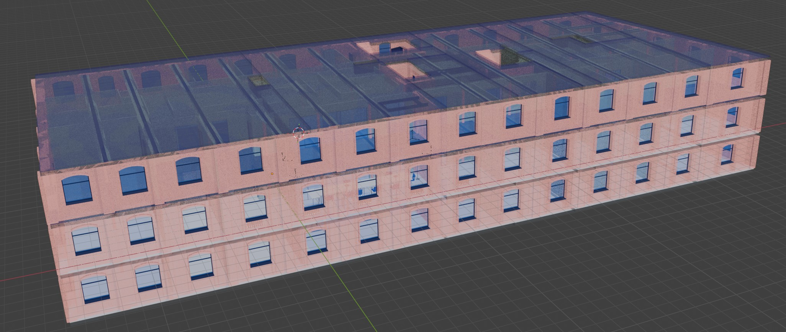

**Figure 1:** *Exterior 3D view of the Palmspeicher Hamburg building model in Blender, showing the multi-storey heritage masonry facade with regularly spaced windows.*

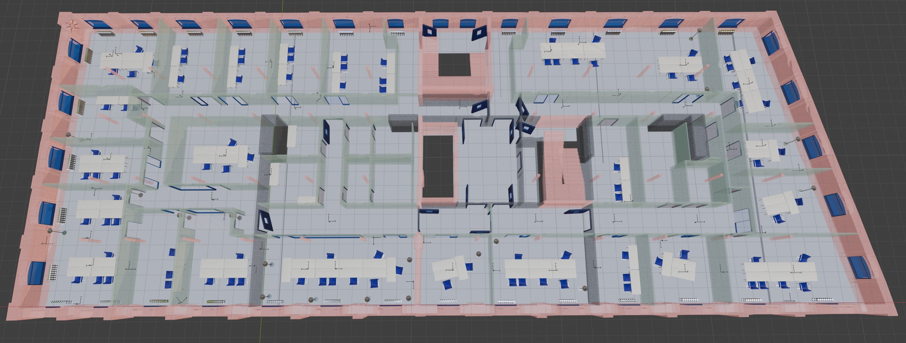

**Figure 2:** *Top-down interior view of the third floor, revealing the office layout including enclosed rooms, open-plan areas, corridors, stairwells, furniture, and glass partitions.*

The floors immediately above and below the target floor are included in the model to capture vertical coupling through ceilings, shafts, and stairwells. Fire doors are modeled in their default open state but can be toggled to a closed configuration to simulate different building operating conditions.

## 2.2 Material Assignment

Each object in the scene is assigned a material whose electromagnetic properties follow the ITU-R P.2040-3 standard ("Effects of building materials and structures on radiowave propagation above about 100 MHz"). The frequency-dependent relative permittivity and conductivity are computed as

$$\varepsilon_r = a \cdot f_\mathrm{GHz}^b, \quad\quad \sigma = c \cdot f_\mathrm{GHz}^d \quad [\text{S/m}],$$

where $f_\mathrm{GHz}$ is the carrier frequency in GHz and *a*, *b*, *c*, *d* are per-material constants tabulated in ITU-R P.2040-3 [[6]](#ref_itur_2040). Table 1 lists the nine material classes used in the simulation together with their computed parameters at the two carrier frequencies of interest. Material labels follow the naming convention of NVIDIA Sionna [[7]](#ref_nvidia_sionna); the QRT engine reads these tags to assign the correct propagation properties during ray tracing.

**Table 1:** *Material parameters at the two simulation carrier frequencies, derived from ITU-R P.2040-3.*

| Material         | Usage                                      | $ε_r$ (2.45 GHz) | $\sigma$ [S/m] (2.45 GHz) | $ε_r$ (5.5 GHz) | $\sigma$ [S/m] (5.5 GHz) |
| ---------------- | ------------------------------------------ | -------------- | ------------------ | ------------- | ----------------- |
| itu_brick        | Heritage masonry walls, stairwells         | 3.91           | 0.0275             | 3.91          | 0.0313            |
| itu_concrete     | Floors, load-bearing walls                 | 5.24           | 0.0931             | 5.24          | 0.1753            |
| itu_chipboard    | Raised-floor substructure                  | 2.58           | 0.0437             | 2.58          | 0.0820            |
| itu_glass        | Glass partitions, glass doors, windows     | 6.31           | 0.0120             | 6.31          | 0.0353            |
| itu_metal        | Steel beams, fire doors, radiators, frames | conductor      | 10⁷                | conductor     | 10⁷               |
| itu_plasterboard | Drywall partitions, suspended ceilings     | 2.73           | 0.0197             | 2.73          | 0.0422            |
| itu_wood         | Furniture, interior fittings               | 1.99           | 0.0123             | 1.99          | 0.0292            |
| plastic          | Furniture, interior fittings               | 2.44           | 0.0001             | 2.44          | 0.0001            |
| textiles         | Furniture, interior fittings               | 1.50           | 0.0001             | 1.50          | 0.0001            |

The frequency dependence is most pronounced for concrete ($\sigma$ nearly doubles from 2.45 to 5.5 GHz) and glass ($\sigma$ roughly triples), while the permittivity of all materials is effectively constant across this band because the exponent $b$ is zero for each material class in Table 1. Metal elements are modeled as perfect electric conductors ($\sigma = 10^7$ S/m).

## 2.3 Transmitter and Receiver Configuration

A total of 58 access points (APs) are deployed across the floor to cover a wide range of plausible deployment options. The APs are distributed among three mounting categories: 15 ceiling-mounted units at 2.35 m height, 15 table-mounted units at 0.75 m height, and 28 wall-mounted units at 1.5 m height. All APs and stations (STAs) use a perfect cross-polarized isotropic antenna pattern with 0 dBi gain.

The receiver locations are arranged on a regular planar grid at a height of 0.85 m above the floor, spanning the full 54 m × 19.3 m footprint of the office floor. The grid comprises 270 points along the x-axis and 97 points along the y-axis with a uniform spacing of 0.2 m, yielding 26,190 evaluation positions in total. This dense spatial sampling supports the extraction of continuous CDF statistics for each 3GPP large-scale parameter.

## 2.4 Simulation Parameters

Table 2 summarizes the key simulation settings used for the ray-tracing campaign.

**Table 2:** *Summary of simulation parameters.*

| Parameter                | Value                                         |
| ------------------------ | --------------------------------------------- |
| Scenario area            | 54 m × 19.3 m (entire office floor)           |
| Carrier frequencies      | 2.45 GHz, 5.5 GHz                             |
| Number of APs            | 58 (15 ceiling, 15 table, 28 wall)            |
| AP/STA antenna           | Perfect cross-polarized, 0 dBi, isotropic     |
| Receiver grid            | 270 × 97 points, 0.2 m spacing, 0.85 m height |
| Total receiver locations | 26,190                                        |
| Initial beams            | 1,000,000                                     |
| Maximum reflections      | 6                                             |
| Maximum transmissions    | 10                                            |
| Diffraction model        | 3D knife-edge (LOS path)                      |
| Ray-tracing engine       | Quadriga Ray-Tracing (QRT)                    |

# 3 Ray Tracing Engine Overview

The channel parameters reported in this study are extracted from site-specific simulations carried out with the **Quadriga Ray-Tracing (QRT)** engine, developed by airpuls GmbH ([airpuls.de](https://airpuls.de)). QRT is a high-performance, deterministic propagation solver designed for accurate radio-network planning in complex indoor and campus environments at frequencies from 1 GHz to millimeter-wave bands. Its architecture provides the physical path data – delays, angles, polarimetric transfer matrices, and power levels – from which the 3GPP channel parameters (path loss, delay spread, K-factor, and angular spreads) are derived.

**Beam-Tracing Core.** Unlike classical ray launchers that trace infinitesimally thin rays, QRT employs a beam-tracing formulation in which each beam is represented as a center (spine) ray plus a triangular footprint that expands with propagation distance. Initial beams are generated by tessellating the unit sphere via geodesic subdivision of an icosahedron, providing uniform angular sampling from the transmitter (TX). Each beam evolves through specular reflection and transmission, with its footprint updated at every surface interaction using per-vertex kinematics. An adaptive subdivision strategy increases the number of tracked beams when the propagation path length grows, maintaining a bounded footprint size. This approach captures geometric spreading and penumbra effects naturally through footprint growth, avoids the aliasing and sampling artifacts inherent in dense ray launching, and scales efficiently to the large receiver (RX) sets required for 3GPP-style spatial statistics.

**Material Interaction and Volumetric Propagation.** QRT traces beams through volumetric objects with their true wall thicknesses, rather than approximating walls as zero-thickness slabs (the thin-slab approximation is used, for example, by Sionna RT [[7]](#ref_nvidia_sionna)). A robust first-bounce/second-bounce (FBS/SBS) state machine classifies entry and exit events at each material boundary, handling thick bodies, thin partitions, near-coincident faces, and edge hits reliably. At every interface, polarization-aware Fresnel coefficients for transverse-electric (TE) and transverse-magnetic (TM) modes are evaluated following the ITU-R P.2040-3 material model [[6]](#ref_itur_2040), and in-medium attenuation is accumulated via Beer−Lambert absorption. This volumetric treatment captures internal reflections and angle- and frequency-dependent effects within building elements – contributions that directly affect path loss and delay spread extraction.

**Material-Aware Fresnel-Ellipsoid Diffraction (MA-FED).** To model propagation into shadowed regions, QRT integrates the MA-FED diffraction model. Rather than relying on explicit edge detection and Uniform Theory of Diffraction (UTD) kernels, MA-FED performs a discrete, calibrated sampling of the TX−RX Fresnel ellipsoid. A small set of paths (typically 5−61) is traced in pass-through mode, each accumulating interface transmission losses and in-medium attenuation via the same state machine used for reflection and refraction. Note that pass-through paths do not alter ray direction at each interface (i.e., refraction is not tracked). The path weights are calibrated to the ITU-R knife-edge reference, ensuring approximately 6 dB loss at grazing incidence and a smooth LOS-to-NLOS transition consistent with the knife-edge model. MA-FED is well suited to computer-aided design (CAD)-centric environments, where partial occlusions and mixed materials are common, and avoids the mesh-cleanup and edge-extraction burden of classical diffraction methods.

**MIMO Channel Generation and Parameter Extraction.** The resolved propagation paths serve as input to QRT's multiple-input multiple-output (MIMO) channel generation module. Antenna field patterns, described in the Ludwig-3 polar-spherical basis, are sampled at each path's departure and arrival angles using phase-aware bilinear interpolation. Polarization basis rotations account for element orientation, and per-element steering phases encode array geometry. The result is a sparse time-domain impulse response for every TX−RX element pair: a set of per-path complex gains at physical delays. The 3GPP large-scale parameters evaluated in this study – path loss, root-mean-square (RMS) delay spread, K-factor, and azimuth angular spread – depend on the per-path powers, delays, and angles rather than on absolute path phases. These quantities are directly available from the resolved path records without requiring coherent channel synthesis, making the extraction robust against sub-wavelength modeling uncertainties that primarily affect phase.

**Implementation.** QRT is a proprietary engine implemented in C++ with AVX2 vectorization and multi-threaded execution, enabling the traversal of hundreds of millions of paths in practical runtimes. The engine is available by request from airpuls GmbH and is operated via a command-line interface; it can also be driven interactively through a Blender-based graphical user interface (GUI) for scene preparation, material assignment, and coverage visualization. Output data are stored in well-defined file formats – QRT (path records), QDANT (antenna models), and HDF5 (channel coefficients and statistics) – and are accessed programmatically through the open-source **Quadriga-Lib** library (C++, MATLAB, Python) [[1]](#ref_quadriga_lib), which provides the parameter extraction routines used in this study but does not contain the QRT engine itself. A single scene trace can be reused across multiple antenna configurations and frequency grids without re-tracing, which substantially accelerates workflows when changing antenna models and orientations.

# 4 3GPP Parameter Extraction

The extraction of 3GPP-compliant large-scale channel parameters from the ray-tracing output follows a three-stage pipeline: 1. per-link parameter computation from the raw channel impulse responses, 2. data selection and masking to remove physically invalid evaluation points, and 3. statistical fitting of the parameter distributions and their inter-relationships.

All parameter computation routines are implemented in the open-source Quadriga-Lib C++ library [[1]](#ref_quadriga_lib) and called from Python via its bindings. The extraction and fitting scripts are implemented in Python and operate on the HDF5 output produced by the ray-tracing post-processor.

## 4.1 Per-Link Parameter Computation

For each transmitter-receiver link and each carrier frequency, the ray-tracing engine provides a set of propagation paths characterized by their delays $\tau_k$, absolute path lengths $l_k$, linear-scale path powers $p_k$, departure and arrival angles ($\varphi_{d,k}$, $\theta_{d,k}$, $\varphi_{a,k}$, $\theta_{a,k}$), and polarimetric transfer matrices. From these per-path quantities the following large-scale parameters are computed.

**Path gain.** The total path gain is the sum of all individual path powers,

$$P_G = \sum_{k = 1}^K p_k,$$

from which the path loss follows as $\mathrm{PL} = - 10\ \log_{10}(P_G)$ in dB.

**RMS delay spread.** Delays are obtained from the absolute path lengths via $\tau_k = l_k/c$, where $c$ is the speed of light. To account for the finite system bandwidth, paths are first aggregated into delay bins of width $\Delta\tau = 1$ ns: the powers of all paths falling into the same bin are summed, producing a binned power delay profile (PDP). On this binned PDP, the power-weighted mean delay and the RMS delay spread are computed as

$$\bar{\tau} = \sum_k \widehat{p}_k\tau_k,\quad\quad\sigma_{\tau} = \sqrt{\sum_k \widehat{p}_k(\tau_k - \bar{\tau})^2},$$

where $\widehat{p}_k = p_k/\sum_jp_j$ are the normalized path powers.

**Rician K-factor.** The K-factor quantifies the ratio of the power in the direct (line-of-sight) component to the power in the scattered components. Each path is classified as LOS or NLOS by comparing its absolute path length $l_k$ with the geometric TX-RX distance $d_\mathrm{TR}$: paths satisfying $l_k \leq d_\mathrm{TR} + w$ are assigned to the LOS group, and all remaining paths to the NLOS group, where $w = \Delta\tau \cdot c \approx 0.3$ m is a tolerance window matching the delay-binning granularity. The K-factor on a linear scale is then

$$K = \frac{\sum_{k \in \mathrm{LOS}}p_k}{\sum_{k \in \mathrm{NLOS}}p_k}.$$

**Angular spreads.** The RMS angular spread is computed independently for azimuth and elevation, and separately at departure and arrival, using the second-moment definition prescribed by 3GPP TR 38.901. For a generic angle variable $\alpha_k$ (azimuth or elevation), the circular power-weighted mean direction is

$$\bar{\alpha} = arg\left( \sum_k\widehat{p}_ke^{j\alpha_k} \right),$$

and each path's angular deviation is centred and wrapped to $(-\pi,\pi]$:

$$\delta_k = \angle\left( e^{j(\alpha_k - \bar{\alpha})} \right).$$

The RMS angular spread is then

$$\sigma_{\alpha} = \sqrt{\sum_k\widehat{p}_k\delta_k^2}.$$

The computation treats the azimuth and elevation domains as independent one-dimensional variables; no spherical coordinate rotation is applied.

**Cross-polarization ratio.** The cross-polarization ratio (XPR) quantifies the degree to which the channel preserves the transmitted polarization state. It is computed from the $2 \times 2$ polarimetric transfer matrix $\mathbf{M}$ that the ray tracer provides for each path, with elements $M_{vv}$, $M_{vh}$, $M_{hv}$, and $M_{hh}$ representing the complex coupling between vertical (V) and horizontal (H) polarization components. Only scattered (NLOS) paths contribute to the XPR; the LOS path and any paths arriving within the same delay-bin window $w$ used for the K-factor are excluded to isolate the depolarization caused by the propagation environment. For each link, the co-polarized and cross-polarized powers are accumulated over all qualifying NLOS paths:

$$P_{vv} = \sum_{k \in \mathrm{NLOS}}p_k|M_{vv,k}|^2,\quad P_{hh} = \sum_{k \in \mathrm{NLOS}}p_k|M_{hh,k}|^2,$$

$$P_{hv} = \sum_{k \in \mathrm{NLOS}}p_k|M_{hv,k}|^2,\quad P_{vh} = \sum_{k \in \mathrm{NLOS}}p_k|M_{vh,k}|^2,$$

and the aggregate linear XPR is obtained as the ratio of total co-polarized to total cross-polarized power:

$$\mathrm{XPR}_\mathrm{lin} = \frac{P_{vv} + P_{hh}}{P_{hv} + P_{vh}}.$$

This total-power-ratio definition corresponds to what a dual-polarized receiver antenna would measure as the ratio of co-polarized to cross-polarized energy across the entire channel impulse response.

## 4.2 Data Selection and Masking

Not all of the 26,190 receiver grid points yield physically meaningful channel data. Two filtering stages are applied before the statistical analysis. First, a geometric mask identifies receiver positions that fall inside walls, floors, or other solid objects in the 3D model. These points are excluded because the ray tracer may still produce paths terminating at locations that are geometrically unreachable in practice. Second, a power-based threshold removes links whose total path gain falls below -110 dB, corresponding to receiver locations in deep shadow where the channel data is dominated by residual low-power paths with limited physical relevance. Additionally, a minimum 3D TX-RX distance of 2.5 m is enforced to avoid near-field artifacts that are not representative of the far-field propagation statistics targeted by the 3GPP model. Only links that pass all three criteria - outside solid geometry, above the power threshold, and beyond the minimum distance - are retained as valid data points for the subsequent fitting.

## 4.3 Distribution Fitting

Before fitting, the raw per-link parameters are transformed to the domains used in 3GPP TR 38.901. Delay spread, azimuth spread of departure (ASD), azimuth spread of arrival (ASA), elevation spread of departure (ESD), and elevation spread of arrival (ESA) are converted to a logarithmic scale: ${DS}_{\log} = \log_{10}(\sigma_{\tau})$ in $\log_{10}(s)$, and all angular spreads are converted via $\mathrm{AS}_{\log} = \log_{10}(\sigma_{\alpha} \cdot 180/\pi)$ in $\log_{10}(^{\circ})$. The Rician K-factor is expressed in decibels as $\mathrm{KF}_\mathrm{dB} = 10\log_{10}(K)$. The cross-polarization ratio is likewise converted to decibels as $\mathrm{XPR}_\mathrm{dB} = 10\log_{10}(\mathrm{XPR}_\mathrm{lin})$.

Each large-scale parameter in the transformed domain is modeled as a linear function of $\log_{10}(f_\mathrm{GHz})$ and $\log_{10}(d_{2D})$ plus a zero-mean Gaussian deviation, consistent with the 3GPP modeling framework. The mean and standard deviation coefficients are estimated by ordinary least-squares regression over all valid data points across all transmitters and both frequencies. The full parameterization equation and the fitted coefficients are presented in Section 5.1.

**Path-loss model.** The path loss is fitted to the log-distance model

$$\mathrm{PL} = A\log_{10}(d_{3D}) + B + C\log_{10}(f_\mathrm{GHz})\quad[dB],$$

where $d_{3D}$ is the 3D TX-RX distance in metres and $f_\mathrm{GHz}$ is the carrier frequency in GHz. The coefficients $A$ (distance exponent), $B$ (reference offset), and $C$ (frequency dependence) are obtained by ordinary least-squares regression over all valid links and both frequencies. The shadow fading (SF) is defined as the per-link residual between the observed and modeled path loss, and its standard deviation $\sigma_{SF}$ characterizes the log-normal shadow fading distribution.

**Decorrelation distances.** The spatial decorrelation distance of each parameter is estimated from the two-dimensional autocorrelation function computed on the receiver grid. For each lag distance, the normalized autocorrelation is averaged over both grid axes (x and y) and all transmitters and frequencies. An exponential decay $R(d) = e^{- d/\lambda}$ is fitted to the resulting curve via linear regression in the log domain, and the decorrelation distance $\lambda$ is extracted as the distance at which the autocorrelation drops to $1/e$.

**Inter-parameter correlations.** The pairwise Pearson correlation coefficients between all large-scale parameters (DS, KF, SF, ASD, ASA, ESD, ESA) are computed from the standardized per-link values at grid points where all parameters are simultaneously valid. XPR is excluded from this cross-correlation matrix, since both 3GPP TR 38.901 and QuaDRiGa treat XPR as statistically independent from the other large-scale parameters. The resulting $7 \times 7$ correlation matrix is symmetrized and projected to the nearest positive-definite matrix by clipping any negative eigenvalues to a small positive floor, ensuring it can be used directly for correlated parameter generation in a channel simulator.

The fitted parameters - means, standard deviations, path-loss coefficients, decorrelation distances, and the cross-correlation matrix - are written to a configuration file in the QuaDRiGa format, which is directly compatible with 3GPP TR 38.901-based channel simulators.

# 5 Results

The results compare four data sources: (1) deterministic **ray-tracing (RT)** output from QRT, serving as the ground truth; (2) the **extracted 3GPP parameter set** (Tables 3-7); (3) a **3GPP stochastic re-simulation** using QuaDRiGa loaded with the extracted parameters (100 realizations per TX, actual AP positions); and (4) **IEEE 802.11 indoor channel models B-F** as implemented in Quadriga-Lib (100 realizations per TX, actual AP positions). The same parameter extraction routines are applied to all sources. A key limitation of the IEEE models is their 2D channel architecture: only azimuth-domain angular spreads are available, whereas the 3GPP model provides full 3D angular statistics including elevation. All results are presented as empirical CDFs across all transmitters and both carrier frequencies (2.45 GHz, 5.5 GHz).

## 5.1 3GPP Parameters

The tables below summarize the 3GPP TR 38.901-compatible parameters extracted from the ray-tracing data set. The extraction covers 58 transmitter locations at two carrier frequencies (2.45 GHz and 5.5 GHz), with 804,916 valid receiver links (53% of the 1.52 million TX−RX pairs) after geometric and power-based masking over a distance range of 2.5−56.2 m. A link is retained only if it passes all masking criteria at both frequencies simultaneously; consequently, the same set of evaluation points is used for both bands.

The extracted parameter set describes a **mixed LOS/NLOS scenario**. In the standard 3GPP TR 38.901 framework, LOS and NLOS conditions are treated as separate parameter tables, and a distance-dependent LOS probability function governs the random selection between the two. Here, a different approach is taken: all links - regardless of their obstruction state - are fitted jointly to a single parameter set. The transition from LOS-dominated to NLOS-dominated propagation is captured implicitly through a distance- and frequency-dependent K-factor model, which scales the power of the geometric LOS component relative to the scattered power. This approach avoids an arbitrary binary partitioning of the data into LOS and NLOS subsets - a split that can be ambiguous in complex indoor environments where partial obstruction and diffraction create a continuum rather than two distinct regimes. While not fully compliant with the dual-table convention of 3GPP TR 38.901, this mixed-condition parameterization is supported by the QuaDRiGa channel simulator and provides a self-consistent single-table description of the environment.

### 5.1.1 Path-Loss Model

The path-loss model coefficients, obtained by fitting the log-distance model defined in Section 4 to all valid links and both carrier frequencies, are listed in Table 3.

**Table 3:** *Path-loss model coefficients.*

| Parameter            | Symbol | Value | Unit            |
| -------------------- | ------ | ----- | --------------- |
| Distance exponent    | $A$    | 43    | dB / log₁₀(m)   |
| Reference offset     | $B$    | 11    | dB              |
| Frequency dependence | $C$    | 41    | dB / log₁₀(GHz) |

### 5.1.2 Large-Scale Parameter Distributions

Following the 3GPP TR 38.901 parameterization framework, the value $V$ of each large-scale parameter in its transformed domain is drawn as

$$V = V_{\mu} + V_{\gamma} \cdot \log_{10}f_\mathrm{GHz} + V_{\epsilon} \cdot \log_{10}d_{2D} + X\left( V_{\sigma} + V_{\delta} \cdot \log_{10}f_\mathrm{GHz} + V_{\kappa} \cdot \log_{10}d_{2D} \right),$$

where $f_\mathrm{GHz}$ is the carrier frequency in GHz, $d_{2D}$ is the horizontal TX-RX distance in metres, and $X$ is a zero-mean, unit-variance Gaussian random variable. The coefficient $V_{\mu}$ sets the global mean of the parameter, $V_{\gamma}$ and $V_{\epsilon}$ capture any frequency- and distance-dependence of the mean, and $V_{\sigma}$, $V_{\delta}$, $V_{\kappa}$ govern the standard deviation and its frequency- and distance-dependence. The transformed domains are log₁₀(s) for delay spread, log₁₀(°) for angular spreads, and dB for K-factor, shadow fading, and XPR. For most parameters in this extraction only $V_{\mu}$ and $V_{\sigma}$ are non-zero; the K-factor additionally exhibits a frequency- and distance-dependent mean, while the shadow fading has a frequency- and distance-dependent standard deviation.

**Table 4:** *Large-scale parameter distribution coefficients.*

| Parameter | Domain   | $V_{\mu}$ | $V_{\gamma}$ | $V_{\epsilon}$ | $V_{\sigma}$ | $V_{\delta}$ | $V_{\kappa}$ |
| --------- | -------- | --------: | -----------: | -------------: | -----------: | -----------: | -----------: |
| DS        | log₁₀(s) |     −8.03 |            — |              — |         0.19 |            — |            — |
| KF        | dB       |       8.5 |        −16.2 |              4 |            4 |            — |            — |
| SF        | dB       |         0 |            — |              — |            9 |            1 |            2 |
| ASD       | log₁₀(°) |      1.58 |            — |              — |         0.25 |            — |            — |
| ASA       | log₁₀(°) |      1.57 |            — |              — |         0.25 |            — |            — |
| ESD       | log₁₀(°) |       0.8 |            — |              — |          0.9 |            — |            — |
| ESA       | log₁₀(°) |       0.8 |            — |              — |          0.9 |            — |            — |
| XPR       | dB       |        20 |            — |              — |            8 |            — |            — |

### 5.1.3 Spatial Decorrelation Distances

**Table 5:** *Large-scale parameter decorrelation distances.*

| Parameter     |   DS |   KF |   SF |  ASD |  ASA |  ESD |  ESA |
| ------------- | ---: | ---: | ---: | ---: | ---: | ---: | ---: |
| $\lambda$ [m] |  4.2 |  8.8 |  6.3 |  4.3 |  4.6 |  5.0 |  4.9 |

### 5.1.4 Inter-Parameter Cross-Correlations

**Table 6:** *Cross-correlation matrix of the large-scale parameters.*

|         | **DS** | **KF** | **SF** | **ASD** | **ASA** | **ESD** | **ESA** |
| ------- | -----: | -----: | -----: | ------: | ------: | ------: | ------: |
| **DS**  |   1.00 |   0.26 |   0.02 |    0.65 |    0.63 |    0.42 |    0.49 |
| **KF**  |   0.26 |   1.00 |  −0.15 |    0.21 |    0.22 |    0.16 |    0.20 |
| **SF**  |   0.02 |  −0.15 |   1.00 |   −0.17 |   −0.13 |   −0.32 |   −0.31 |
| **ASD** |   0.65 |   0.21 |  −0.17 |    1.00 |    0.61 |    0.59 |    0.60 |
| **ASA** |   0.63 |   0.22 |  −0.13 |    0.61 |    1.00 |    0.54 |    0.68 |
| **ESD** |   0.42 |   0.16 |  −0.32 |    0.59 |    0.54 |    1.00 |    0.86 |
| **ESA** |   0.49 |   0.20 |  −0.31 |    0.60 |    0.68 |    0.86 |    1.00 |

### 5.1.5 Cluster Parameters

The per-cluster small-scale parameters were not extracted from the ray-tracing data and are set to the 3GPP TR 38.901 InH-Office defaults.

**Table 7:** *Cluster-level model parameters.*

| Parameter                                 | Value |
| ----------------------------------------- | ----: |
| Number of clusters                        |    15 |
| Number of sub-paths per cluster           |    20 |
| Delay scaling factor ($r_{\text{DS}}$)    |   3.6 |
| Per-cluster log-normal shadowing ($\xi$)  |  6 dB |
| Per-cluster ASD                           |    8° |
| Per-cluster ASA                           |    8° |
| Per-cluster ESD                           |    3° |
| Per-cluster ESA                           |    3° |
| Small-scale fading decorrelation distance |  10 m |

## 5.2 Path Loss

Table 8 summarizes the median path gain and standard deviation for all models at both carrier frequencies (0 dBm TX power). Note that the path gain statistics and CDFs depend on the spatial distribution of STAs, which is determined by the geometric and power-based masks derived from the ray-tracing analysis; the same masks are applied to all models to ensure a fair comparison.

**Table 8:** *Median path gain and standard deviation across all models and carrier frequencies.*

|                |    RT |  3GPP | IEEE B | IEEE C | IEEE D | IEEE E | IEEE F |
| -------------- | ----: | ----: | -----: | -----: | -----: | -----: | -----: |
| **2.45 GHz**   |       |       |        |        |        |        |        |
| Median [dBm]   | −73.4 | −73.4 |  −74.0 |  −73.8 |  −69.2 |  −65.0 |  −65.2 |
| Std. dev. [dB] |  14.6 |  15.9 |   11.0 |   11.4 |   10.4 |    8.9 |    7.7 |
| **5.5 GHz**    |       |       |        |        |        |        |        |
| Median [dBm]   | −87.4 | −87.8 |  −81.0 |  −80.8 |  −76.2 |  −72.2 |  −72.2 |
| Std. dev. [dB] |  17.0 |  16.1 |   11.0 |   11.4 |   10.4 |    8.9 |    7.7 |

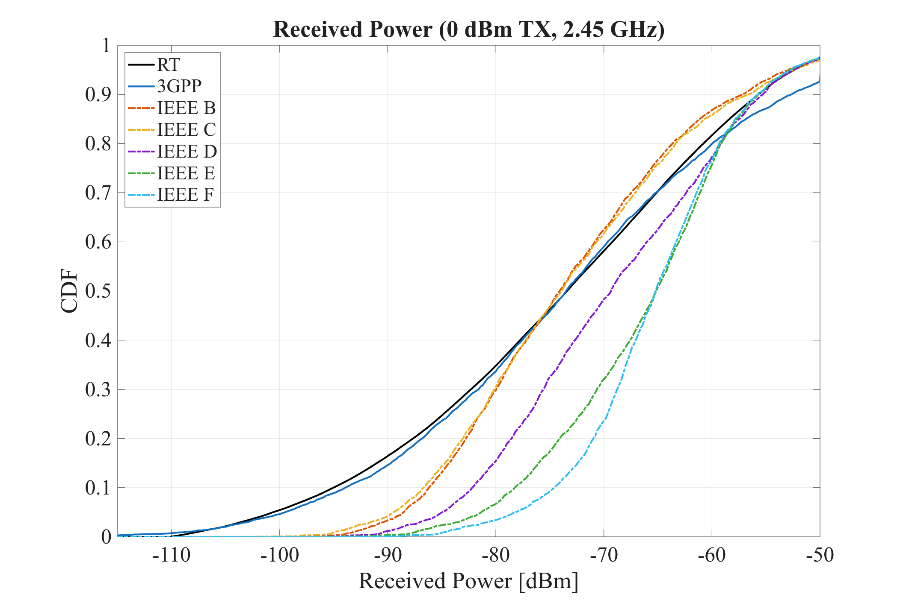
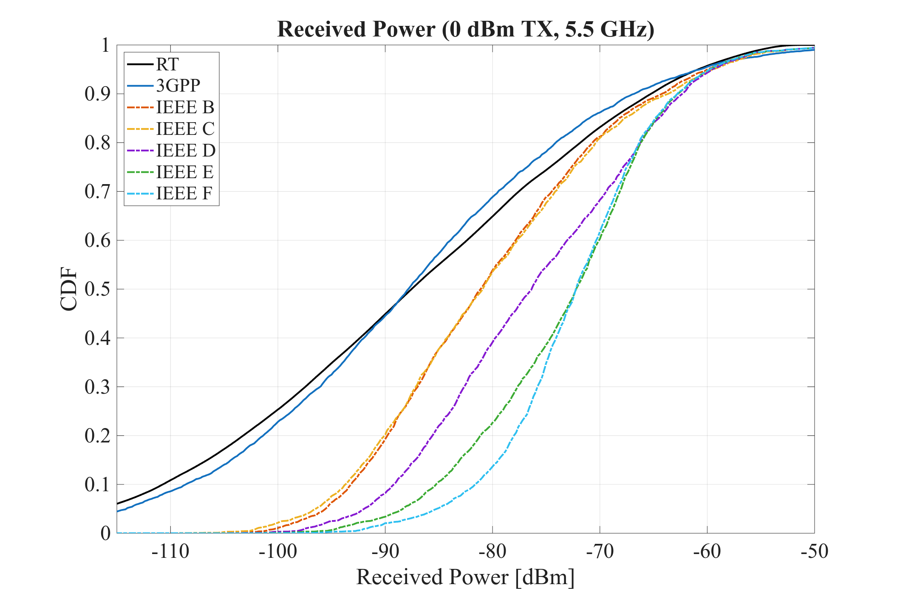

**Figure 3:** *CDF of received power (0 dBm TX) for RT, 3GPP, and IEEE Models B-F. Left: 2.45 GHz. Right: 5.5 GHz.*

**RT vs. 3GPP Re-Simulation.**

- Medians: identical at 2.45 GHz (−73.4 dBm); offset of only 0.4 dB at 5.5 GHz.
- Standard deviations: differ by \~1 dB at each frequency, consistent with the inherent smoothing of a Gaussian fit to the empirical tails.
- The close agreement confirms that the extracted path-loss coefficients ($A = 43$, $B = 11$, $C = 41$) and shadow-fading model faithfully capture the site-specific channel statistics.
- The extracted shadow-fading model includes distance- and frequency-dependent variance terms ($V_{\kappa} = 2$, $V_{\delta} = 1$), so $\sigma_{SF}$ increases from approximately 9 dB at short range to 12.5 dB at the maximum distance of 56 m.

**Comparison with 3GPP TR 38.901 Reference Parameters.**

- Distance exponent: the extracted $A = 43$ is steeper than the InH-Office NLOS reference ($A = 38.3$).
- Frequency scaling: the extracted $C = 41$ is substantially stronger than the reference ($C = 24.9$).
- Both differences are attributable to the heritage building's materials: thick masonry walls (itu_brick, $\varepsilon_r = 3.91$), reinforced concrete floors ($\varepsilon_r = 5.24$, $\sigma$ up to 0.18 S/m at 5.5 GHz), and steel structural members introduce per-wall losses far exceeding the lightweight drywall partitions assumed in canonical indoor models. The frequency-dependent absorption – concrete conductivity nearly doubles and glass conductivity roughly triples between 2.45 and 5.5 GHz (Table 1) – compounds the free-space loss to produce the observed 14 dB median shift between the two frequencies. This material-driven propagation behavior is a recurring theme throughout the results and explains many of the deviations from both the 3GPP reference tables and the IEEE models observed in the following sections.

**Comparison with IEEE 802.11 Models.**

- At 2.45 GHz: Models B/C closely match the RT median (within 0.6 dB); Models D−F underpredict path loss by 4−8 dB.
- At 5.5 GHz: the gap widens – Models B/C underpredict by 6−7 dB, Models D−F by 11−15 dB – due to the weak frequency dependence in the IEEE path-loss laws.
- All IEEE models exhibit smaller standard deviations (7.7−11.4 dB vs. 14.6−17.0 dB), reflecting their implicit assumption of a homogeneous environment that cannot capture the wide range of LOS-to-deep-NLOS conditions present in the Palmspeicher.

## 5.3 Delay Spread

Table 9 summarizes the median RMS delay spread and standard deviation for all models at both carrier frequencies.

**Table 9:** *Median RMS delay spread and standard deviation across all models and carrier frequencies.*

|                |   RT | 3GPP | IEEE B | IEEE C | IEEE D | IEEE E | IEEE F |
| -------------- | ---: | ---: | -----: | -----: | -----: | -----: | -----: |
| **2.45 GHz**   |      |      |        |        |        |        |        |
| Median [ns]    |  7.4 |  7.0 |   15.6 |   33.4 |   50.0 |   99.0 |  148.8 |
| Std. dev. [ns] | 5.73 | 5.09 |   0.00 |   0.00 |   0.91 |   0.62 |   0.00 |
| **5.5 GHz**    |      |      |        |        |        |        |        |
| Median [ns]    |  7.2 |  7.8 |   15.6 |   33.4 |   50.0 |   99.0 |  148.8 |
| Std. dev. [ns] | 5.99 | 5.43 |   0.00 |   0.00 |   0.91 |   0.62 |   0.00 |

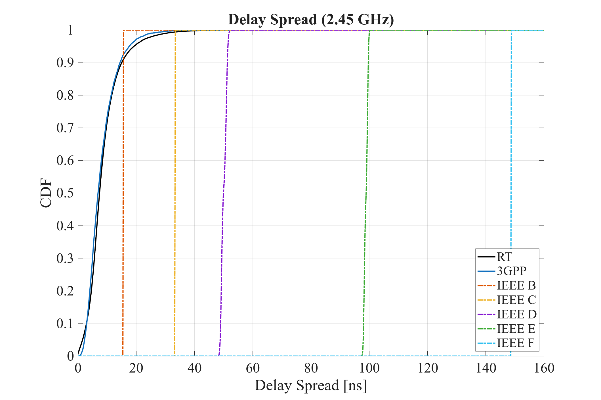
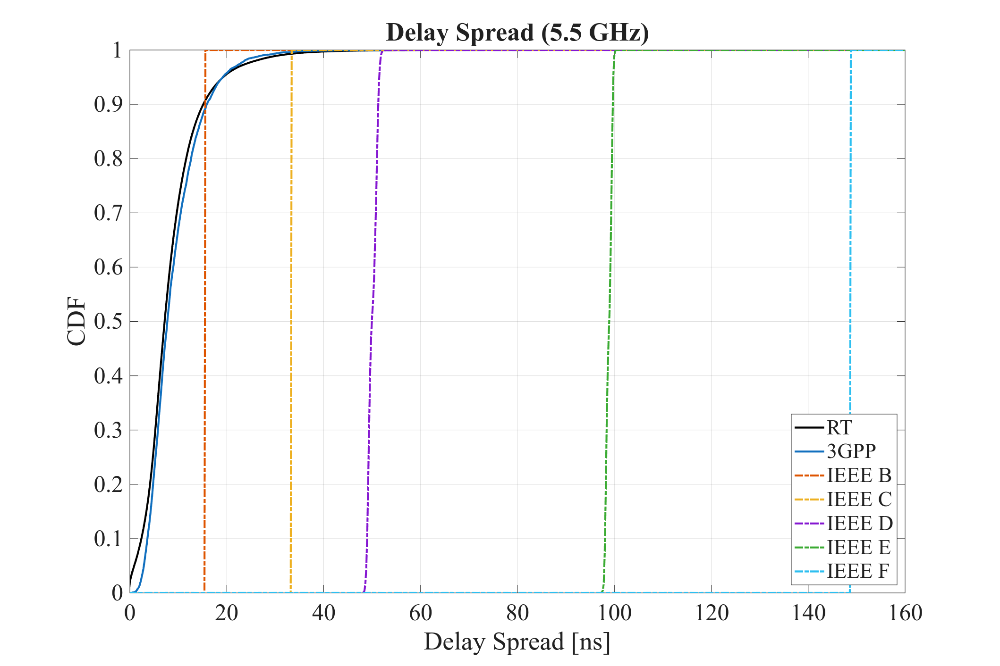

**Figure 4:** *CDF of RMS delay spread for RT, 3GPP, and IEEE Models B-F. Left: 2.45 GHz. Right: 5.5 GHz.*

**RT vs. 3GPP Re-Simulation.**

- Medians differ by at most 0.6 ns at both frequencies; standard deviations agree within \~0.6 ns.
- CDF shapes are nearly indistinguishable (Figure 4), confirming that the extracted parameters ($\mu_{DS} = - 8.03$, $\sigma_{DS} = 0.19$ in log₁₀(s)) faithfully represent the site-specific propagation statistics.

**Comparison with 3GPP TR 38.901 Reference Parameters.**

- The extracted mean delay spread $\mu_{DS} = - 8.03$ ($\log_{10}$(s)), corresponding to a geometric mean of approximately 9.3 ns,[^1] lies well below the InH-Office reference range for both LOS (\~20 ns at both frequencies) and NLOS (\~48 ns at 2.45 GHz, \~40 ns at 5.5 GHz).[^2]

- This strong compression of the delay spread is consistent with the elevated per-wall attenuation identified in the path loss analysis: the same heavy masonry and concrete partitions that increase path loss also suppress late-arriving multipath components, confining the power delay profile to a narrow temporal window.

- The extracted standard deviation $\sigma_{DS} = 0.19$ slightly exceeds both the LOS reference ($\sigma_{DS}^{LOS} = 0.18$, constant) and the NLOS reference (0.11 at 2.45 GHz, 0.14 at 5.5 GHz), indicating moderate spatial variability consistent with the heterogeneous mix of LOS corridors and multi-wall NLOS spaces within the floor.

**Comparison with IEEE 802.11 Models.**

- The RT-observed delay spreads fall well below all IEEE indoor models: even the closest model (Model B, 15.6 ns) exceeds the RT median by more than 2×; Models C−F overestimate by factors of 4.5× to 20×.

- The IEEE models show negligible variability (σ ≤ 0.91 ns). This is a limitation of the tapped-delay-line architecture with static stations, where the delay spread is determined by fixed tap configurations rather than by spatial variability of the propagation environment.

## 5.4 K-Factor

Table 10 summarizes the median Rician K-factor and standard deviation for all models at both carrier frequencies.

**Table 10:** *Median Rician K-factor and standard deviation across all models and carrier frequencies.*

|                |    RT | 3GPP | IEEE B | IEEE C | IEEE D | IEEE E | IEEE F |
| -------------- | ----: | ---: | -----: | -----: | -----: | -----: | -----: |
| **2.45 GHz**   |       |      |        |        |        |        |        |
| Median [dB]    |  −0.4 | −0.1 |   −1.3 |   −3.7 |   −6.6 |   −9.8 |  −11.6 |
| Std. dev. [dB] | 13.03 | 8.39 |   0.00 |   0.00 |   0.04 |   0.09 |   0.00 |
| **5.5 GHz**    |       |      |        |        |        |        |        |
| Median [dB]    |  −2.5 | −4.6 |   −1.3 |   −3.7 |   −6.6 |   −9.8 |  −11.6 |
| Std. dev. [dB] | 21.17 | 8.39 |   0.00 |   0.00 |   0.04 |   0.09 |   0.00 |

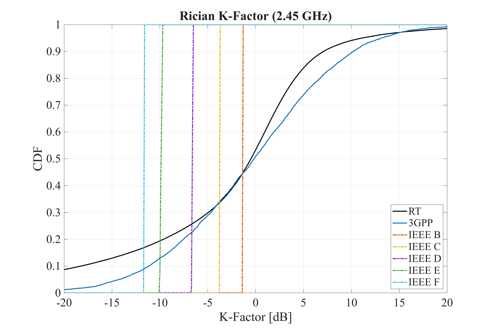
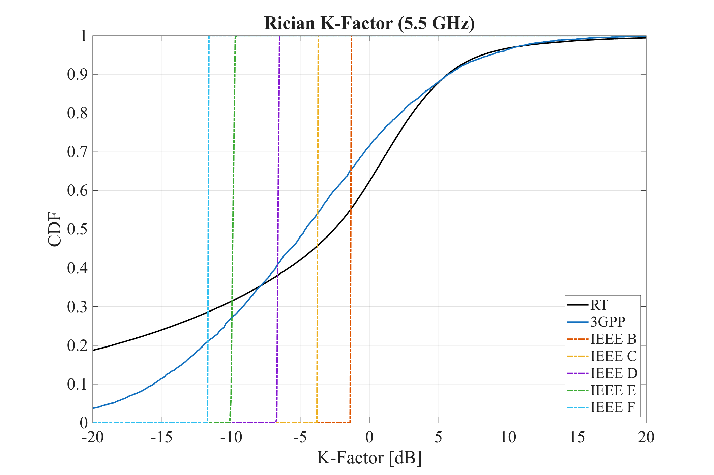

**Figure 5:** *CDF of Rician K-factor for RT, 3GPP, and IEEE Models B-F. Left: 2.45 GHz. Right: 5.5 GHz.*

**RT vs. 3GPP Re-Simulation.**

- Medians: nearly identical at 2.45 GHz (−0.4 vs. −0.1 dB); at 5.5 GHz the 3GPP median is 2.1 dB lower (−4.6 vs. −2.5 dB), indicating that the log-linear frequency model ($V_{\gamma} = - 16.2$) slightly over-corrects at the higher frequency.

- Standard deviations: RT variability is substantially larger (13.0 vs. 8.4 dB at 2.45 GHz; 21.2 vs. 8.4 dB at 5.5 GHz). The 3GPP model draws K-factor from a Gaussian with fixed $V_{\sigma} = 4$ dB, which cannot reproduce the heavy tails generated by the mixture of LOS corridors and multi-wall NLOS paths.

- The RT K-factor standard deviation more than doubles from 2.45 to 5.5 GHz (13.0 → 21.2 dB), but the extracted model contains no frequency-dependent variance term ($V_{\delta}$), so the 3GPP re-simulation produces identical spread at both frequencies. A standard deviation of 21 dB far exceeds any standard 3GPP parameterization and suggests that the single-Gaussian model may be structurally inadequate for the K-factor in a mixed LOS/NLOS fit, where the underlying distribution is more likely bimodal.

- Despite the tail mismatch, the CDF shapes overlap well in the central region (20th−80th percentile).

**Comparison with 3GPP TR 38.901 Reference Parameters.**

- The extracted K-factor model differs fundamentally from the standard InH-Office parameterization in 3GPP TR 38.901 [[2]](#ref_3gpp38901) Table 7.5-6, where K-factor is defined only for the LOS table ($\mu_\mathrm{KF} = 7$ dB, $\sigma_{KF} = 4$ dB) and set to $- \infty$ in the NLOS table. The extracted mixed-condition model uses a continuous, distance- and frequency-dependent K-factor: $\mathrm{KF} = 8.5 - 16.2 \cdot \log_{10}(f) + 4 \cdot \log_{10}(d_{2D})$ dB.

- The positive distance coefficient ($V_{\epsilon} = 4$) indicates that K-factor increases with TX−RX distance in the mixed-condition regression. This is consistent with the expectation that NLOS power – carried by multiply-reflected paths that accumulate wall-transmission losses at each interaction – decays faster with distance than the direct-path component. In QRT, the MA-FED diffraction model sustains direct-path power into shadow regions through calibrated Fresnel-ellipsoid sampling, which reinforces this effect; a different diffraction model could produce a different distance dependence. Additionally, the coefficient is partly a regression artifact of the joint LOS/NLOS fit: in a standard dual-table parameterization, many of the short-range low-K links would be classified as NLOS and handled separately.

- The strong negative frequency coefficient ($V_{\gamma} = - 16.2$) reflects the frequency-dependent material absorption identified in the path loss analysis.

- The extracted cross-correlations for KF (Table 6) show a positive correlation with DS (+0.26) and with the angular spreads, and a weak negative correlation with SF (−0.15). The positive DS−KF sign is opposite to the standard 3GPP LOS convention, where strong direct paths (high KF) suppress delay spread. In the mixed-condition fit, this sign reversal is largely a confounding artifact of the shared distance dependence: because the extracted model assigns a positive distance coefficient to KF ($V_{\epsilon} = 4$) and delay spread also tends to increase with distance, both parameters rise together, producing a spurious positive correlation. A separate LOS/NLOS analysis would be needed to recover the underlying physical DS−KF relationship.

**Comparison with IEEE 802.11 Models.**

- The IEEE models produce effectively fixed K-factor values (σ ≤ 0.09 dB), determined entirely by the pre-defined tap power profiles rather than the propagation geometry.

- Model B (−1.3 dB) is closest to the RT median, but no IEEE model can represent the \~25 dB spread (10th to 90th percentile) observed in the RT data – a significant shortcoming for heterogeneous indoor scenarios.

## 5.5 Angular Spreads

Having established that the heritage construction compresses both the temporal statistics (delay spread) and the LOS/NLOS power balance (K-factor), this section examines whether a similar effect appears in the angular domain. All four angular spread parameters – ASD, ASA, ESD, ESA – are discussed jointly. All four exhibit nearly symmetric departure-arrival behavior, a consequence of the isotropic antenna patterns and reciprocal propagation geometry. The IEEE 802.11 models provide only azimuth-domain statistics due to their 2D channel architecture; elevation comparisons are therefore limited to RT vs. 3GPP.

**Table 11:** *Median azimuth angular spread and standard deviation across all models and carrier frequencies.*

|                    |    RT |  3GPP | IEEE B | IEEE C | IEEE D | IEEE E | IEEE F |
| ------------------ | ----: | ----: | -----: | -----: | -----: | -----: | -----: |
| **ASD - 2.45 GHz** |       |       |        |        |        |        |        |
| Median [°]         |    35 |    34 |     58 |     30 |     35 |     85 |     72 |
| Std. dev. [°]      | 20.26 | 17.96 |  10.72 |   4.23 |   7.60 |  15.38 |   9.12 |
| **ASD - 5.5 GHz**  |       |       |        |        |        |        |        |
| Median [°]         |    35 |    37 |     58 |     30 |     35 |     85 |     72 |
| Std. dev. [°]      | 21.14 | 19.19 |  10.72 |   4.23 |   7.60 |  15.38 |   9.12 |
| **ASA - 2.45 GHz** |       |       |        |        |        |        |        |
| Median [°]         |    34 |    33 |     56 |     29 |     49 |     61 |     84 |
| Std. dev. [°]      | 20.28 | 17.81 |  10.15 |   4.50 |  16.40 |   9.95 |  12.03 |
| **ASA - 5.5 GHz**  |       |       |        |        |        |        |        |
| Median [°]         |    34 |    36 |     56 |     29 |     49 |     61 |     84 |
| Std. dev. [°]      | 21.18 | 18.86 |  10.15 |   4.50 |  16.40 |   9.95 |  12.03 |

**Table 12:** *Median elevation angular spread and standard deviation for RT and 3GPP re-simulation.*

|                    |   RT |  3GPP |
| ------------------ | ---: | ----: |
| **ESD - 2.45 GHz** |      |       |
| Median [°]         |  7.2 |   6.4 |
| Std. dev. [°]      | 6.22 | 11.75 |
| **ESD - 5.5 GHz**  |      |       |
| Median [°]         |  7.0 |   6.6 |
| Std. dev. [°]      | 6.21 | 12.90 |
| **ESA - 2.45 GHz** |      |       |
| Median [°]         |  7.0 |   6.8 |
| Std. dev. [°]      | 5.76 | 11.67 |
| **ESA - 5.5 GHz**  |      |       |
| Median [°]         |  7.0 |   7.0 |
| Std. dev. [°]      | 5.77 | 12.91 |

Figures 6 and 7 show the empirical CDFs of ASD and ASA at both frequencies. Figures 8 and 9 show the corresponding ESD and ESA CDFs.

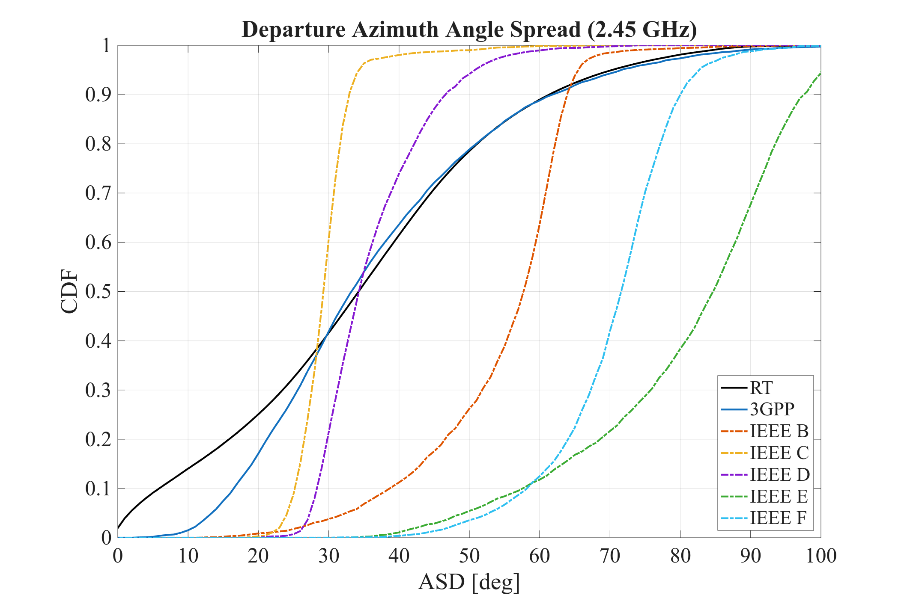
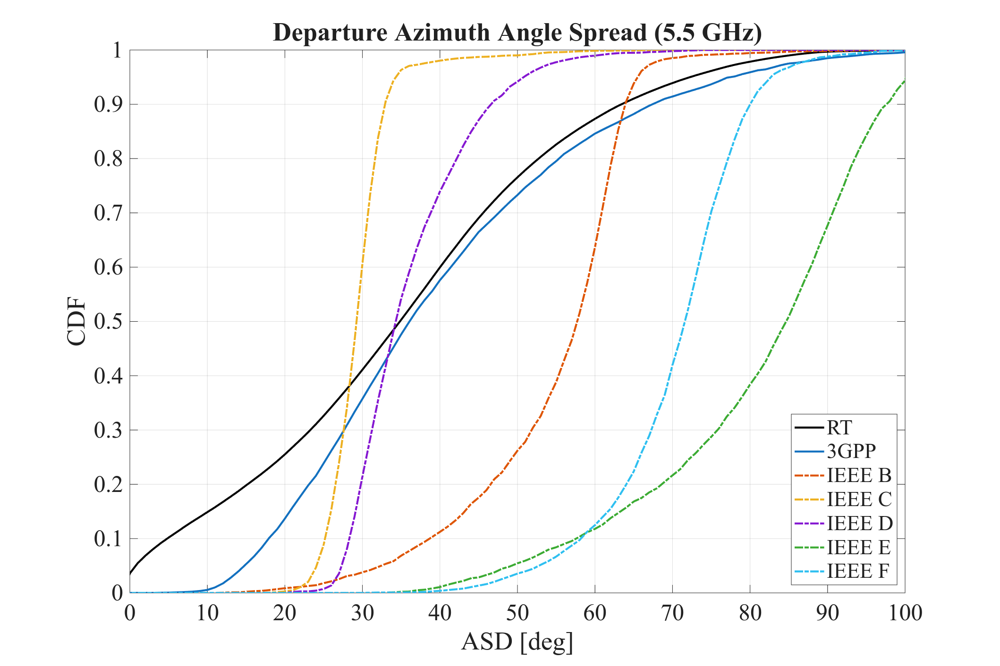

**Figure 6:** *CDF of departure azimuth angle spread (ASD) for RT, 3GPP, and IEEE Models B-F. Left: 2.45 GHz. Right: 5.5 GHz.*

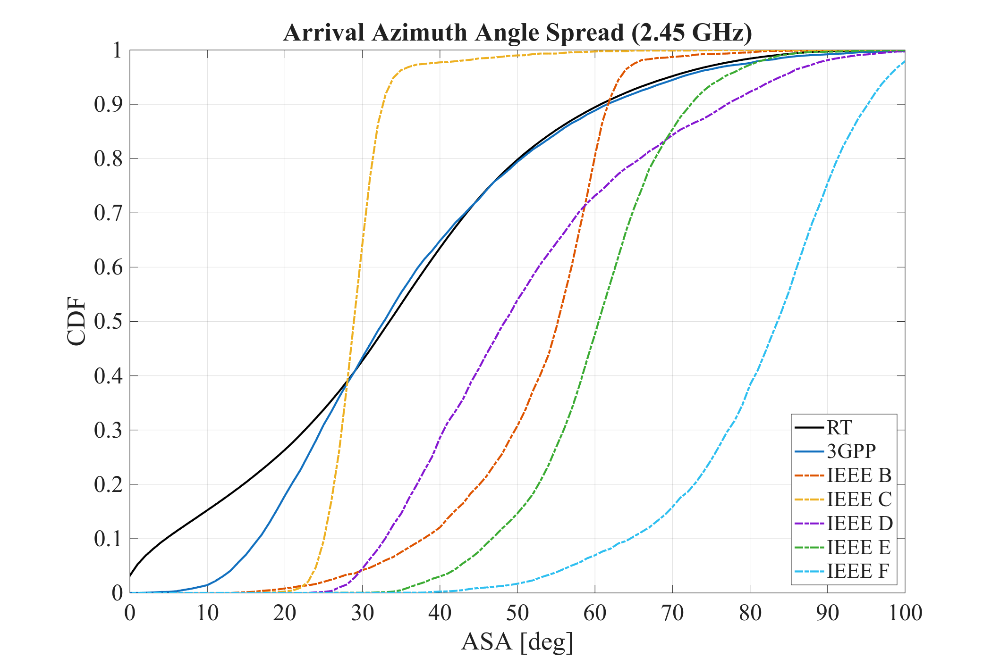
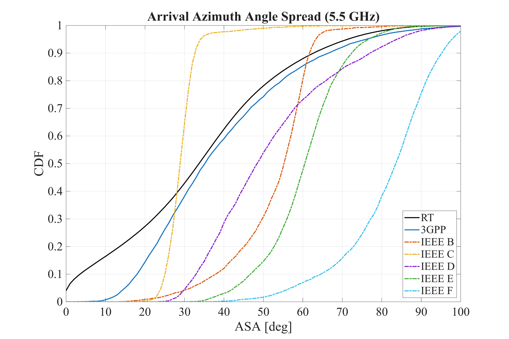

**Figure 7:** *CDF of arrival azimuth angle spread (ASA) for RT, 3GPP, and IEEE Models B-F. Left: 2.45 GHz. Right: 5.5 GHz.*

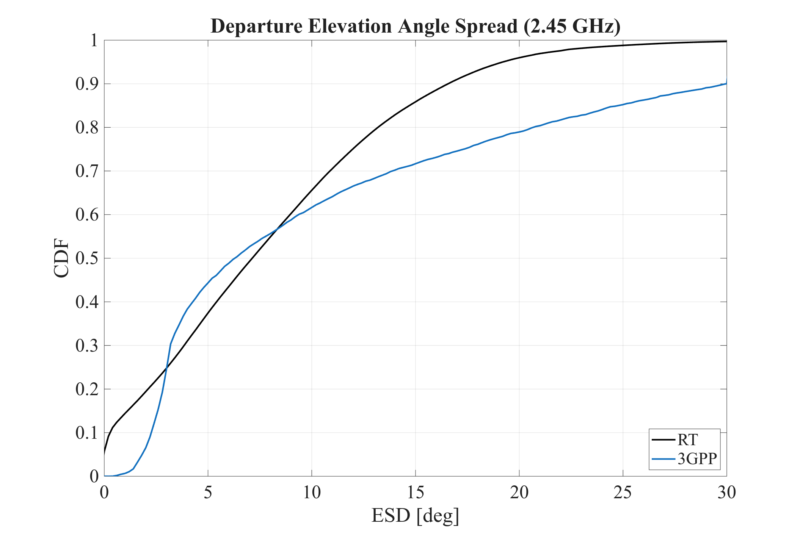
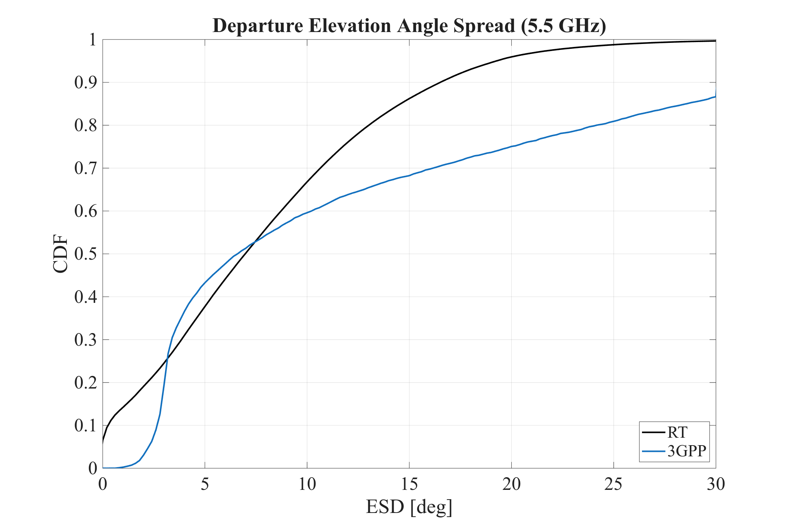

**Figure 8:** *CDF of departure elevation angle spread (ESD) for RT and 3GPP. Left: 2.45 GHz. Right: 5.5 GHz.*

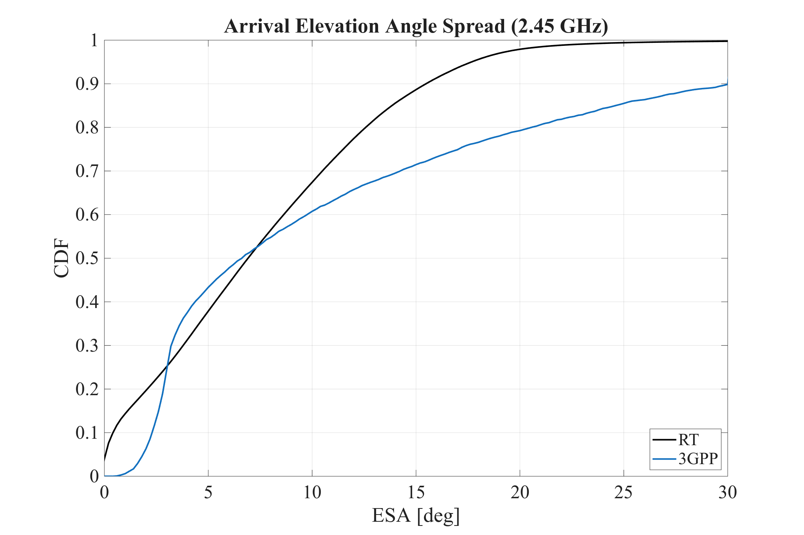
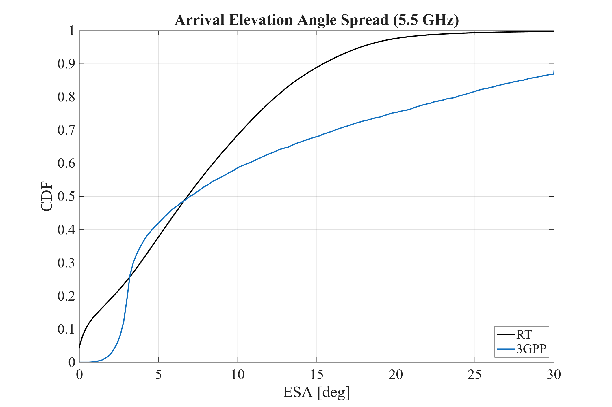

**Figure 9:** *CDF of arrival elevation angle spread (ESA) for RT and 3GPP. Left: 2.45 GHz. Right: 5.5 GHz.*

**Departure-Arrival Symmetry.**

- ASD and ASA medians differ by at most 1° (Table 11); ESD and ESA medians differ by at most 0.2° (Table 12).
- Reflected in the extracted parameters (Table 4): ASD/ASA share $V_{\mu} \approx 1.58$ and ESD/ESA share $V_{\mu} = 0.8$.
- Elevation symmetry is tighter than azimuth, consistent with the strong ESD−ESA cross-correlation of +0.86 (Table 6).

**Azimuth: RT vs. 3GPP Re-Simulation.**

- ASD and ASA medians agree within 1−2° at both frequencies.
- Standard deviations are underestimated by 2−3°, consistent with the Gaussian approximation's inability to fully capture the RT distribution tails.
- CDF shapes overlap closely in the central region (20th−80th percentile), validating the extracted parameters ($V_{\mu} = 1.58$/$1.57$, $V_{\sigma} = 0.25$ for ASD/ASA).

**Azimuth: Comparison with 3GPP TR 38.901 Reference Parameters.**

- Extracted ASD mean $V_{\mu} = 1.58$ (geometric mean 38.0°) is close to the InH-Office LOS (39.8°) and NLOS (41.7°) values from 3GPP TR 38.901 [[2]](#ref_3gpp38901) Table 7.5-6, consistent with the mixed-condition fit.
- Extracted ASA mean $V_{\mu} = 1.57$ (37.2°) is below both the LOS and NLOS references at either frequency (LOS: 42−48°, NLOS: 59−64°).[^3] The suppression of wide-angle scattered paths by the elevated per-wall attenuation of the masonry construction is consistent with this finding.
- Extracted $V_{\sigma} = 0.25$ matches the InH-Office NLOS reference (0.22) and exceeds the LOS value (0.18), as expected from the mixed-condition fit spanning both LOS and NLOS links.

**Elevation: RT vs. 3GPP Re-Simulation.**

- Medians agree well (within 0.8°), but the 3GPP model substantially overestimates variability – roughly twice the RT standard deviation (e.g., ESD: 11.75−12.90° vs. 6.21−6.22°). This is the opposite of the azimuth domain, where the 3GPP model *underestimated* variability.

- The discrepancy is a distributional mismatch: the RT elevation spread is bounded by the compact single-floor geometry, producing a concentrated distribution with a hard upper limit near 20°. The log-normal model with $V_{\sigma} = 0.9$ in log₁₀(°) is unbounded and generates physically implausible tail values – the 3GPP CDFs (Figures 8−9) show 10−15% of links exceeding 30° – that inflate the fitted standard deviation. A truncated or bounded log-normal could provide a better distributional fit for elevation spreads in this environment.

**Elevation: Comparison with 3GPP TR 38.901 Reference Parameters.**

- Extracted ESD/ESA mean $V_{\mu} = 0.8$ (6.3°) is substantially below the InH-Office reference values at both frequencies and for both LOS and NLOS conditions (17−20°).[^4] This is physically expected: the compact single-floor geometry with TX heights of 0.75−2.35 m and RX height of 0.85 m results in small geometric elevation angles.

- The extracted $V_{\sigma} = 0.9$ is **4−6× larger** than the InH-Office reference ($\sigma_\mathrm{lgESD} =$ 0.20−0.22; $\sigma_\mathrm{lgESA} =$ 0.16−0.22 per [[2]](#ref_3gpp38901) Table 7.5-6). This inflation is driven by the log-normal distribution being a poor match for the bounded elevation data: the fitting procedure must accommodate the tails of the empirical distribution, which inflates $V_{\sigma}$ beyond what the central mass of the data would suggest.

**Cross-Correlation Structure.** The most notable correlations (Table 6) are:

- ESD−ESA (+0.86): the strongest in the entire parameter set, reflecting the geometrically constrained vertical scattering.
- ASD−ASA (+0.61): weaker than elevation due to richer lateral scattering diversity.
- DS−ASD/ASA (+0.65/+0.63): multipath-rich links produce both wide delay tails and broad angular dispersion.
- ESD/ESA−SF (−0.32/−0.31): the strongest negative angular-SF correlation, indicating that heavily obstructed paths scatter energy into wider elevation cones via ceiling/floor reflections.

**Azimuth: Comparison with IEEE 802.11 Models.**

- No single IEEE model matches the RT azimuth statistics. For ASD, Models C/D (30−35°) bracket the RT median (35°), while Models B/E/F substantially overestimate it. For ASA, Model C (29°) is closest.
- The IEEE models do not preserve ASD−ASA symmetry and show no frequency dependence.
- The observed IEEE variability (σ = 4−16°) is an artifact of random sub-path generation within the Laplacian angular profile, not a representation of spatial variability. It is consistently lower than the RT reference (σ ≈ 20−21°).

**Frequency Dependence.**

- All angular spread statistics are essentially frequency-independent: RT azimuth and elevation medians vary by at most 1° and 0.2° respectively between 2.45 and 5.5 GHz, and standard deviations are stable.

- This is consistent with the extracted parameters (Table 4), where no frequency-dependent terms are included for any angular spread.

## 5.6 Cross-Polarization Ratio

The final parameter in the extraction set is the cross-polarization ratio (XPR), which quantifies the channel's polarization selectivity (Section 4.1). Table 13 summarizes the median and standard deviation of the XPR obtained from ray tracing (RT), 3GPP re-simulation, and the IEEE 802.11 channel models at both frequency bands.

**Table 13:** *Median XPR and standard deviation across all models and carrier frequencies.*

| Parameter | RT (2.45 GHz) | 3GPP (2.45 GHz) | RT (5.5 GHz) | 3GPP (5.5 GHz) | IEEE B-F |
| --------- | ------------: | --------------: | -----------: | -------------: | -------: |
| μ [dB]    |          20.7 |            13.3 |         20.7 |           13.3 |      3.0 |
| σ [dB]    |          10.0 |             1.8 |         10.1 |            1.8 |      0.0 |

Figure 10 shows the empirical CDFs of the XPR at both carrier frequencies.

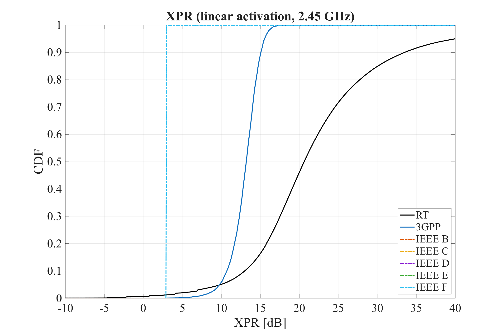
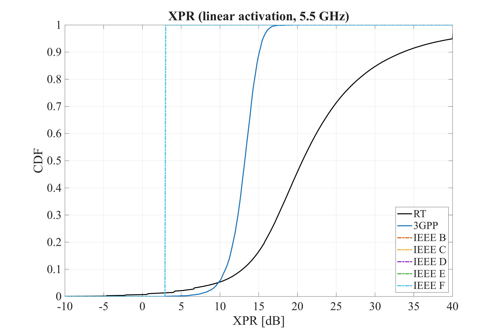

**Figure 10:** *CDF of XPR for RT, 3GPP, and IEEE Models B-F. Left: 2.45 GHz. Right: 5.5 GHz. RT results (black) exhibit a wide spread compared to the narrower 3GPP distribution (blue). IEEE models B-F collapse to a fixed value of 3 dB (dashed lines). Distributions are virtually identical across frequencies, indicating negligible frequency dependence.*

**RT vs. 3GPP Re-Simulation.**

- The comparison is affected by a level mismatch between the extraction and the 3GPP model. The XPR parameters ($V_{\mu}$, $V_{\sigma}$) were fitted to *channel-level* statistics (Section 4), but the 3GPP TR 38.901 model applies them at the *per-ray* level: $V_{\mu}$ and $V_{\sigma}$ define the distribution from which individual ray XPR values are drawn, and the effective channel-level XPR emerges only after combining all rays and clusters into a composite channel. The cluster model's sub-path structure introduces additional depolarization that reduces the effective channel-level XPR below the per-ray mean and narrows the distribution through averaging.

- This structural mismatch manifests in both the median and the spread: the RT median XPR (20.7 dB) exceeds the 3GPP re-simulated value (13.3 dB) by approximately 7.4 dB at both frequencies, and the RT distribution is substantially wider (σ ≈ 10 dB vs. 1.8 dB). The re-simulated channel-level σ (1.8 dB) is much narrower than both the extracted $V_{\sigma} = 8$ dB and the 3GPP TR 38.901 InH-Office NLOS per-ray default ($\sigma_\mathrm{XPR} = 4$ dB per [[2]](#ref_3gpp38901) Table 7.5-6), consistent with the averaging effect.

- A dedicated per-ray XPR extraction – e.g., by computing XPR individually for each resolved multipath cluster – would be needed to achieve consistent per-ray parameterization.

**Comparison with IEEE 802.11 Models.**

- All IEEE models assign a fixed XPR of 3 dB, far below both the RT and 3GPP values.
- This conservative assumption does not reflect the polarization selectivity observed in the ray-traced indoor scenario. MIMO schemes designed under this assumption would be more robust but may not exploit the full polarization-domain capacity that the channel actually supports.

**Frequency Dependence.**

- XPR statistics are nearly identical at 2.45 GHz and 5.5 GHz for all models, consistent with the expectation that polarization coupling is governed by scatterer geometry rather than wavelength at these frequencies.

## 5.7 Scenario Classification Summary

Table 14 summarizes the closest IEEE model match for each parameter. The RT data consistently places the Palmspeicher closest to IEEE Models B/C in terms of path loss (at 2.45 GHz), K-factor, and delay spread, and Models C/D for azimuth angular spreads.

***Table 14**: Best-matching IEEE model per parameter.*

| Parameter    | Closest IEEE Model(s) | RT Median       |       IEEE Median |
| ------------ | --------------------- | --------------- | ----------------: |
| Path gain    | B/C (at 2.45 GHz)     | −73.4 dBm       | −74.0 / −73.8 dBm |
| Delay spread | Below B               | 7.2-7.4 ns      |       15.6 ns (B) |
| K-factor     | B/C                   | −0.4 to −2.5 dB |    −1.3 / −3.7 dB |
| ASD          | C/D                   | 35°             |         30° / 35° |
| ASA          | C                     | 34°             |               29° |

The physical floor plan - 54 × 19.3 m with a mixture of enclosed offices and open-plan areas - would nominally suggest Model D (typical office) or Model E (large open space). The consistent mismatch towards smaller models confirms that the heritage building construction produces a more attenuating and delay-confining propagation environment than the canonical IEEE scenarios. No single IEEE model simultaneously matches all parameters, which underscores a core constraint of the fixed-profile IEEE model family. The site-specific 3GPP parameterization captures all parameters in a self-consistent framework fitted to the actual propagation data, providing a more accurate channel description for this environment.

# 6 Conclusion

This report has demonstrated that the 3GPP TR 38.901 modeling framework can be parameterized directly from deterministic ray-tracing simulations and that the resulting stochastic model reproduces site-specific channel statistics with high fidelity. The extracted parameter set - covering path loss, delay spread, K-factor, azimuth and elevation angular spreads, cross-polarization ratio, decorrelation distances, and inter-parameter cross-correlations - was validated by re-simulating the Palmspeicher office scenario with QuaDRiGa and comparing empirical CDFs against the ray-tracing reference. For path loss, delay spread, and azimuth angular spreads, the 3GPP re-simulation matched the ray-tracing distributions closely, with median offsets below 1 dB, 0.6 ns, and within 2° respectively. The K-factor and elevation angular spread distributions showed good agreement in central tendency but larger discrepancies in the tails, reflecting limitations of the Gaussian distributional assumption when applied to the wide range of LOS and NLOS conditions present in a mixed-condition fit.

The comparison with the IEEE 802.11 indoor models B−F revealed that no single IEEE model provides a consistent match across all parameters. Quantitatively, all IEEE models underpredicted path loss at 5.5 GHz by 6−15 dB, overestimated delay spread by factors of 2−20×, and produced near-zero K-factor variability compared to the 13−21 dB standard deviation observed in the ray-tracing data. The fixed-profile architecture cannot accommodate the strong frequency dependence, the wide spatial variability, or the elevation-domain statistics observed in the ray-tracing data. The site-specific 3GPP parameterization, by contrast, captures all of these characteristics within a single self-consistent framework. This finding has direct implications for IEEE 802.11 channel modeling: the 3GPP parameter structure could serve as a more flexible basis for future IEEE indoor models, enabling scenario-specific tuning without the constraints of the current fixed-profile model family.

A central limitation of the present work is that the ray-tracing results have not yet been validated against measurements. The QRT engine produces physically plausible propagation data – grounded in ITU-R P.2040-3 material models [[6]](#ref_itur_2040), volumetric beam tracing, and Fresnel-ellipsoid diffraction – but the accuracy of the extracted parameters ultimately depends on the fidelity of the 3D scene model and the electromagnetic material characterization. Discrepancies in wall thicknesses, furniture placement, or material properties propagate directly into the channel statistics. Measurement campaigns in representative environments are therefore needed to establish quantitative confidence bounds on the ray-tracing-derived parameters and to identify systematic biases that may require calibration.

Several directions for future work follow from these findings. First, the extracted parameters should be validated against measurement data for the same environment, refining material properties and diffraction model parameters where discrepancies are observed. Second, the methodology should be applied to additional indoor scenarios – residential buildings, factory halls, and large open-plan offices – to build a library of scenario-specific 3GPP parameter tables covering the diversity of environments relevant to IEEE 802.11 deployments. Third, the feasibility of deriving consolidated parameter sets by averaging across multiple representative scenarios of the same type should be investigated, offering a middle ground between the current one-size-fits-all IEEE models and fully site-specific ray-tracing. The ray-tracing channel data can also be used directly for system-level evaluation without the intermediate step of 3GPP parameterization, at the cost of reduced generalizability.

# References

1.  Quadriga-Lib: C++/MEX/Python Utility library for radio channel modelling and simulations\
   <http://quadriga-lib.org>

2.  3GPP TR 38.901 v19.1.0 "Study on channel model for frequencies from 0.5 to 100 GHz", Tech. Rep., 2025.\
   <https://www.3gpp.org/ftp/Specs/archive/38_series/38.901/38901-j10.zip>

3.  IEEE 802.11-25-2318r0, "A modern C++ framework for the IEEE indoor channel models", Tech. Rep., 2025.\
   <https://mentor.ieee.org/802.11/dcn/25/11-25-2318-00-0ucm-a-modern-c-framework-for-the-ieee-indoor-channel-models.docx>

4.  S. Jaeckel, L. Raschkowski, K. Börner, L. Thiele, F. Burkhardt and E. Eberlein, "QuaDRiGa - Quasi Deterministic Radio Channel Generator", Fraunhofer Heinrich Hertz Institute, Tech. Rep. v2.8.1, 2023\
   <https://quadriga-channel-model.de>

5.  IEEE 802.11-26/0211r0, "Comparison of IEEE and 3GPP indoor channel models", Tech. Rep., 2026.\
   <https://mentor.ieee.org/802.11/dcn/26/11-26-0211-00-0ucm-comparison-of-ieee-and-3gpp-indoor-channel-models.docx>
   
6.  ITU-R, "Effects of building materials and structures on radiowave propagation above about 100 MHz," Recommendation ITU-R P.2040-3, International Telecommunication Union, Geneva, 2023.\
   <https://www.itu.int/rec/R-REC-P.2040/en>

7.  NVIDIA, "Sionna: An Open-Source Library for Next-Generation Physical Layer Research," 2022.\
   <https://sionna.ai>

[^1]: The regression intercept $\mu_{DS} = - 8.03$ represents the least-squares mean across all distances and both frequencies, not the sample median. The empirical medians in Table 9 (7.0−7.8 ns) are lower because the log-normal distribution is right-skewed and the distance/frequency averaging shifts the regression mean upward.

[^2]: Per 3GPP TR 38.901 [[2]](#ref_3gpp38901) Table 7.5-6, the InH-Office mean delay spread is frequency-dependent: $\mu_{DS}^{LOS} = - 0.01\log_{10}(1 + f_\mathrm{GHz}) - 7.692$ and $\mu_{DS}^{NLOS} = - 0.28\log_{10}(1 + f_\mathrm{GHz}) - 7.173$ (in $\log_{10}$(s)). At 2.45 GHz: LOS $- 7.70$ (\~20.0 ns), NLOS $- 7.32$ (\~47.5 ns). At 5.5 GHz: LOS $- 7.70$ (\~20.0 ns), NLOS $- 7.40$ (\~39.7 ns). The standard deviation is $\sigma_{DS}^{LOS} = 0.18$ (constant) and $\sigma_{DS}^{NLOS} = 0.10\log_{10}(1 + f_\mathrm{GHz}) + 0.055$, giving 0.11 at 2.45 GHz and 0.14 at 5.5 GHz.

[^3]: Per 3GPP TR 38.901 [[2]](#ref_3gpp38901) Table 7.5-6, the InH-Office ASA mean is frequency-dependent: $\mu_{lgASA}^{LOS} = - 0.19\log_{10}(1 + f_\mathrm{GHz}) + 1.781$ and $\mu_{lgASA}^{NLOS} = - 0.11\log_{10}(1 + f_\mathrm{GHz}) + 1.863$. At 2.45 GHz: LOS 1.679 (47.7°), NLOS 1.804 (63.7°). At 5.5 GHz: LOS 1.627 (42.3°), NLOS 1.774 (59.4°).

[^4]: Per 3GPP TR 38.901 [[2]](#ref_3gpp38901) Table 7.5-6, the InH-Office ESA (ZSA) mean is frequency-dependent: $\mu_{lgZSA}^{LOS} = - 0.26\log_{10}(1 + f_\mathrm{GHz}) + 1.44$ and $\mu_{lgZSA}^{NLOS} = - 0.15\log_{10}(1 + f_\mathrm{GHz}) + 1.387$. At 2.45 GHz: LOS 1.300 (20.0°), NLOS 1.306 (20.2°). At 5.5 GHz: LOS 1.229 (16.9°), NLOS 1.265 (18.4°).
